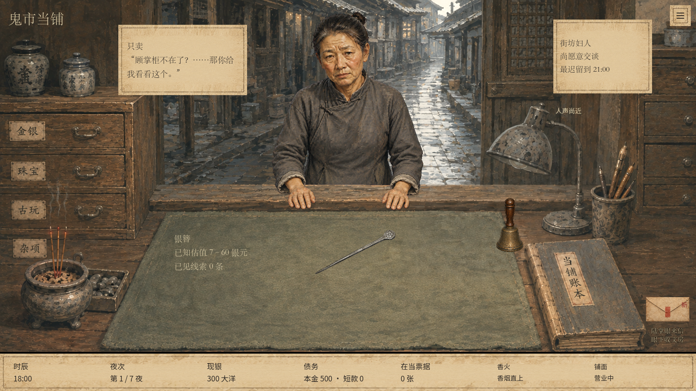

# 街坊妇人站姿修订 · 本地验收

2026-09-12 完成本地优化；2026-09-13 负责人明确授权推送并在线合并到 main。

## 结果

- 内置 image_gen 基于原人物、空柜台和负责人截图重画站姿，保留脸、发髻、灰布衣和水粉笔触。双手及袖口完整，肩背不再明显前趴。
- 新增 `assets/art04/customers/neighbor_v2.png`，旧版 `neighbor.png` 保留。提示词和来源见 `assets/art04/customers/neighbor_v2_prompt.md`。
- 妇人中央腰腹遮挡线与原画柜台后沿对齐；双手在柜台前景。仅这位妇人使用新版摆放尺寸；其他顾客恢复原锚点。
- 新版专用的去色溢出处理清理发丝紫边；柜台中的双手投下由自身轮廓生成的轻微接触阴影。对话头像不带桌面阴影。
- 玩法数据、文案和存档格式没有改动。工作区已有大量其他修改，本次对已有脏文件只做人物素材与摆放相关的局部补丁。

## 验证

2026-09-13 发布复验：从线上 main `8a9dd3d` 重建的 1550 个文件全部通过 Git blob 哈希核对，基线树与线上 `e7c50fc4` 完全一致。只应用本次补丁后，人物专项检查再次 90 项通过；下列截图已更新为该 main 基线的真实渲染。

Godot 4.6.1 / OpenGL Compatibility / RTX 3060 Laptop GPU，实际窗口渲染截图，测试存档隔离在本地 QA 路径。

- `tests/neighbor_visual_smoke.gd`：**90 assertions, 0 failures**。
- 1280×720、1600×900、1920×1080：人物完整可见，腰腹遮挡线与柜沿对齐，截图已逐一检查。
- 正常、深夜、鬼市：同一位置和素材；切换不改游戏状态。
- 对话使用新版人物、无台面阴影；交易入口可用；查看抽屉不耗时间或现金；首笔交易成功；离场后双手和阴影一起消失。
- 同一 1600×900 场景、同一游戏状态输出旧图和新图，已并排核对身份、双手、衣袖、遮挡和边缘。没有把生成素材预览冒充游戏截图。
- 修改的已有文件 `git diff --check` 无空白错误；本次改动与开工前工作区快照已比对。

### 未通过及环境限制

- 先运行的 `counter_notice_ui_smoke.gd -- wide` 为 75 项断言、1 项失败：它仍要求默认内容版本为 21 且运行 ID 为 `goods_expertise_seven`，与当前工作区默认开局不一致。其余 74 项通过；本次没有修改内容版本或放宽该断言。随后用当前正式开局进行上述人物专项验证。
- 本机 Godot 启动日志报告 `Failed to read the root certificate store`；渲染、图片导入、本地游戏与截图均成功，本任务未验证联网能力。
- 首轮阴影着色器曾出现编译错误，已修正；最终日志没有着色器或脚本错误。未运行全游戏完整回归，不把专项通过描述为全量通过。

## 截图

| 内容 | 文件 |
| --- | --- |
| 调整前，同场景 | [1600 before](screenshots/neighbor_v2_1600_before.png) |
| 调整后，默认灯色 | [1600 after](screenshots/neighbor_v2_1600_after.png) |
| 小窗口 | [1280 after](screenshots/neighbor_v2_1280_after.png) |
| 大窗口 | [1920 after](screenshots/neighbor_v2_1920_after.png) |
| 正常预览 | [normal](screenshots/neighbor_v2_1600_normal.png) |
| 深夜预览 | [late](screenshots/neighbor_v2_1600_late.png) |
| 鬼市预览 | [ghost](screenshots/neighbor_v2_1600_ghost.png) |
| 对话 | [dialogue](screenshots/neighbor_v2_1600_dialogue.png) |
| 成交离场 | [departed](screenshots/neighbor_v2_1600_departed.png) |

