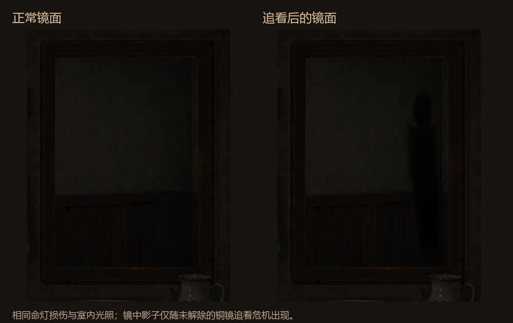
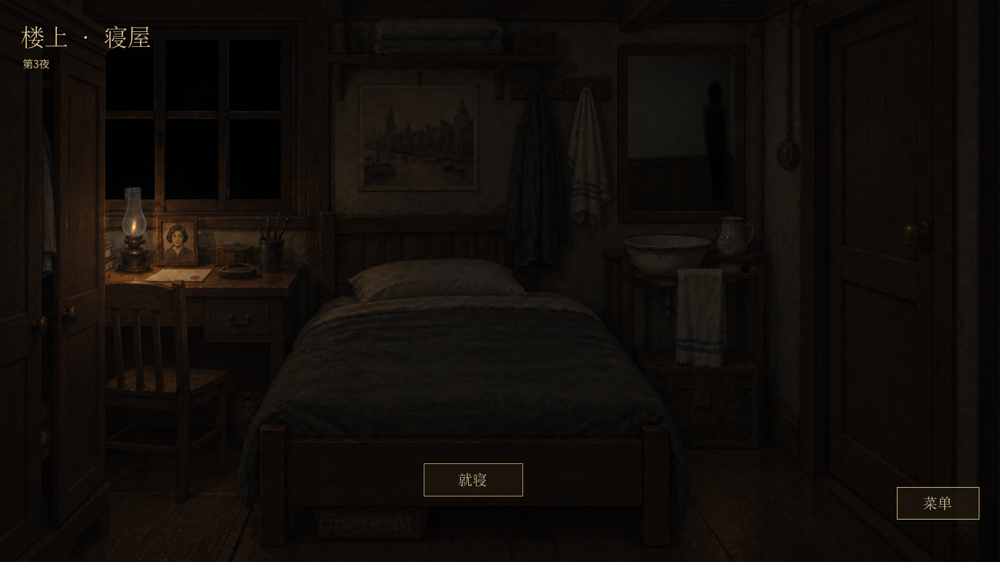
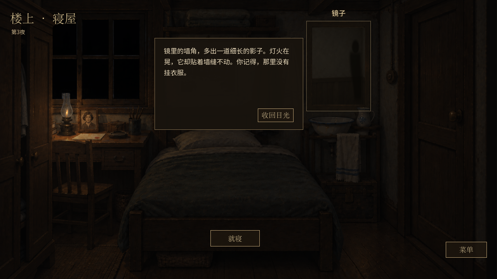

# 寝屋镜面：追看后的影子

本地实现基于 main `8a9dd3d`，分支 `codex/bedroom-shadow`。沿用 v22 运行与存档，不新增随机事件、伤害或存档字段。

## 触发与结束

- 当前夜成功主动追看铜镜、个人危机尚未解除：寝屋镜中的墙角出现一道不随灯火晃动的细长影子。
- 普通用镜、只遇见异象、停止或过期追看、单纯店铺阴侵、单纯命灯损伤均不触发。
- 点击镜子只观察，不耗时、不写存档、不造成伤害。照片、信件、命灯和菜单继续可用。
- 就寝沿用已有危机选项；避险成功或承受重伤后仍生还，影子消失，已有命灯损伤保留。死亡及离开寝屋时组件清除影子。
- 读档从当前夜的成功追看与个人应对记录恢复表现，事件实例沿用 `mirror/<visit_id>`。失去铜镜所有权及治疗本身不能解除追看危机。

`BedroomMirrorFeedback` 只生成读模型；现有 `BedroomMirror` 独立组件新增 `shadow` 表现。着色器只改变镜内墙角，保留固定反射墙面、黑窗、暗室及命灯间接光。保存失败直接沿用原子操作回滚后的状态，不保留临时视觉标记。

## 本地试玩

从此分支项目目录运行：

```powershell
powershell -ExecutionPolicy Bypass -File .\tools\preview_bedroom_shadow.ps1
```

先生成第三夜的真实流程检查点，再直接进入有影子的寝屋。可观察镜子、打开私人信件和菜单、就寝并处理危机；重新运行脚本可重新体验。首次导入和准备检查点需要稍等。

- `-Width 1280`：1280×720；默认1600×900。
- `-Play`：从主菜单正常游玩。
- `-GodotPath '路径'`：指定 Godot 4.6.1。
- 脚本隔离用户目录至 `.artifacts/shadow-preview/user`，不覆盖平时游玩的存档。

## 验证结果（2026-09-13）

| 检查 | 结果 |
| --- | --- |
| 新功能模型与三条实际经营路线 `run_bedroom_shadow.gd` | 961项通过 |
| 独立进程读取9个房间、应对后、次日或死亡检查点 | 20项通过 |
| 命灯全部伤害、恢复、旧档及保存失败回归 | 2364项通过 |
| 照片与私人信件保存回归 | 333项通过 |
| 寝屋完整流程回归 | 701项通过 |
| 新功能实际窗口：1280×720、1600×900 | 各31项通过 |
| 镜子组件像素、区域隔离、清理及延迟模式回归 | 35项通过 |
| 命灯实际窗口回归 | 85项通过 |
| 照片、信件、焦点及就寝实际窗口回归 | 162项通过 |
| 一键试玩脚本 | 已实际启动并进入第三夜寝屋 |

新功能路线覆盖正确避险、同事件重伤升级、铺内重伤叠加后睡眠死亡、失败回滚、重复操作、读档及次日无残影。所有权丢失与治疗后仍保留影子的检查是读模型测试夹具，不宣称新增了实际出售或治疗剧情。

实际窗口测试通过鼠标输入观察与关闭、打开书桌/菜单、点击就寝和原有避险按钮，再点击“放松入眠”进入第四夜。重复观察前后对比状态及存档文件字节，无变化。镜子组件像素检查确认影子不影响镜框及房间其他区域。

旧镜子测试曾要求熄灯时镜框像素不变，与已合入的间接光规则冲突；改为验证镜框素材与位置保持、亮度随命灯减弱。日志中有本机 Windows 根证书读取警告，不影响本地运行；最终检查无脚本或着色器错误。







原始截图位于 `docs/qa/bedroom-shadow/`，包含两种尺寸的正常镜面、异常镜面、观察、危机与解除后画面。所有测试日志与生成的测试检查点保存在本地 `.artifacts/`。本批等待本地审阅后再推送、合并。
