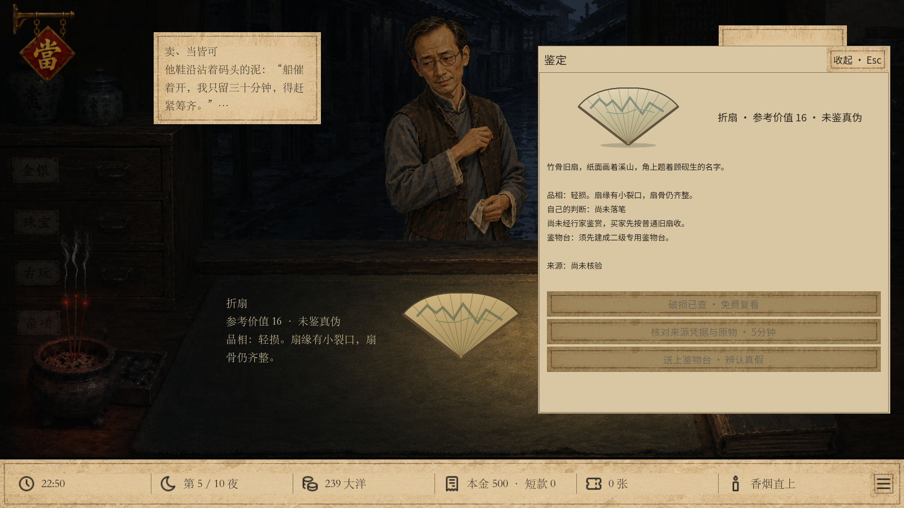
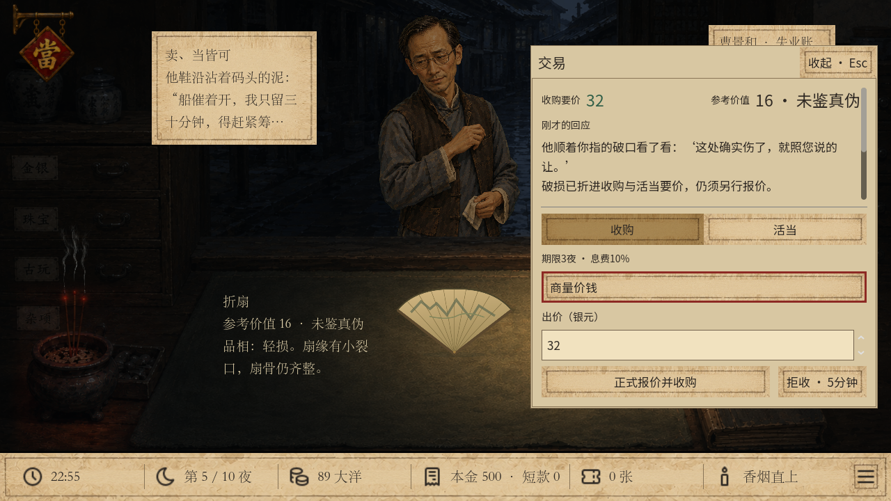

# 折扇检查整合 · v29 验收

日期：2026-09-22（2026-09-21开始实施）。状态：本地交付，未推送、未合并、未制作发行包。

**同日后续调整**：知识已改为按领域、对象独立记录；“顾砚生知识”在旧账柜第一柜花1次准备直接掌握，不再要求先找册。下文升级补充中关于“取得图录后研习”的内容是此前验收快照，现行流程和新增验收见[旧账柜知识](SHOP_KNOWLEDGE.md)。

## 实现与来源

在 `.artifacts/shop-appraisal` 的既有v28未提交成果上增量开发。基础HEAD为 `026b0579270400ce5a9a48f40c7010ce8b11ff41`；开发前检查根目录与各隔离工程清单，29尚未占用。新运行 `fan_condition_ten`，保留v28、v27入口。没有编辑其他关系、美术或铜镜任务目录。[来源记录](qa/fan-condition/source.json)。

新增独立品相服务，统一处理生成、已查状态、折价、检查资格、破损让价及说明。品相和压价前后金额存于物品独立字段；原鉴定记录、判假说法与真假ID互不替代。接入会话命令、动作重放、自动保存及完整回滚。

## 检查结果

Godot 4.6.1，在隔离测试数据目录实际执行：

| 检查 | 结果 |
| --- | --- |
| `fan_condition.gd` | 2078项通过，0失败 |
| `fan_condition_extended.gd` | 154项通过，0失败 |
| `fan_condition_restore.gd` | 独立进程18项恢复检查通过 |
| `fan_condition_performance.gd` | 25项通过，0失败 |
| `fan_condition_ui.gd` | 1280×720及1600×900，各81项实际输入断言通过 |
| `fan_bargaining.gd`，v28议价 | 641项通过，0失败 |
| `shop_appraisal.gd`，v27鉴物台 | 462项通过，0失败 |
| `fan_draft_rules.gd`，旧草稿流程 | 163项通过，0失败 |
| `fan_condition_reunion.gd`，新版铜镜流程 | 2499项通过，0失败 |

[测试日志与截图目录](qa/fan-condition/)。日志中的Windows根证书读取提示不影响本地游戏；已检查无脚本错误、解析错误或失败断言。

重点覆盖：

- 无台检查、升级前后检查耗时一致、未查品相不泄露、旧按钮与旧命令不能绕过鉴物台；草稿免费，落笔10分钟。
- 三种真假×三种品相；普通／自鉴／行家价值；买家倍率与15%来源溢价顺序；陈列报价固定且只折价一次。
- 两种让价顺序、20%／50%、四舍五入最低1、买断与活当独立基数、重复无效操作不记录不写盘。
- 客人到期与03:00严格边界、强制待办、离场、禁忌、轮次耐心、自有现货／在当／已售状态。
- 真货判假成交隐藏事件与原有名声规则；破损压价反应不读取真假或识货程度。
- 真正存档库写盘故障：检查、判假、破损压价及最终收购失败，状态与原文件字节均恢复；随后重试成功。
- 新存档跨进程恢复与档案分叉、品相和压价字段篡改拒绝、旧运行不补字段。

固定1000个种子的独立品相样本为589完整、304轻损、107重损，与暂定60／30／10权重相符；同种子改真假不会改变品相。该样本不是正常玩法真迹概率的统计。

## 经济与时间实测

下表为固定自然来客，均已完成自鉴及品相检查。比较正式收购至向回收商出售，不含前面的5分钟检查、10分钟落笔；“毛利”不扣设施投入、行家费用及整夜经营费用。[机器记录](qa/fan-condition/economy.json)。

| 样本 | 说法 | 收购成本 | 出售收入 | 交易毛利 | 谈价／交易动作耗时 | 出货 |
| --- | --- | ---: | ---: | ---: | ---: | --- |
| 轻损，急用钱 | 普通报价 | 28 | 15 | -13 | 25分钟 | 第五夜 |
| 同上 | 只谈破损 | 22 | 15 | -7 | 30分钟 | 第五夜 |
| 同上 | 只说假画 | 17 | 15 | -2 | 30分钟 | 第五夜 |
| 同上 | 破损后说假画 | 13 | 15 | +2 | 35分钟 | 第五夜 |
| 重损，普通情境 | 普通报价 | 28 | 10 | -18 | 25分钟 | 第五夜 |
| 同上 | 只谈破损 | 14 | 10 | -4 | 30分钟 | 第六夜 |
| 同上 | 只说假画 | 22 | 10 | -12 | 30分钟 | 第六夜 |
| 同上 | 破损后说假画 | 11 | 10 | -1 | 35分钟 | 第六夜 |

重损样本接近关铺，多谈价使当晚20分钟外出无法完成；游戏正确阻止出货，跨夜后实际售出。表中动作耗时不计封铺、休息与其他客人接待。折价降低占款，但无法保证获利；旧销路的窗口、行程与倍率未变，货物基数计入实际品相。

两种让价逐次取整，轻损急用钱样本先破损后判假底价13，反向为14；活当底价均为11。该差异来自每步四舍五入，非重复折价。

## 界面与性能

两个分辨率均实际点击检查、模拟失败后重试、破损谈价、开启图录、圈点和落笔；确认旧检查按钮、17–83区间及商誉分数未显示。交易页将当前要价移到顶部，避免回应文字挤掉价格；验货页删去重复品相提示。

实际冷重放约118–156毫秒；缓存重放约31–44毫秒，重复重放动作数为0；页面数据读取约6.6–8.2毫秒。缓存篡改检查通过。数值为本机测试观察，详见[性能记录](qa/fan-condition/performance.json)。

## 本地交付

完整启动指令见[试玩说明](FAN_CONDITION_PLAYTEST.md)。正常新局、隔离 `no-bench` 及 `fan` 快速入口经过实际窗口启动检查；两个分辨率运行同一套源码。高级设施、修复破损及其他商品检查整合仍在本批范围之外。

## 2026-09-22补充验收：二级台不再依赖工具册

范围：仅v29取消二级台改造、扇画工具购买的工具册前置；保留一级台、资金、准备额度、施工与研习条件。未找到书、已找到未研习、已研习分别显示；鉴物台操作排在说明前，首次打开即可看到二级升级。v27/v28保持原规则，已有v29存档无需重开。

| 检查 | 本次结果 |
| --- | --- |
| `tests/bench_independent.gd` | 127通过，0失败：无书升级、80/30费用与准备、两夜完工、找书与研习分开、重复操作无效、写盘失败完整回滚、冷重放及已有v29保存恢复 |
| `tests/bench_independent_ui.gd` | 1280×720、1600×900各24断言，0失败：真实点击无书升级、无书买工具，研习仍禁用；升级按钮无需滚动可见 |
| `tests/shop_appraisal.gd` | v27回归462通过，0失败 |
| `tests/fan_bargaining.gd` | v28回归641通过，0失败 |
| `tests/fan_condition.gd` | 统一启动器重新生成并校验v29试玩样本，2078通过，0失败 |
| 统一启动入口 | `upgrade -Wide -Verify`、`fan -Wide -Verify`均实际打开窗口并通过，无脚本错误 |

测试日志只有本机已有的根证书读取警告，没有脚本解析错误或测试失败。证据：[无书升级1280](qa/fan-condition/bench_independent_1280_upgrade.png)、[无书升级1600](qa/fan-condition/bench_independent_1600_upgrade.png)、[工具已买但未取得图录](qa/fan-condition/bench_independent_1600_tools.png)、[规则日志](qa/fan-condition/bench-independent.log)、[界面日志](qa/fan-condition/bench-ui-1600.log)。
