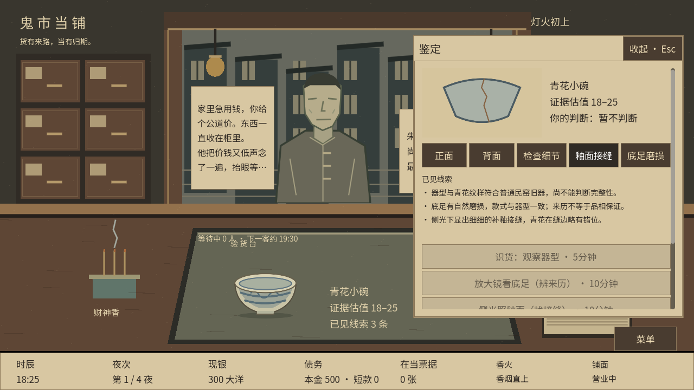
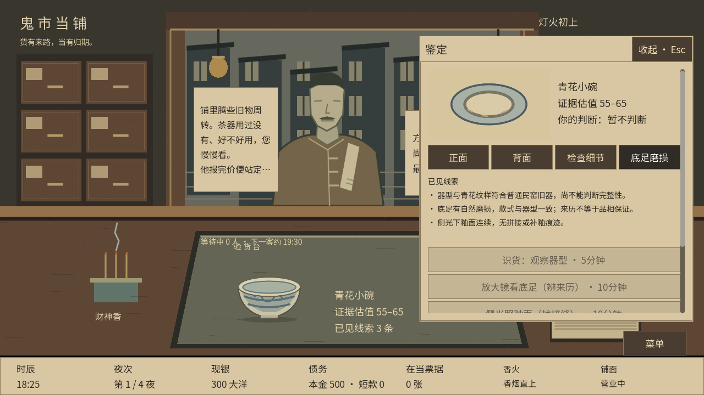
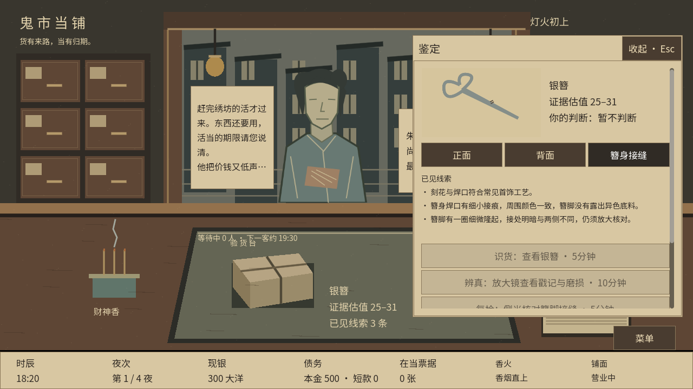
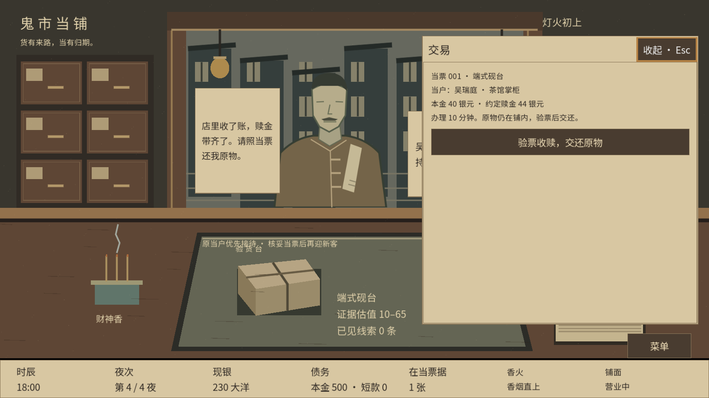
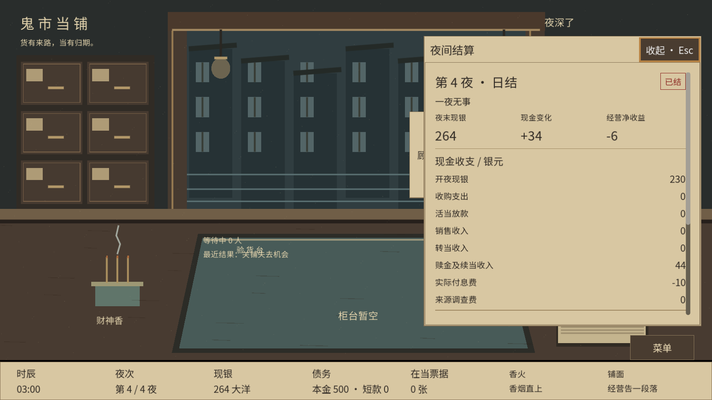

# 四夜普通经营样板 · v11

## 本地启动

本轮源码在独立工作树 `.artifacts/four-night-samples`，分支 `codex/four-night-samples`。在原项目根目录运行：

```powershell
& "./.tools/godot-4.6.1/Godot_v4.6.1-stable_win64_console.exe" --path "./.artifacts/four-night-samples" "res://scenes/four_night.tscn" -- --seed=42
```

该命令直接运行引擎，无需更改 PowerShell 脚本执行策略。在合并后的项目根目录或直接打开本工作树时：

```powershell
& '你的Godot路径/Godot_v4.6.1-stable_win64_console.exe' --path . res://scenes/four_night.tscn -- --seed=42
```

省略 `--seed` 每次新局随机；传入种子可复现全部来客与预约。读取存档始终使用存档中的种子。控制台输出 `FOUR NIGHT SEED`。默认入口保留主菜单与三夜原型；四夜样板通过上述专用场景进入。

## 可体验的内容

- 每夜四位新客，四夜共十六位；六类机会分占不同随机席位。拒绝、错过或早关门不会补刷。
- 第一夜有一位只办活当的原当户；放款后第四夜带原票来赎。赎当优先办理十分钟，新客时间顺延。
- 四夜局的当约均为三夜、固定息费10%向上取整。未到期当票在第四夜结束后仍保留；到期无人来赎继续使用留货或转当处置。
- 有效瑕疵、无效理由、三十分钟急客、来源核验、活当占款、持货等买家，分别构成不同取舍。八类人物均支持一次性贬低，原耐心和口供反应保留。
- 商会预约在购货机会之后的一夜19:00–21:00收一件指定品类，基础报价为原有1.25倍规则；来源溢价另算。没有额外常驻同类商会高价机会。
- 开局现金300、本金500，每夜利息5、铺费5。第四夜封铺、合账、回房、就寝、日结、合卷；保留真实债务和资产。
- 青花碗接缝、自然底足磨损、银簪接缝三幅草图，仅在对应实物证据获得后出现。

所有关键机会均不作为玩家任务清单。四夜局没有铜镜、阿七、主线事件、准备行动和完整行情系统。

## 版本与保存

- 实施基线：`00864844ae00aa2f0adf3ef825d091145c236ae7`。推送前已整合最新 `main` 的 `5d22feef9bcfd9e0e2246aadc81a7f256a82fa31`，保留线上主菜单与四夜独立入口。
- 输入快照：原目录 `.artifacts/four-night-input/manifest.json`、`input.patch` 与逐文件副本。原目录的主菜单、美术方案和策划附件未纳入本轮。
- 新内容与新局使用v11；四夜场景使用 `user://ordinary_four/autosave_v11.json`，三夜场景使用 `user://p0/autosave_v11.json`。
- v9和v10继续读取冻结目录。v10的100现金/300本金与300现金/500本金分别执行完整历史验证，只有通过的配置才恢复。无法验证保留文件并报告错误。
- 继续使用原有夜末、房间和就寝检查点。报价不会自动写盘；写盘失败退回动作之前。读取不会重抽顾客、重定价或变更旧合同。

## 验证入口

`tools/test_windows.ps1` 包含原功能回归、冻结v10、整合v11三夜、四夜512种子、实际窗口双分辨率及独立进程保存恢复。需要 Godot 参数及一个新的输出目录：

```powershell
& ./tools/test_windows.ps1 -GodotPath '你的Godot路径/Godot_v4.6.1-stable_win64_console.exe' -OutputDir './.artifacts/validation'
```

专门入口：`tests/run_four_night.gd`、`tests/run_integrated_variety.gd`、`tests/four_checkpoint_process.gd`、`tests/four_ui_smoke.gd`。

体验评审仍需要负责人判断：能否说明收或不收的理由；三十分钟是否足够完成重点判断；是否愿意为一次后续收货机会占款；第三夜是否仍记得那位尚未来赎的原当户。自动测试验证规则、时序、窗口输入和恢复，不替代人的体验判断。

本轮仅交付源码与草图，不制作试玩包。负责人已于2026-09-06完成本地测试并确认推送合并。

## 本轮验证结果 · 2026-09-06

负责人本地测试确认通过后，整合最新主菜单并重新运行完整Windows源码验证，**75项全部通过**。本次记录在原目录 `.artifacts/four-merge-validation-01/results.json`，包含两种分辨率的主菜单和四夜样板检查，以及全部跨进程恢复验证。下面保留首次交付时的验证记录。

完整Windows源码验证共 **73项全部通过**，输出在原目录 `.artifacts/four-regression-04/`。随后补充的四夜检查 **28,161项断言、0失败**；整合三夜检查 **16,973项断言、0失败**。补充日志为 `.artifacts/four-final-core.log` 与 `.artifacts/four-final-integration.log`。

- 512个种子验证16席位、六类机会、适配人物和变体、身份唯一、先购后收、重复读取稳定。
- 实际规则路线覆盖赎回、拒收、早关、当夜卖出、等待买家、第四夜仍在当、未赎留货、每次接待的贬低历史恢复。10%息费覆盖30→33及取整边界。
- 真实窗口自动输入通过1280×720与1600×900：证据解锁、完整说辞、滚动与焦点、收当成交页、四夜房间流程及原主赎回。逐图检查了证据图和最终账目。
- 独立进程验证第二夜、第四夜回访前、回访后房间、就寝和最终摘要。覆盖写盘失败回滚、重试和重复结算阻止。
- v9、两种资金配置的v10以及v11在各自目录执行历史校验；本轮按已固定的输入快照整合。

[验证记录](qa/four-night/validation.json) · [开发用种子42完整编排（含隐藏答案）](qa/four-night/seed42-plan.json)

### 草图与游戏截图







来源行动另补充了与事件、铜镜和存放处理的耗时交叉核验，拒绝把同一分钟重复用于两件事的历史记录。

耗时交叉核验补齐后，7个受影响核心测试套件全部重跑通过；日志为原目录 `.artifacts/four-timing-*.log`。原目录收尾比对中的独立更新清单保存在验证记录中，未覆盖这些文件。
