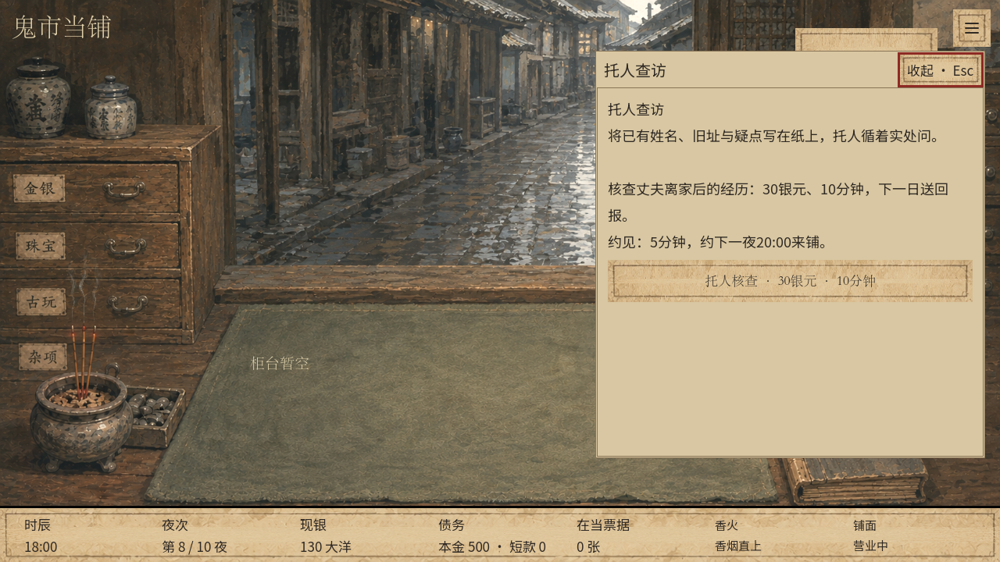
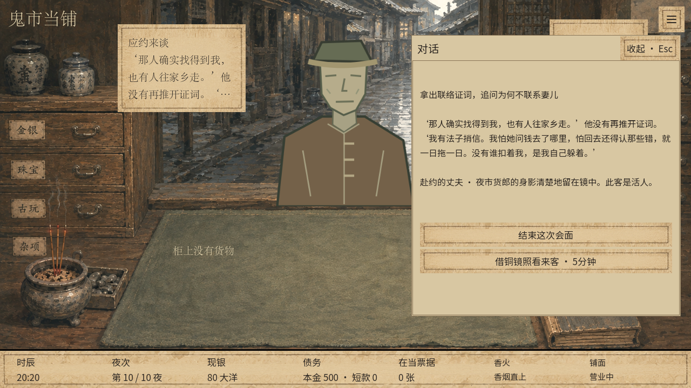
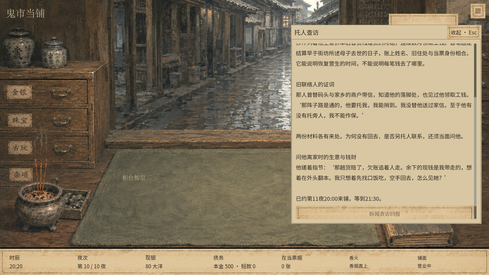

# v23 十夜旧事试玩与验证

v23整合到最新main，默认新游戏完整经营至第十夜。包含铜镜查访与再次会面，以及库存事件提醒、等待选项、封铺与回房入口、存档和操作响应优化。

## 启动

在项目目录运行：

```powershell
.\tools\play_v23.cmd
```

或直接启动引擎：

```powershell
& .\.tools\godot-4.6.1\Godot_v4.6.1-stable_win64_console.exe --path .
```

首次试玩请选择新游戏。旧存档继续原版本规则，不迁移到十夜，也不追溯增加命灯伤害。

## 隔离快速试玩

```powershell
.\tools\play_v23.cmd -Stage commission
.\tools\play_v23.cmd -Stage report
.\tools\play_v23.cmd -Stage meeting -Wide
```

| 入口 | 实际进度 | 可以测试 |
| --- | --- | --- |
| commission | 第8夜，现实材料齐备，未付查访费 | 菜单“托人查访”，支付30银元、耗时10分钟，下一日送回报 |
| report | 第9夜，回报已送到但未拆阅 | 拆阅取得材料；5分钟约第10夜20:00来铺 |
| meeting | 第10夜，丈夫已在柜前，未问实质问题 | 照客、三段问话、中断会面、第11夜重新预约待办 |

这些是示例进度，不是任务开放日期。脚本先通过真实指令生成并验证测试资料，再进入对应页面。测试资料在 `.godot/qa/v23/`；试玩存档使用隔离的测试用户目录与 `user://tests/v23_preview/`，不接入玩家正常存档库。`-Wide` 使用1600×900，否则1280×720。可用 `-Godot` 指定其他本机Godot 4.6.1路径。

## 完整路线

1. 第三夜经手铜镜后查用镜短记；其后循旧当票、街坊证词、身份链、两册矛盾、动机旁记调查。保留原最早夜次与耗时，开放后可继续查。“封存”“继续使用”均不封锁查访。售镜、未照客、错过货郎仍能循现实材料核实。
2. 身份链、两册矛盾和动机旁记齐备后，营业菜单“托人查访”受理委托。铜镜的“照看与处置”也可跳转。现银不足或无法在封铺前完成则不执行；正式剧情、危机、赎当须先处理，普通客人照常等候。
3. 查访一次30银元、10分钟；费用单列现金流水与经营费用。下一次日期推进收到回报通知，主动拆阅才取得码头结算抄件和联络人证词。查看不推进任务日期。
4. 拆阅后花5分钟约下一夜20:00来铺，等待至21:30。预约独立排队，不覆盖六个基础客位。丈夫与第三夜是同一具体人物，纯谈话，没有第二块怀表；借镜仍为活人。
5. 三段问话各5分钟，依次询问生意与钱财、恢复营生时间、为何有渠道却回避妻儿。未完成便离场只保留耗时和前面已取得的回答，可重约。全部问清后选择准备将事实带到镜前或暂收材料；无镜仍可查明，但不能记下镜前准备。

第七夜可继续经营，第十夜正常结束。第十夜仍可委托或预约，预计第十一夜的事项保持待办；不提前投递、不判失败、不开放第十一夜。正式镜前对质、女主人离去、铜镜能力失效、换物补救不在本批。

## 体验整合

- 每夜六个基础客位，共十夜，另有准备产生的来访和独立预约。熟客、指定活当、剧情及已透露来访受保护。原四次一次报价/湿包夜客仍安排在前七夜，两类铜镜阴客保留原范围与次数。
- 丈夫、一次报价客为活人；湿包客及两类铜镜阴客为亡魂。具体来访决定生死，不由共享职业模板误判。
- 通用照客每次5分钟、不限次数，不触发个人损伤。旧事窥看与危险追看独立；追看和湿包受害采用个人命灯伤害，同事件累计去重。覆布、睡眠、售镜、封存湿包不治疗伤害。
- 铜镜追看未处理的个人危机会在寝屋镜面留下阴影；应对后解除阴影，已受的命灯损伤保留。寝屋旧镜仍为另一个物品。
- 第8–10夜延续普通买卖、到期/提前赎当与熟客回访。第7夜实际交出换物替物后，第8夜死讯正常投递；第10夜以后的后果留待。
- 物品见闻仅收材料、关键回答与进度，不放照客流水，也不显示“复看不耗时”。

## 保存

内容标识 `mirror_investigation_ten`，内容与存档版本23；自动档案位 `auto/mirror_investigation_ten`，旧独立文件入口 `user://mirror_investigation_ten/autosave_v23.json`。统一最外层动作日志负责原子回滚和通知，铜镜与命灯不嵌套写盘。回放不写文件、不重复发通知。沿用原保存时机，命灯实际受害、恢复或死亡自动保存；营业中没有随时手动保存。

## 本地验证

2026-09-14，Godot 4.6.1 Standard / Windows / Compatibility。以下检查均通过：

| 检查 | 结果 |
| --- | --- |
| `tests/run_investigation.gd` | 2362项通过；64种子、提前/示例/延迟/不查/售镜路线、部分会面、十夜结束及重放 |
| `tests/investigation_edges.gd` | 58项通过；费用与时间不足、证据顺序、问答中断、伪造费用/日期/身份/问答/伤害拒绝、原子回滚、真实伤害存档读写、湿包及寝屋阴影 |
| `tests/investigation_business.gd` | 1075项通过；真实第7夜交付、第8夜死讯、跨七夜熟客保护及十夜经营重放 |
| `tests/investigation_ui.gd` | 1280×720、1600×900各74项通过；真实鼠标输入，委托扣款、拆信、预约、照客、问答、中断、重约、阶段态度及收尾 |
| 旧基础流程 `run_all` | 1800项通过 |
| 旧命灯 `run_personal_risk` | 2364项通过 |
| 旧夜客 `run_night_market` | 38610项通过 |
| 商品复核 `run_goods_expertise` | 8544项通过 |
| 照片与私人信件 `run_room_keepsakes` | 333项通过 |
| 铜镜第一章 `run_mirror_chapter` | 4090项通过 |
| 旧铜镜边界/活当/保存 | 93 / 4764 / 13项通过 |

引擎有本机根证书读取提示，未影响离线游戏、保存和测试。GDD当前57页经本机Word导出检查，新增v23附录在第57页；打包渲染器因未安装LibreOffice无法运行，已使用Word完成替代版式验证。未重新制作发行包。

## 实际画面

截图与检查日志在 [验收目录](qa/investigation/)。






