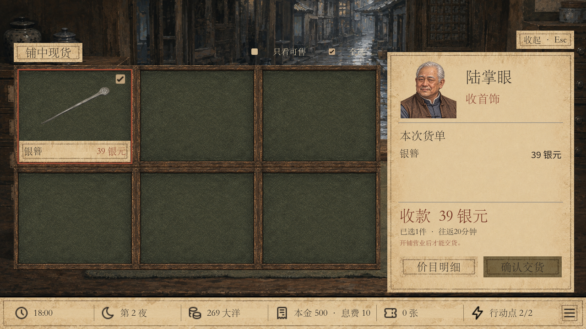
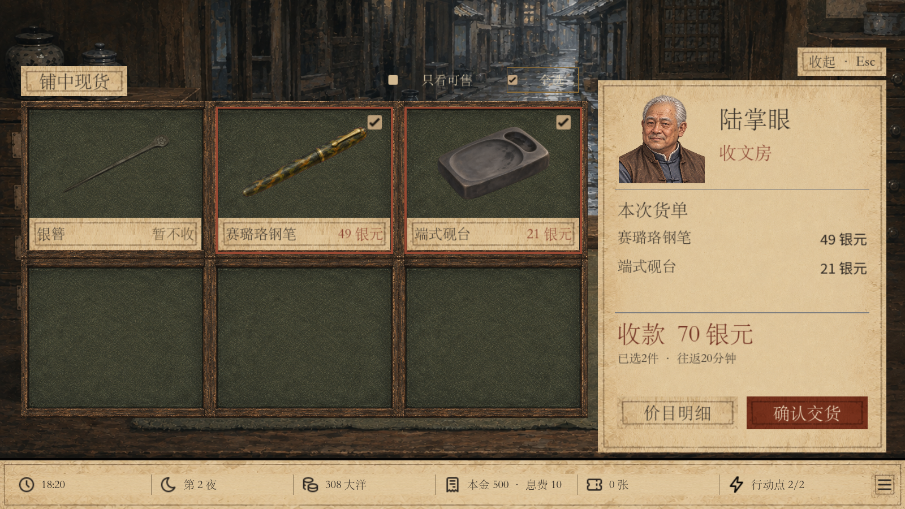

# v44 陆掌眼交易整合发布

日期：2026-09-25。整合基线：main `30a325e`（相机、行动点、富商立绘已发布）。

## 本次内容

- 第二夜开铺前孙大元、陆掌眼按顺序登门；均沿用人物立绘、底部短页对白、独立回应选项的 RPG 排版。
- 陆掌眼告别后开放右下角来信和卖货；第一夜隐藏。新增老年陆掌眼立绘，修正孙大元显示比例。
- 独立六格售货界面，含筛选、全选、分页、需求、价目明细及原有成对加价；沿用真实出货规则和每趟20分钟。
- 勾框一体、名称与价格同行、标题居中；货单去除叉号与清空按钮。底部左侧价目明细、右侧确认交货，同排同宽高。
- 背景音乐默认关闭。营业页保留最近一期本金到期文本；HUD 区分每日息费与未付欠费。
- 工作树启动脚本能找到主仓库的 Godot，同时保留相机等鉴定预设。

## 入口与存档

| 入口 | 内容 | 自动存档 | 档案库 |
| --- | --- | --- | --- |
| `play-lu-v44.cmd` / `play-unified.cmd` / 默认项目 | v44 `lu_trade_unified` | `user://lu_trade_unified/autosave_v44.json` | `user://lu_trade_unified/save_library_v44.json` |
| `play-lu-v43.cmd` | 原本地陆掌眼 v43 `porcelain_release` | `user://lu_introduction/autosave_v43.json` | `user://lu_introduction/save_library_v43.json` |
| `play-camera-v43.cmd` | 原 main 相机 v43 `camera_unified` | `user://camera_unified/autosave_v43.json` | 原共享档案库 |
| `play-porcelain-v42.cmd` | 瓷器 v42 `porcelain_release` | `user://porcelain_release/autosave_v42.json` | 原共享档案库 |

两个历史 v43 使用各自的 manifest 与 run 身份解码，不覆盖旧内容或存档。v44 基于相机 run 仅增加陆掌眼事件与标记，保留主线既有夜晚和规则。

## 本次发布验证

Godot 4.6.1，独立发布工作树，隔离 APPDATA；资源导入通过。

| 检查 | 通过 | 失败 |
| --- | ---: | ---: |
| 陆掌眼规则、首次见面、失败回滚、冷启动解码、两套 v43 与 v42 兼容 | 128 | 0 |
| 卖货真实操作、选择、金额、失败保留货单、双尺寸布局 | 114 | 0 |
| 陆掌眼 RPG、分页、回应、来信解锁、双尺寸 | 243 | 0 |
| 孙大元 RPG、立绘、双尺寸 | 210 | 0 |
| 相机鉴定规则（保留历史 v43） | 3958 | 0 |
| 相机主线与旧债路线（保留历史 v43） | 3151 | 0 |
| 合并版默认 v44 相机 UI | 69 | 0 |
| 共用行动点 UI | 115 | 0 |
| HUD、息费与到期提示 | 133 | 0 |

四个新旧启动入口通过 `-Verify`，`git diff --cached --check` 通过。

实际渲染检查覆盖 1280×720、1600×900。发布版交易截图见本页下方；测试完整图保留在工作树 `.godot/qa/`。

