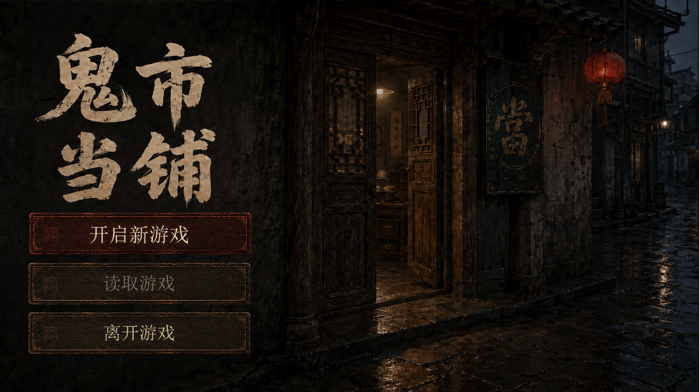

# 雨夜当铺主画面接入记录

2026-09-06：使用负责人最终贴图确认的构图——左侧“鬼市当铺”与三枚菜单木牌，右侧雨夜铺门、灯笼及门内暖光。

## 已接入游戏

工程启动场景为 `scenes/start.tscn`，复用现有 `scenes/main.tscn` 的游戏初始化。启动时隐藏并停用柜台界面，选择新游戏或成功读档后恢复柜台、释放主菜单。

- **开启新游戏**：调用现有 `RunSession.new_run()`。已有进度时先确认，可返回取消；确认不会立即覆盖文件，仍由游戏原有保存时机落盘。
- **读取游戏**：调用现有 `load_checkpoint()`，成功恢复后进入本体。无档时按钮不可用；坏档显示实际错误并保留原文件和主菜单。
- **离开游戏**：退出当前游戏进程。

存档版本、兼容迁移和保存规则由现有游戏本体维护，主菜单不另建存档格式。历史测试仍可直接加载 `main.tscn`。

## 按钮与动效

三枚按钮平时均为暗木色，移入时缓慢显出暗红漆色，伴随轻微木牌抬起、文字重影及延迟门灯变暗；移开约 0.8 秒恢复木色。“开启新游戏”不再常驻红色。鼠标移动会清除残留键盘选择；键盘选中仍有可见焦点。

原生界面使用 `assets/main_menu/` 的场景及木牌资源、真实 Button 控件、宋体系统字库及随包 Noto Sans SC 后备字库。场景等比缩放并居中。设置 `gui/accessibility/reduce_motion=true` 可关闭位移、文字重影和门灯变化，保留即时颜色反馈。

网页视觉预览保留在 `artifacts/main-menu-preview/`，它本身不读写游戏进度。

## 本地启动

在工程根目录运行：

```powershell
& ./.tools/godot-4.6.1/Godot_v4.6.1-stable_win64.exe --path .
```

或导入 `project.godot` 后按 F5。本次交付为源码接入，已有 dist 试玩包未重新生成。Windows 构建清单已加入启动场景和 PNG 资源，资源审计新增启动场景检查；未执行整包导出验收。

## 验证结果

- Godot 4.6.1 编辑器导入及脚本解析通过。
- `tests/title_menu_ui_smoke.gd`：1280×720 和 1600×900 各 **52 项断言，0 失败**。覆盖真实鼠标悬停及离开、键盘切换、无档/有档、新游戏确认与取消、实际夜末存档后重新启动读取、坏档保护、减少动态及退出入口。
- `tests/title_menu_ui_smoke.gd -- quit`：实际点击离开游戏，进程正常退出（代码 0）。
- `tests/run_all.gd`：**1799 项断言通过**；`tests/run_room.gd`：**701 项断言，0 失败**。
- 网页 `npm run build` 与浏览器验证通过；三枚按钮实际颜色复原、三种视口、键盘及减少动态检查均通过，浏览器错误为 0。
- 构建与测试 PowerShell 脚本语法检查通过；相关已跟踪修改的 `git diff --check` 通过。

测试使用独立 APPDATA 和临时存档，不操作玩家存档。原生测试日志与截图位于 `.artifacts/title-menu-check/`。该环境每次启动 Godot 都报告系统根证书读取失败；上述离线加载、交互和存档检查全部通过，未验证联网功能。

主画面已检查完整构图、按钮静止/悬停/恢复状态和两种窗口尺寸。原生控件较网页略有字体渲染差异，无档时读取文字变灰是实际功能状态。



合并前基于最新 main（0086484）的独立分支复测：两种主菜单窗口各 52 项通过、真实退出通过、M0–M7 1799 项通过、房间 701 项通过、议价 182 项通过。未包含工作目录中另行开发的 v10 内容。日志位于本地 .artifacts/menu-merge-check/。
