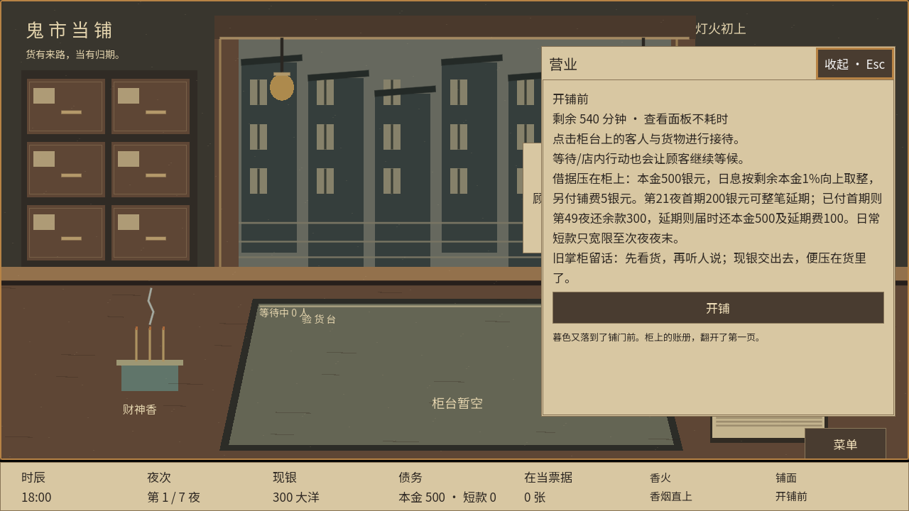
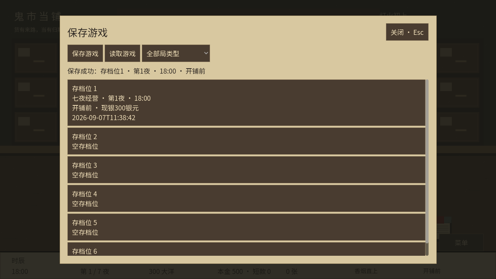
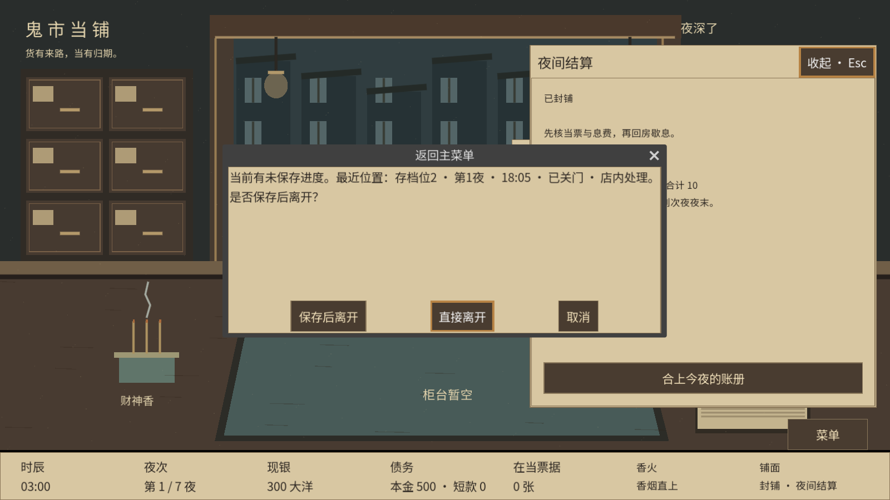
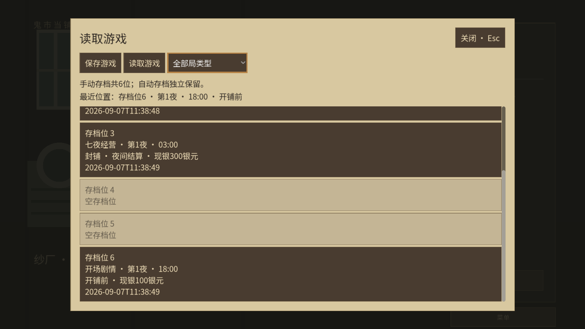

# 手动存档与读档：本地验收

本轮从已提交的开场基线 `facb3db` 建立独立工作树 `codex/manual-save-slots`。源码位于 `.artifacts/manual-saves`，保留原工作目录；本轮不制作试玩包。用户试玩确认后已授权推送合并。

## 启动

在 `C:\Users\alvachen\Documents\ChatGPT\pawnbroker` 的 PowerShell 中执行以下命令。直接运行 Godot，不依赖 PowerShell 脚本执行策略。

七夜局，种子 42：

```powershell
& ./.tools/godot-4.6.1/Godot_v4.6.1-stable_win64_console.exe --path ./.artifacts/manual-saves res://scenes/seven_night.tscn -- --seed=42
```

主菜单：

```powershell
& ./.tools/godot-4.6.1/Godot_v4.6.1-stable_win64_console.exe --path ./.artifacts/manual-saves
```

开场局：

```powershell
& ./.tools/godot-4.6.1/Godot_v4.6.1-stable_win64_console.exe --path ./.artifacts/manual-saves res://scenes/opening.tscn
```

读档会使用存档所属的内容、种子、编排与运行规则，启动命令中的种子不会重新编排已保存的局。旧内容初始资金按原规则恢复，本轮没有调整开场或其他局的经济配置。

## 玩家可见规则

- 游戏菜单中的保存、读取和主菜单读取共用同一列表。柜台左上角没有额外入口；开场剧情右下角「菜单」也使用这套功能。六个手动槽共享，自动存档另列，可筛选局类型。
- 营业中不能保存；列表说明原因。开铺前、提前关铺、03:00未结算、房间、就寝、日结和终局可保存。未完成的必要选择恢复到原位置。
- 可以在营业或失败后读档。读取前确认，校验成功才替换当前局；读取后清除上一局的成交、离场和临时面板反馈。
- 空槽直接保存，已有槽确认覆盖。保存失败保留旧档；成功显示槽位、夜次、时刻和阶段。操作不花时间或银元。
- 返回主菜单、退出和正常关闭窗口共用离开提示。可保存时支持选槽保存后离开；营业中仅直接离开或取消。查看面板、滚动和焦点变化不算新进度。
- 读取可继续游玩的旧档会建立新的尝试标识。旧《绝当录》《破铺录》保留，重复读取终局不重复归档。

## 建议试玩顺序

1. 开铺前存到槽1，覆盖一次并取消，检查原摘要不变。关闭并重新启动，从主菜单读取槽1。
2. 开铺后做一次鉴定或报价，确认保存被禁用；此时读取槽1，检查现金、时刻和来客回到保存时。
3. 做一笔交易后提前关铺，存槽2并重启读取。应保留成交结果和关铺时刻，尚未扣当夜息费。推进至03:00，再存槽3；读取后仍需自己执行夜末结算。
4. 在房间、就寝选择和日结分别保存读取，确认必要选项仍在、费用不重复扣除。
5. 有未保存进度时点返回主菜单或窗口关闭：先取消，再试「保存后离开」。应先选槽，成功才返回或退出。营业时应明确提示无法保存。
6. 开场局另存槽6，再从七夜入口读取槽6，确认恢复开场内容。也可用三夜危机路线保存后失败，再读取旧档重试，查看历史失败记录是否仍在。

## 保存与兼容实现

`SaveLibrary` 是统一管理层；`SaveManager` 的既有自动保存调用接入它，界面通过管理层列档、存档及读档。没有增加营业中自动保存。

新库位于 `user://save_library/library_v1.json`。普通源码启动时对应 `%APPDATA%\Godot\app_userdata\鬼市当铺\save_library\library_v1.json`。六个手动槽、各局自动槽和独立于槽位的追加式失败记录在同一文件内，以一次原子替换提交，避免终局与自动档只写入一半。此路径由这些源码入口共享，不按工作树分别建立库。

外层格式版本为1，内部内容版本维持原值。写入前完整校验状态；临时文件写完回读并核对，再替换原文件。失败时不更新槽位摘要和最近保存位置。读取先完整校验内容，再恢复状态；不会补做未发生的结算。

交易已结束的夜数与财务已结算的夜数分别计算。提前关铺和03:00未结算档可保存当夜成交、售货、回访和剧情历史，同时没有当夜财务摘要。资金、当票到期、风险及事件校验均使用相应边界。

原自动存档文件保留。列表展示既有 v9/v10/v11/v12/v13 相关入口，使用对应冻结内容和完整历史校验读取；旧原始文件仍只允许原来的检查点。旧档中的有效失败记录在读取时并入新库，之后覆盖槽位或开新局不会清除。无效记录提示原因，不清档、不放宽校验。没有新增营业中顾客会话存储。

## 验证结果

测试使用隔离的 APPDATA，没有改动玩家真实存档。

| 验证 | 结果 |
| --- | --- |
| 本轮运行原完整 Windows 源码回归 | 106个测试任务全部通过 |
| 新存读档核心、账目、危机与失败重试 | 1163项断言，0失败 |
| 新槽位四次独立进程写入、读取、继续、终局恢复 | 130项断言，0失败 |
| 新界面1280×720与1600×900 | 每种82项断言，0失败（从菜单点击进入） |
| 开场核心与双分辨率界面补充回归 | 100 + 94 + 94项断言，0失败 |
| 最终房间回归 | 701项断言，0失败 |

新界面测试包含实际鼠标点击、滚动、Tab焦点、覆盖与取消、读档清除离场提示、写入失败反馈、正常窗口关闭取消、保存后返回主菜单及主菜单跨局读档。核心包含真实交易与活当、七夜结局、镜中危机、死亡提交失败回滚、两次重试和破产后重读。

完整回归与新增专项分别执行；不是引用旧任务通过记录。新的测试已加入 `tools/test_windows.ps1`，便于后续统一运行。画面由真实 Godot 窗口生成并检查，仍是简单草图界面；人工自由试玩由本轮交付后继续验收。

结果索引及日志见 [qa/manual-saves](qa/manual-saves/)。








