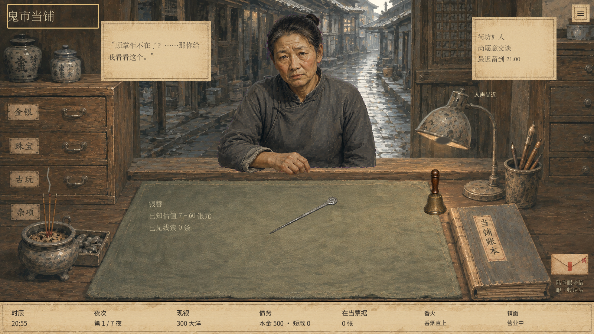
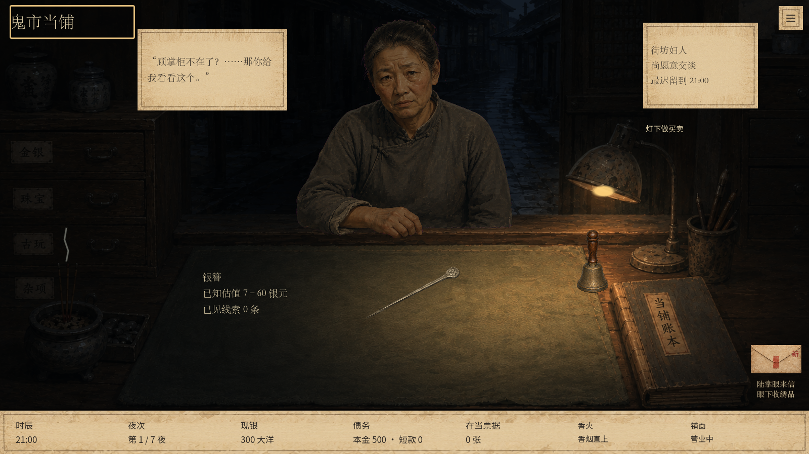
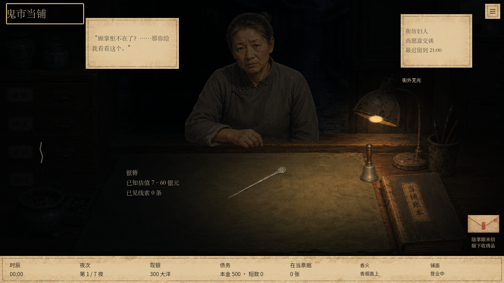
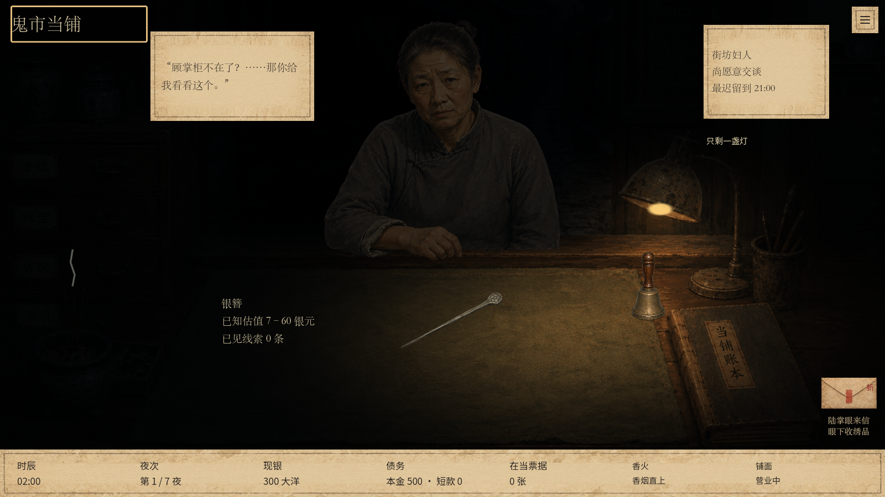
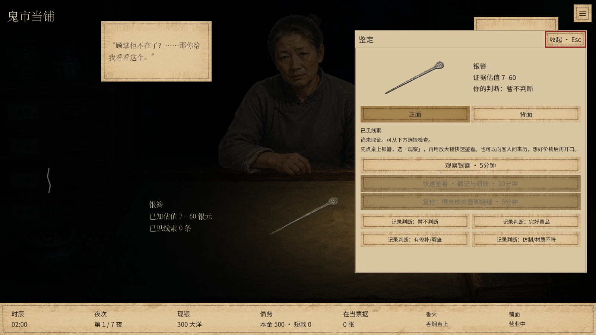
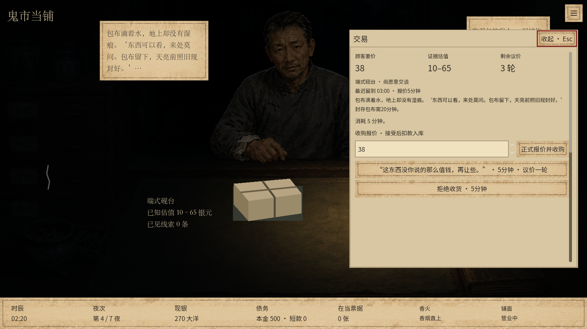

# 四档光照调整与验证

2026-09-11，按试玩反馈替换此前环境声方案。现有 `night_market` v21 存档无需迁移，光照由恢复后的游戏时刻直接计算；本次只修改表现层。

## 画面判断与落地

原版台灯一直发光、午夜背景仅略微染冷，时段差异不足；持续环境声又增加了听觉负担。此次移除新增市声、车声、午夜底音及风声，删除对应播放器、素材、生成脚本和音量控件。原有开场与操作声音不在此次调整范围。

1. **21点前：**整体提亮，铺内木柜、柜台和街道清楚，台灯灯泡不发光。
2. **21点后：**街道与四周明显变暗，台灯点亮，在右侧柜台形成暖光。
3. **午夜后：**远处街道接近隐没，近处人物压暗，货物仍位于灯下。
4. **2点后：**背景进一步接近黑色，近处光域收紧；保持菜单、账本金额及鉴定证据的可读性。

沿用已有背景和立绘，用光效调整实现草稿；没有替换原画、移动热点、修改经营或命灯规则。证据页不随场景染色，避免影响品相判断。

## 本次重新执行的验证

| 检查 | 1280×720 | 1600×900 |
| --- | --- | --- |
| 四档光照及明暗区域采样 | 75项通过 | 75项通过 |
| 实际夜客交易与房间流程 | 117项通过 | 117项通过 |
| 菜单、信封、库存与账本导航 | 75项通过 | 75项通过 |
| 柜铃、长按、键盘与美术预览 | 88项通过 | 88项通过 |

以上均为0失败。另在新进程读取153项存档状态并检查损坏记录拒读，0失败。`git diff --check`通过。本轮未重新跑上一版全部经济编排测试，未将其旧结果算作本次验证。

原始日志：`.godot/lighting-regression.log`、`.godot/lighting-*-1280.log`、`.godot/lighting-*-1600.log`、`.godot/lighting-save-process.log`。

## 截图

以下四档截图为实际Godot渲染的**同一画面光照对照夹具**：保留同一人物及货物、仅切换显示时刻，用于隔离光照差异，不表示该顾客在正式游戏中持续等到凌晨。实际来客离场规则另由交易流程测试验证。

午夜后鉴定页仍保持原有图片与文字对比度：

实际第四夜湿包卖家交易界面：

已目视检查四档、鉴定页及菜单，确认没有遮挡新操作入口。实际显示器亮度仍会影响深黑区域的可辨程度，待负责人试玩确认暗度。不制作试玩包、不推送。
