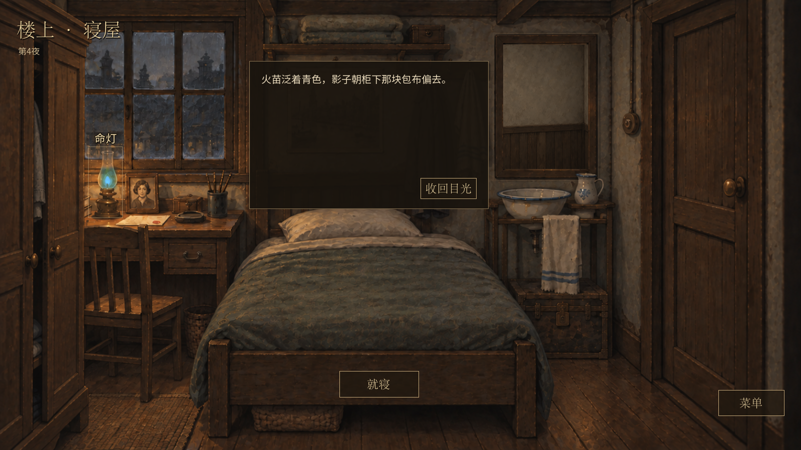

# 深夜经营与最新 main 合并验证

2026-09-11，在深夜经营及四档光照修改上合入 `e6148d4`（职业赎当 v20、寝屋美术与独立镜面）。

- 默认入口保留 `night_market` v21；`pawn_chance_seven` v20 及其他旧入口、存档各自保留原规则。未向已测试的 v21 来访和合同插入职业概率，不重算旧局。
- 保留最新寝屋和镜面；命灯读实际夜客后果，在新寝屋呈现青火及衰暗。旧版未配置夜客时保持原画面。
- 新增环境音维持移除状态，四档柜台光照和 21:00 台灯开关不变。
- 原主目录的其他任务与未提交资产未纳入提交。

## 合并后重新运行

| 检查 | 结果 |
| --- | --- |
| 深夜经营 512 种子、完整路线、账目与风险 | 38,610 项，0 失败 |
| 职业赎当、56 个检查点 | 41,813 项，0 失败 |
| v19/v20 兼容与周转模型 | 41 项，0 失败 |
| 手动存读档 | 1,163 项，0 失败 |
| 夜客档跨进程恢复及损坏拒读 | 153 项，0 失败 |
| 四档光照，1280×720 / 1600×900 | 各 75 项，0 失败 |
| 夜客实机流程与新寝屋命灯，双分辨率 | 各 118 项，0 失败 |
| 菜单及顾客反馈，双分辨率 | 各 75 项，0 失败 |
| 独立镜面，双分辨率 | 各 30 项，0 失败 |
| v20 赎当界面，双分辨率 | 各 131 项，0 失败 |

Godot 导入及 `git diff --check` 通过。测试使用隔离存档。合并时将旧 v20 UI 测试绑定到其内容入口；夜客房间测试使用新版房内菜单，避免点击已隐藏的柜台菜单。修正后重跑上述双分辨率界面测试，全部通过。

日志在 `.godot/merge-*.log`，测试汇总在 `.godot/merge-regression.log` 与 `.godot/merge-ui-regression.log`。此前 182 组完整源码回归属于合并前记录，本表仅计本次实际重跑。

