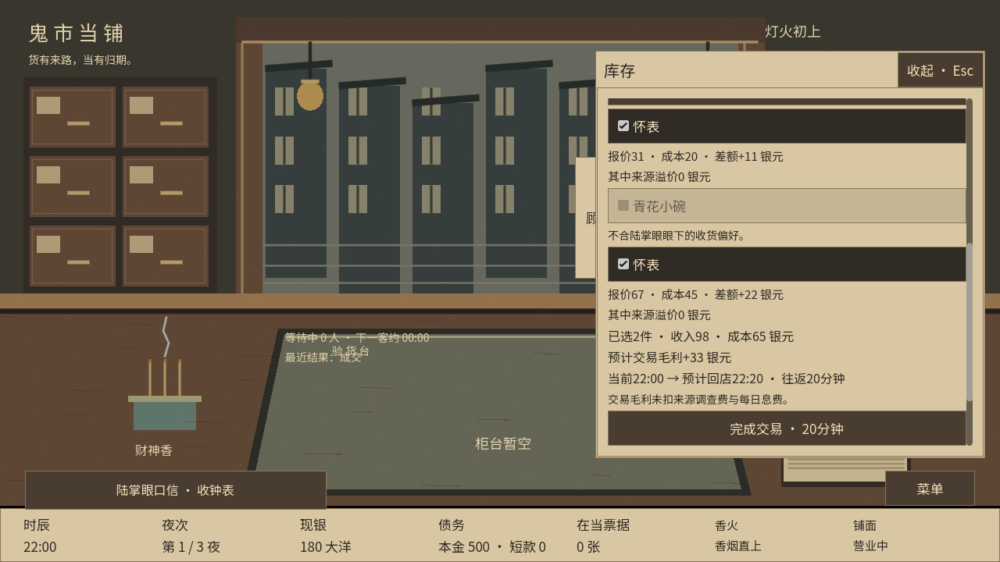
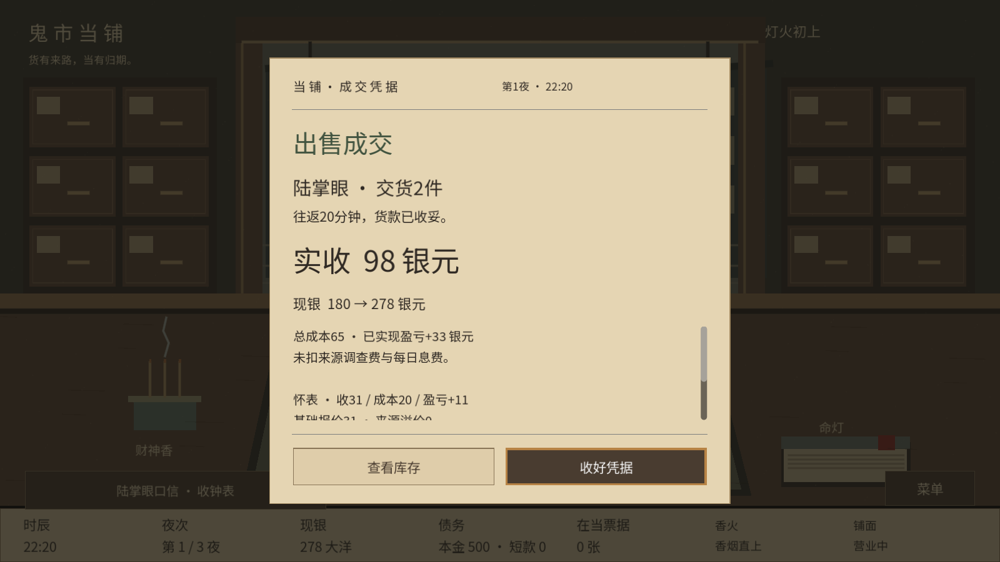

# 卖货机制交付验证（v12）

2026-09-06，本地源码已完成实现与验证，负责人试玩确认通过并授权推送及线上合并。默认三夜新局使用新版卖货；独立四夜样板和旧局继续既有规则。本轮未重新制作EXE或ZIP。

## 改动

陆掌眼只收当前口信品类，按真实品相价值140%报价；已核实来源再加15%溢价。外部需求由本局种子固定，每夜随机时刻更新一次，与库存无关。所有新局销路统一选择买家、批量勾货、一趟20分钟，不限件数；在店客人及赎当客未办妥时不能外出。出发前整体校验并锁定行情，返回后刷新客流与口信。货单与成交凭据显示收入、成本和毛利，逐件流水保留。

## 验证结果

Godot 4.6.1 / Windows，使用隔离APPDATA，未使用玩家存档。共 **87个测试入口及分辨率／跨进程组合通过**，完整清单见 [结果JSON](qa/market/results.json)。

合回当前项目后，已再次通过资源导入、新卖货核心5931项和真实鼠标界面84项；检查记录位于 `.godot/market-delivery-check/`。改动也通过差异格式检查。

- 新卖货核心：5931项通过，覆盖六类偏好、随机时点、全品相报价、来源溢价、无效批次不扣时、重复提交、客人门槛、营业边界、途中来客与改行情、存档损坏及历史兼容。
- 真实鼠标界面：1280×720、1600×900各84项通过；批量三件超过原额度，凭据可滚动且按钮在画面内。另完成真实收购后向陆掌眼交货。
- 新存档三个独立进程：write / next / read各9、7、4项通过。
- M0–M7核心1799项、旧普通交易17079项、独立四夜42532项通过；房间、活当、议价、主画面、账本、危机及旧存档跨进程回归全部通过。

首轮跨进程测试因JSON数字解码为浮点、恢复后为整数造成类型比较误报；比较双方统一JSON往返格式后通过。界面测试另发现刷新函数与Godot绘制回调重名造成重复刷新，已改名并通过两种分辨率复测。仅对修正相关入口复测，其余已通过回归保留原结果。

## 真实界面

陆掌眼此次收钟表：两件怀表成本65、报价98、毛利33银元，往返22:00–22:20。青花小碗不合偏好，无法勾选。

## 三夜经营样本

策略为查看可见证据、据已知估值压价，空柜时向可用买家出售正毛利库存。初始现金300银元，每夜息费合计10。下表销售毛利未扣来源调查费及息费，不能视为人工难度验收。

| 种子 | 期末现金 | 售出件数 | 陆掌眼收货 | 销售毛利 | 剩余库存件数 | 出货总分钟 |
|---|---:|---:|---:|---:|---:|---:|
| 0 | 333 | 5 | 1 | 63 | 0 | 100 |
| 1 | 294 | 6 | 0 | 44 | 1 | 60 |
| 7 | 385 | 8 | 3 | 115 | 0 | 140 |
| 42 | 326 | 7 | 2 | 76 | 1 | 140 |
| 73 | 372 | 8 | 2 | 102 | 0 | 140 |
| 121 | 342 | 8 | 3 | 92 | 1 | 160 |
| 255 | 323 | 8 | 2 | 73 | 1 | 120 |
| 511 | 344 | 9 | 2 | 94 | 1 | 120 |

8局均完成三夜；部分种子没有匹配陆掌眼或仍有余货，行情门槛实际影响销路。原始样本见 [经营样本JSON](qa/market/market_samples.json)。仍需人工试玩确认20分钟的节奏与高价渠道的难度。

## 整合与兼容

在主线8d3138b基础上整合，恢复工作期间另一任务同步主目录前的本轮备份；逐文件比对当前目录，未覆盖其他改动。新内容使用v12避免与已发布v11冲突；保存v11三夜内容快照并保留旧v9/v10资金配置回退，历史成交不重算。体验入口和详情见 [卖货机制说明](SELLING_MARKET_GUIDE.md)。
