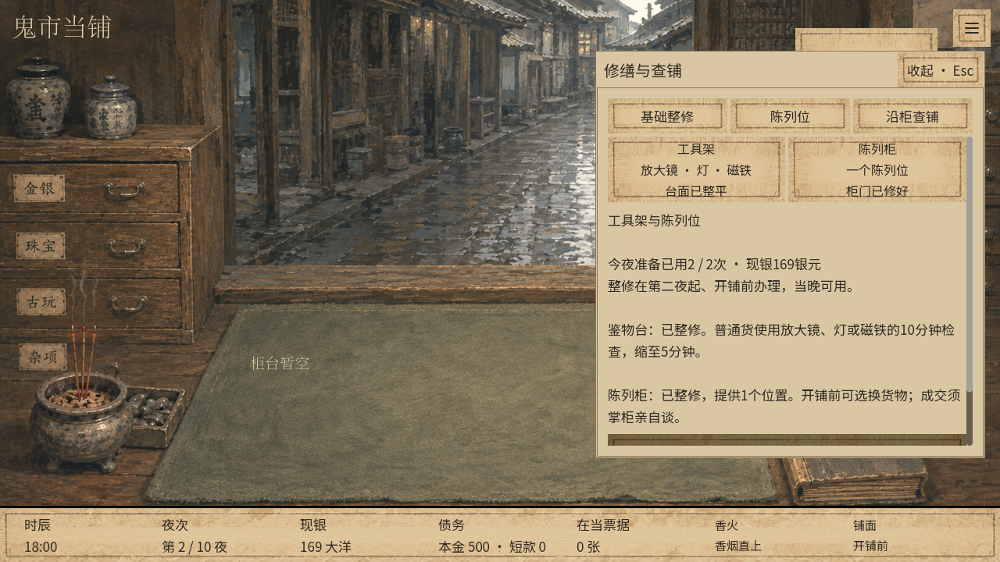
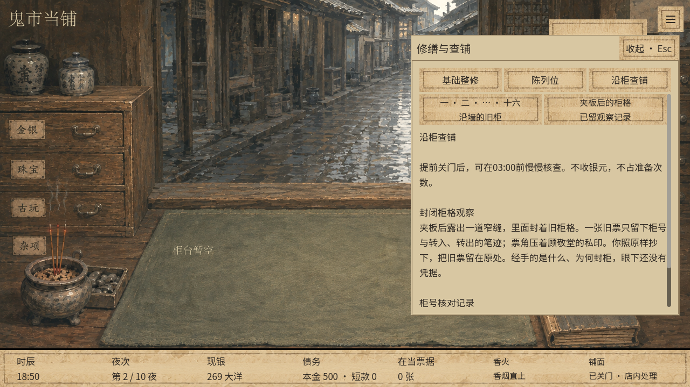
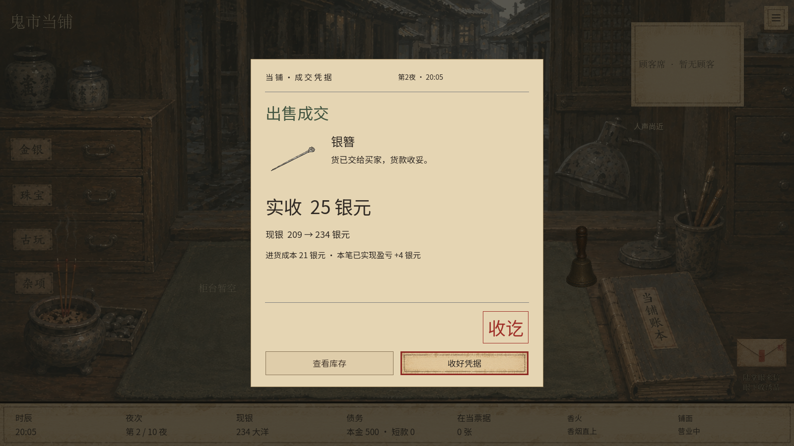

# 当铺成长首批 · 本地验收记录

日期：2026-09-15
结论：首批功能已在独立 v25 完成本地实现与验证，交由玩家试玩；数值未认定为最终平衡。

## 1. 版本与协作边界

- 工作目录：`.artifacts/shop-growth`；来源：实施开始时 `.tools/v23-playable` 的 v23、`mirror_investigation_ten` 十夜内容。
- 冻结1800个文件，复制前后逐文件SHA-256核对；[原始来源清单](SHOP_GROWTH_SOURCE.json)记录了每个源文件。主目录当时的HEAD为 `fdf586d20e7a6c32c31d3222be52a2e4a082c6d5`，仅作背景参考；真正基线以清单为准。
- 开始时发现 `.tools/mirror-journal-release/data/aqi_investigation_manifest.json` 已使用v24，因此本批注册未占用的v25、新运行 `shop_growth_ten` 和独立自动槽。
- 开发期间，“泣血铜镜”“人物图像美术设计”仍在进行。复查发现源目录的 `ui/risk/mirror_journal.gd` 后续变化；本批保留冻结副本，没有拉入该变更。其他任务状态与根目录差异都是当时快照，不是对其当前进度的承诺。
- 原目录的铜镜、美术、交易、性能工作未被本批覆盖。独立副本的所有原有图像、背景与人物资产内容哈希不变。本批仅复用纸页、按钮、缩略图及局部设施示意。
- [变更清单](qa/shop-growth/source-diff.json)、[已有文件的源码差异](qa/shop-growth/source.patch)。没有推送、合并或制作发行包。

## 2. 实现与验收对应

| 项目 | 结果与证据 |
| --- | --- |
| 设施 | 40/60银元、每日共用2次准备、第二夜与结束准备门槛、资金不足、重复购买、投资独立记账均通过 |
| 鉴物台耗时 | 全物品动作表核对；同一计算用于显示、资格、扣时和重放。普通工具10→5，原5分钟和其他动作保持原口径 |
| 检查边界 | 禁止验货的客人仍离开；检查碰到离店期限不取得证据；03:00仍进入封铺 |
| 陈列资格 | 空柜、缺失货物、在当货、鬼货、重复上架、营业中换货禁止、跨夜持续、撤下、另售与机会取消通过 |
| 额外买家 | 不替换原6席；报价、接受、一次回价、谈崩、拒绝、超时、提前关门、库存一次出柜通过 |
| 接待冲突 | 原当户和危机优先；丈夫等候与买家成交并行时照常到期；熟客与原有预约、基础客位保留。后续v23完整剧情/经营回归通过 |
| 价格 | 未复核折扇20基数、来源15%、实际接待时冻结、最高价不进入界面、合法报价优先于自身等待到期、03:00前办妥通过 |
| 柜17 | 15/15/20顺序、同夜和跨夜、无设施前提、强制事件阻断、时间不足、恰好03:00、无现金/库存奖励、十夜忽略或停在1/2步均通过 |
| 保存 | v23旧档保持原状态结构；v25独立入口；真实原子文件写失败保留旧文件且完整回滚；新进程恢复；逐字段篡改与追加重复建造记录拒绝 |
| 性能 | 原存档列表缓存、隐藏页延迟刷新、完整动作重放前缀缓存继续生效；缓存命中后不重跑已验证动作，篡改仍拒绝 |
| 界面 | 1280×720、1600×900真实鼠标点击与键盘输入：购买设施、陈列、三步查柜、买家回价和接受、成交凭据、日结，均通过 |

新规则集中在 `core/shop/shop_growth_service.gd`；读模型在 `shop_growth_read_models.gd`。新增操作通过 `RunSession.growth_command` 和现有柜台命令进入外层记录与回滚。单件与批量销售复用同一现银、成本、库存、销售记录提交函数。

## 3. 自动检查

以下为最终成功运行的结果；断言数包含测试路径中的阶段、事件及重复性检查，不等于独立功能数量。

| 检查脚本 | 通过 | 失败 |
| --- | ---: | ---: |
| `tests/shop_growth.gd` | 1358 | 0 |
| `tests/shop_growth_edges.gd` | 1055 | 0 |
| `tests/shop_growth_storage.gd` 写入进程及快速入口保存 | 25 | 0 |
| 同一脚本 `-- read` 独立读取进程 | 5 | 0 |
| `tests/shop_growth_performance.gd` | 25 | 0 |
| `tests/shop_growth_economy.gd` | 23382 | 0 |
| `tests/shop_growth_ui.gd` 1280×720 | 66 | 0 |
| 同一脚本 `-- wide` 1600×900 | 66 | 0 |
| 原 `tests/run_investigation.gd` | 2362 | 0 |
| v25下同一套铜镜完整路线 `tests/shop_growth_mirror_regression.gd` | 2373 | 0 |
| 原 `tests/run_goods_expertise.gd` | 8544 | 0 |
| 原 `tests/manual_save_tests.gd` | 1163 | 0 |
| 原 `tests/investigation_replay_cache.gd` | 100 | 0 |
| 原 `tests/hidden_drawer_refresh.gd` | 6 | 0 |
| 原 `tests/save_list_cache.gd` | 11 | 0 |

检查日志保存在 [qa/shop-growth](qa/shop-growth/results.json)；正常与三种快速启动入口均实际启动验证。入口使用原工程，不依赖导出包。

### 保存与性能测量

实际写盘测试先生成合法原子存档，模拟发布失败，核对原文件字节不变、内存状态完全恢复，再重试成功。另开Godot进程读取并逐字段比对；缓存不是跨进程恢复的前提。

[性能原始数据](qa/shop-growth/performance.json)：十夜样本397条外层记录，冷启动校验约583毫秒；同一进程再次校验约69–90毫秒，重放动作数为0。准备与买家样本冷读约161/182毫秒。读模型无状态变化，双模型平均约6–7毫秒。数值受机器和同时运行的检查影响，不能当成所有设备的帧率承诺。

## 4. 固定种子的经营对比

32个固定种子（0–31），每个分别运行“不升级／只买鉴物台／只买陈列柜／两项都买”，共128局、每局10夜。按现有每日息费执行，未改初始现银、货值、客流或旧销路。

策略统一：保留第一夜银簪到第二夜；检查普通货，按已知估值中点的85%与客人要价中的较低值报价一次，不成便送客，保留110银元供周转；开场银簪按可见要价买入。已建陈列柜就把一件存货留作陈列，其余货在有空且销路开放时按当前公开报价最高的买家出售。陈列买家接受其初始开价。策略不读取隐藏真值或卖方底价，也没有专门针对每个种子优化。

下表为**每局平均值**，金额单位银元；净现金变化包含整修、进货、销售及十夜费用。经营净收益不重复扣设施投入。

| 指标 | 不升级 | 只买鉴物台 | 只买陈列柜 | 两项都买 |
| --- | ---: | ---: | ---: | ---: |
| 设施投入 | 0 | 40 | 60 | 100 |
| 销售回款 | 175.47 | 139.72 | 119.09 | 89.03 |
| 十夜净现金变化 | -180.00 | -199.16 | -206.22 | -223.41 |
| 十夜末现银 | 120.00 | 100.84 | 93.78 | 76.59 |
| 经营净收益 | -180.00 | -159.16 | -146.22 | -123.41 |
| 十夜末现货占款 | 0 | 0 | 0 | 0 |
| 单局最高现货占款的平均值 | 71.16 | 70.16 | 73.72 | 70.03 |
| 错过原有客人 | 9.38 | 1.69 | 6.59 | 1.31 |
| 检查总分钟数 | 1025.47 | 837.03 | 1026.09 | 837.03 |
| 破铺局数 / 32局 | 0 | 0 | 0 | 0 |

- 有陈列目标的夜数：只买柜95夜、两项都买92夜；生成并成交34/32位买家，来客率35.8%/34.8%。样本受货物是否持有影响，不能把整个十夜数直接当陈列抽取次数。
- 单独验证1000个种子的机会抽取，生成398次（39.8%），三种到访时间、开价档和最高价档均覆盖。40%仍是设定，不是保证每五夜固定来两人。
- 鉴物台每局约省188分钟，并减少因检查而错过的客人。更快营业也会改变可见买家窗口和可做交易，不能只把时间换算成固定银元奖励。
- 陈列柜没有保证十夜内回本；在这条较保守的报价路线中，经营结果虽改善，设施付款仍降低夜末现金。更早投入两项设施后，可用于买货的钱更少，销售回款也更低。
- 对旧销路：当面陈列开价平均约价值基数100%，高于杂货回收商60%口径；但瓷器收藏客120%及部分专项销路仍有优势。概率、等候、资金占用、一次回价失败和有效收货窗口，使旧销路仍有用途。回价成功可能到110%–130%档，但玩家不能看到上限。
- 本策略最后把余货卖出，因此表中期末占款为0，**不表示整个十夜没有占款，也不覆盖囤货玩法**。经营净收益为负，说明这条统一报价策略及当前十夜交易密度仍有改善空间；不能把这一组数据解释成玩家普遍收益。

逐局数据与完整策略记录见 [economy.json](qa/shop-growth/economy.json)。40/60银元、40%与价格系数作为本批试验默认值保留，建议真实试玩重点反馈“为了整修错过哪些买货机会”“留柜等客值不值”“15/15/20分钟查铺是否挤占必要收尾”。

## 5. 实际截图

### 1280×720

### 1600×900

## 6. 验证环境与交付限制

Windows、本地Godot 4.6.1、OpenGL兼容渲染、RTX 3060 Laptop；所有检查与试玩使用隔离APPDATA。Godot启动日志中有系统证书库读取失败的环境提示；本批离线游戏、内容读取、保存及上述操作不依赖网络，未因此阻断。最终检查没有脚本或解析错误。

没有新增二三级设施、高级自鉴、名声、组合陈列及后续阴账。保留旧资产可能仍有原有临时人物图像；本批没有接管人物美术任务。

返回[试玩说明与启动入口](SHOP_GROWTH_PLAYTEST.md)。
