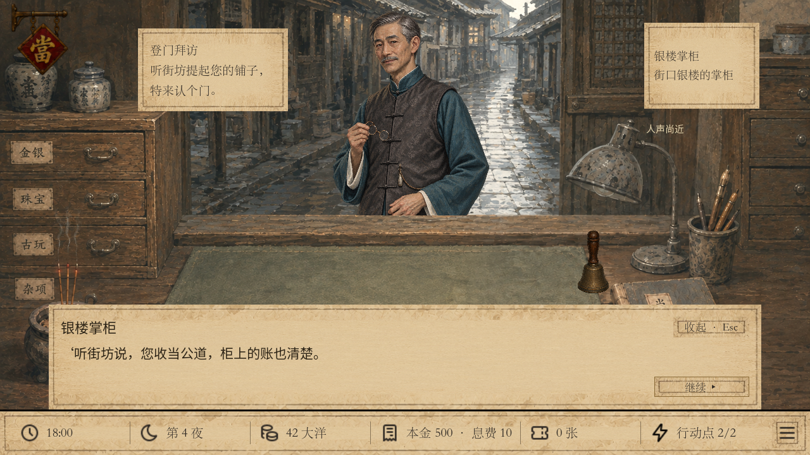
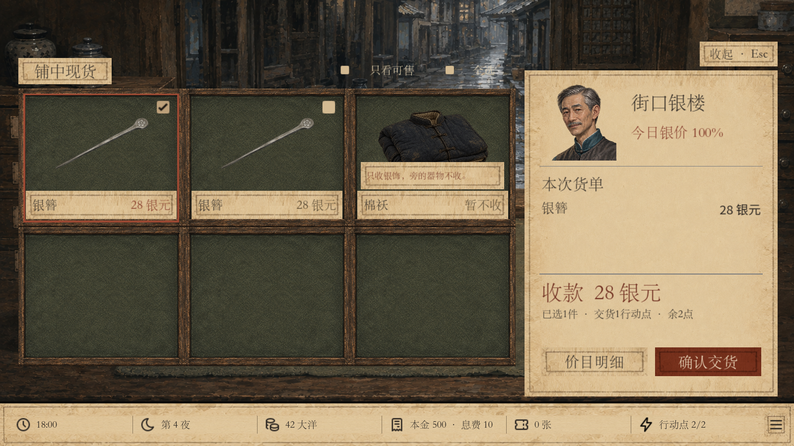
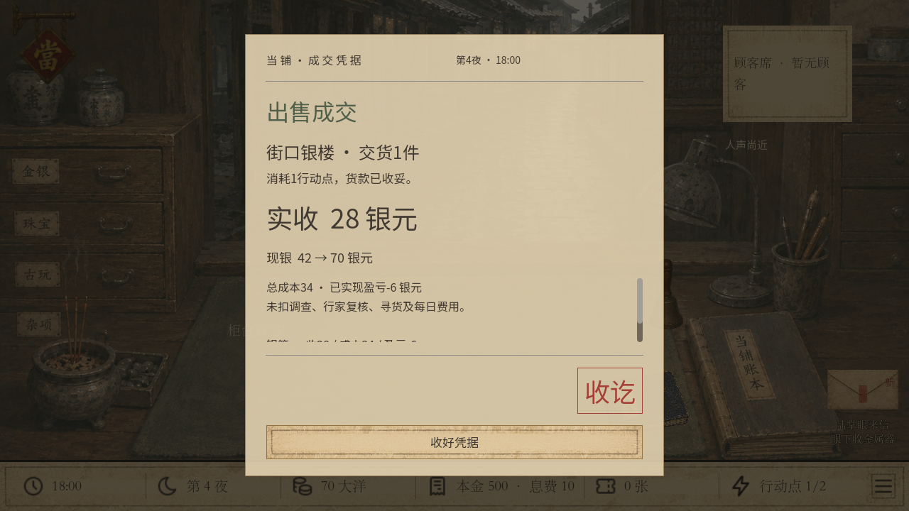
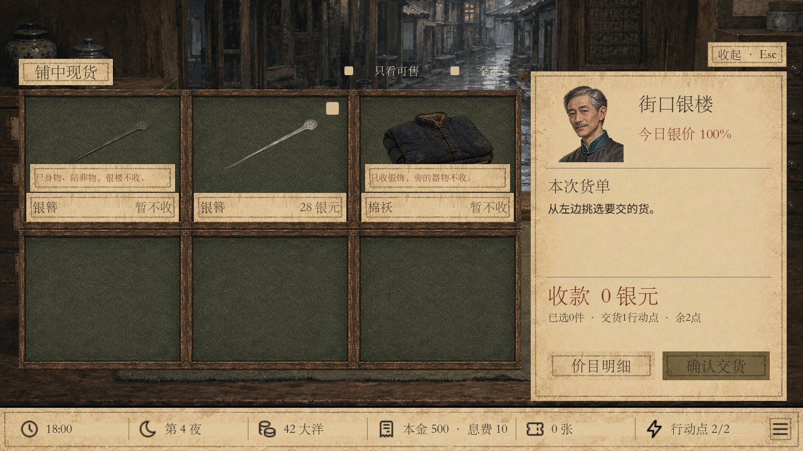

# 银楼商誉解锁与白银行情 · v48 本地试玩

验收日期：2026-09-26。基于实施时最新 main `f3719f5595f6181bd725924771800a9d53601ca2`（v47杂货回收）。本地分支 `codex/silver-market-v48`，复用已完成的 `D:/CodexData/runs/pawnbroker-preopen-recycler-v47` 工作目录。目录名保留，游戏入口与存档为v48；本轮已完成本地验收，并获用户授权推送及合并。

## 启动

```powershell
& "D:\CodexData\runs\pawnbroker-preopen-recycler-v47\play-silver-v48.cmd"
# 1600×900
& "D:\CodexData\runs\pawnbroker-preopen-recycler-v47\play-silver-v48.cmd" -Wide
```

### 直接测试商誉16

```powershell
& "D:\CodexData\runs\pawnbroker-preopen-recycler-v47\play-silver-preview-v48.cmd"
```

直接进入第四夜开铺前：商誉16、银楼掌柜登门、42银元、2行动点，库存有可出售银簪。完成对话后，在营业页进入街口银楼交货。使用真实经营、完整重放校验的进度；每次启动重置到登门起点，本次试玩不保存，不改正式进度。`-Wide` 可切1600×900。已执行 `play-silver-preview-v48.cmd -Verify`，确认商誉16、第四夜、42银元、2行动点及RPG对白可见；已检查实际启动截图。

通用 `play-unified.cmd` 与编辑器默认新局也进入v48。旧版 `play-recycler-v47.cmd`、`play-pawn-v45.cmd` 和陆掌眼旧入口仍保留。v48为独立新局，不将旧存档迁移到新规则。

- 场景：`res://scenes/start_silver_v48.tscn`
- 内容：`res://data/silver_market_manifest.json`，运行ID `silver_market`，内容版本48
- 自动保存：`user://silver_market/autosave_v48.json`
- 存档库：`user://silver_market/save_library_v48.json`

## 玩法与表现

商誉首次达到16时，以已持久化、可重放验证的商誉变化记录保存邀约事实；15不触发，之后下降也不撤销。下一夜开铺前，先完成原有孙大元、陆掌眼等登门剧情，再接待银楼掌柜。三段 RPG 短页对白依次介绍结识、收货禁忌与每日行情。逐段保存，收起后点击人物继续，告别前不能开铺；对白不扣时间或行动点。告别永久开放营业页“卖货 · 街口银楼 · 1行动点”，不显示商誉分数或门槛。

货盘沿用陆掌眼与杂货回收商的样式；银楼有独立掌柜立绘与头像，底部价目明细、确认交货等大并排。打开货盘即可验货：不合要求的物品显示简短拒收理由且不可选。查看、选择、收起免费，每批成功交货扣1共享行动点、件数不限，不推进营业时间。只在开铺前交货；交货后显示凭据，收好后回营业页。

收完整、修补和破损的真银饰，现有银簪、银戒、银锁均按实际材质纳入。非银、镀银、假货、银餐具等非饰品拒收。物品实例独立保存 `silver_trade.material/origin`；明确的尸身物与陪葬物拒收，正常继承物可收。来源与凭据真伪独立，不以鬼客身份或名称判断。本轮只增加标记与规则，未新增携带禁忌银饰的客人或改写人物来历。

## 行情与合同

从第一夜起，每5夜一轮，未解锁时照常计算。首轮三种市场等概率；下一轮在另外两种中等概率选择，不连续重复。牛市依次110/120/130/140/180%，熊市90/80/70/60/40%，横盘每日独立整数90至110%。以本局种子和独立命名随机序列重算，不消耗客流随机数，读档或重新打开不改价。

单件为实际品相估值×当日比例，四舍五入、最低1银元，逐件取整后汇总。无成套或来源溢价。页面仅显示今日比例与报价，不显示市场类型、周期、轮内天数或未来走势。成交记录保存实收合同；凭据复查使用成交夜次的比例。

集中政策位于 `core/inventory/silver_policy.gd`。UI和单件/批量命令共用限制；生成时附材质来源，保存解码由原始内容与完整命令历史重放复算，拒绝金额、来源、材质、邀约、解锁和行动点篡改。写盘失败沿用整体快照回滚，包含库存、现金、时间和行动点。

## 验收结果

全部下列检查均为0失败，Godot 4.6.1，Windows Compatibility / NVIDIA RTX 3060 Laptop。

| 检查 | 结果 |
|---|---:|
| `tests/silver_market.gd` | 10,139项通过 |
| `tests/silver_reload.gd` 独立进程读取 | 37项通过 |
| `tests/silver_ui.gd` 两种分辨率实际交互 | 102项通过 |
| `tests/silver_interest_regression.gd` v48活当回归 | 604项通过 |
| `tests/recycler_sales.gd` v47杂货回收回归 | 1,309项通过 |
| `tests/pawn_interest.gd` v45活当回归 | 588项通过 |
| `tests/lu_sale_ui.gd` 陆掌眼原卖货界面 | 114项通过 |
| `tests/recycler_ui.gd` v47回收界面 | 90项通过 |
| `play-silver-v48.cmd -Verify` 导入及实际启动 | 通过 |
| `git diff --check` 及提交范围检查 | 通过，仅本轮银楼文件 |

专项覆盖：15/16边界、邀约次夜生效与下降后保留、原登门优先、告别永久解锁；120个种子跨5轮、1/5/6/10/11夜、横盘所有21个整数比例、相邻轮不重复、稳定重算；三种品相、全部材质/来源矩阵；逐件取整、批量收入、单件API、重复提交、行动点耗尽、开铺中及结束准备后拦截、整体回滚；三段对白与成交后冷读档、篡改拒绝、v44至v47内容及存档隔离。

真实经营验收使用种子42，正常购买与杂货回收筹措资金，无直接添加金钱或商誉：前三夜商誉依次6、12、16，第四夜银楼登门，告别后由42银元起交货。构造的服务边界测试另外覆盖尸身物、陪葬物、镀银等当前客流不携带的情况；拒收截图使用明确标注的受控物品来源，不代表新增了此类剧情客人。

UI实际点击检查了1280×720、1600×900：人物比例与透明边缘、底部短页对白、独立回应、收起继续、货盘选择、拒收提示、等大按钮、价目明细、写盘失败保留货单、成功凭据与返回营业页。v48不会沿用旧存档的解锁，需新开游戏。

复现时先运行 `silver_market.gd` 生成并校验真实进度，再运行 `silver_reload.gd` 和 `silver_ui.gd`。本地完整日志与中间进度在 `.godot/qa/silver/`；截图副本如下。

## 截图

### 掌柜登门 · 1280×720



### 银楼货单 · 1600×900



### 成交凭据 · 1280×720



### 拒收提示 · 1280×720（受控来源测试）



两种分辨率的对应截图均保存于 `docs/qa/silver-v48/`。

## 美术来源

使用内置 image_gen 参考项目既有绘画风格生成约55至60岁的银楼掌柜，灰黑短发、细髭、整洁青灰长衣与深色马甲，手持眼镜；与陆掌眼的高龄圆脸形象区分。独立资源为 `assets/art04/customers/special/silver_owner_v48.png`，保留生成的透明通道；头像由同一资源的固定区域裁切展示，旧人物资源未覆盖。生成原件：`C:/Users/alvachen/.codex/generated_images/01a0d628-a640-7462-8527-1bd081761ac0/exec-ed37c132-2ef4-4236-a387-13510847ebf0.png`。


### 立绘环境融合修订 · 2026-09-26

根据试玩反馈，使用 image_gen 对银楼掌柜原立绘定向重绘：压低面部、手部和发丝的强反光，降低蓝衣饱和度，改为灰褐环境色与哑光水粉笔触。保留原人物身份、姿势、尺寸、透明通道及柜台遮挡比例。货单头像同步使用新版立绘。

重绘原件：`C:/Users/alvachen/.codex/generated_images/01a0d628-a640-7462-8527-1bd081761ac0/exec-fa585c99-8050-4d74-ab34-1a2b80215089.png`。

实际运行 `play-silver-preview-v48.cmd -Verify`，并完成 `tests/silver_ui.gd` 两个分辨率的102项检查，0失败；检查了登门立绘、透明边缘和货单头像。对照截图：`docs/qa/silver-v48/portrait-before.png`、`portrait-after.png`。本次只替换美术资源并更新截图，交易规则与存档格式无变化。
