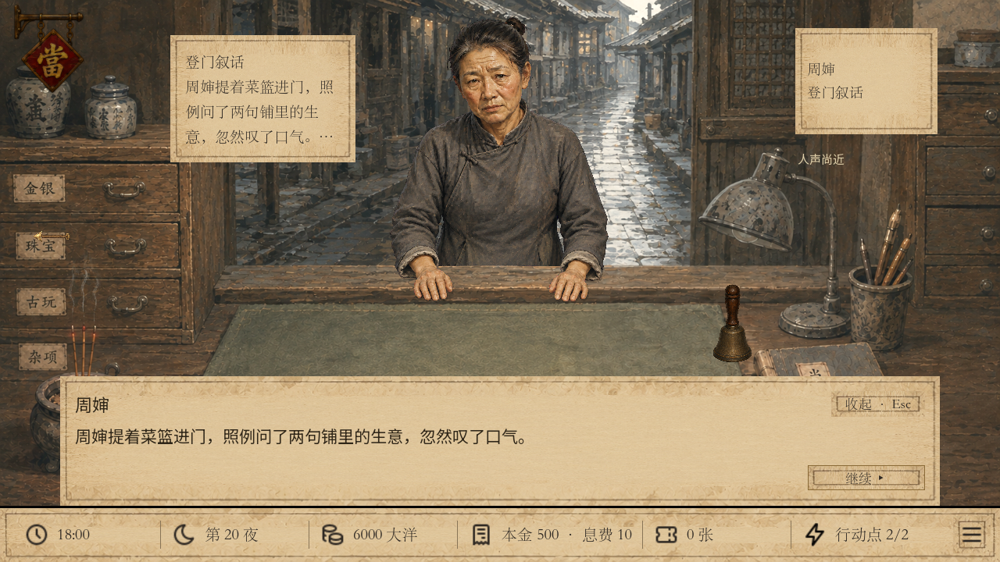
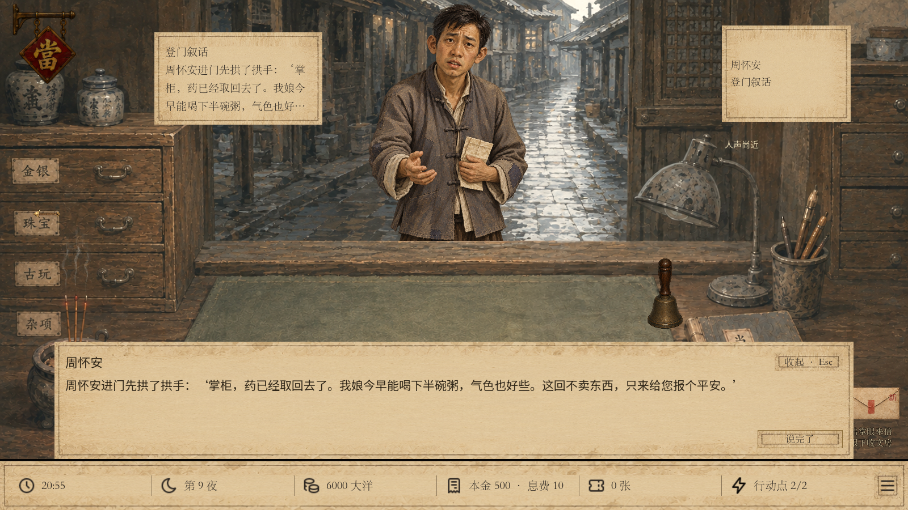
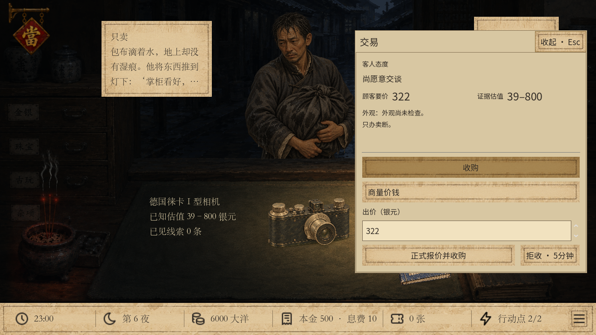

# 特殊客与周怀安支线发布整合

2026-09-26，基于线上 main `5e66ad2` 整合本线程的特殊客 v44—v46、周怀安 v47 和账簿串文案修复。原试玩目录、未提交缓存及旧存档均保留，发布使用独立工作目录。

## 范围与入口

- 四种特殊客匿名、种子固定调度、独立货池及深夜到店；抱包客4/8/15夜连续交易资格，提匣客一次到访。
- 湿包客新立绘、半价卖断、持有具体货品时卧房异响；入房1—2秒起声，之后4—8秒间隔，第5个持货夜起每次就寝扣一格命灯并叙述压力和哭声。
- 周怀安独立立绘，3/9/18/19夜筹药费；累计200银元决定后续。提前筹齐会报平安，第20夜好结局本人道谢，坏结局由周婶串门提及。对话复用RPG组件。
- 账簿当票等页只显示本页内容；不再附带铜镜或其他操作遗留文本。
- 高级鬼货任务只记录三次抱包交易资格，任务本体仍在待办中。

`play-medicine-huaian.cmd` 是含以上最新特殊客及周怀安的新局入口。`-Stage report` 报平安、`-Stage saved` 好结局、`-Stage bereaved` 周婶坏消息，`-Wide` 为1600×900。预览不保存。

`play-special-guests.cmd` 保持特殊客 v46 独立入口；v44/v45/v46/v47场景、运行ID与存档规则均保留。通用 `play-unified.cmd` / `scenes/start.tscn` 仍为main的留声与当约v46。本次发布源码和独立入口，没有把几个并行版本的数据强行合成新默认局；周怀安入口不因此获得后续陆掌眼卖货、活当档位或留声机的新配置。

## 与最新main的整合

保留线上陆掌眼RPG登门与卖货、活当档位、留声机及价格底线实现。逐项合并启动存档、种子别名、交易前置检查、报价失败回调、展示与立绘的七处冲突。存档识别表同时登记新旧运行配置；补齐早期v44特殊客入口的登记，并扩展已有入口兼容测试，避免同内容版本号的不同运行互相误认。

## 发布目录重新验证

| 检查 | 结果 |
| --- | --- |
| 周怀安20夜路线、200/199边界、读档与回滚 | 1870通过 |
| 特殊客v46深夜与跨夜回访 | 1252通过 |
| 湿包v45持货及扣灯 | 364通过 |
| 特殊客v44规则 / 边界 / 提匣完整流程 | 867 / 2200 / 210通过 |
| 最新main留声机旅程 / 价格底线 | 1440 / 433通过 |
| 活当主测试 / 合同回放 | 588 / 3493通过 |
| 陆掌眼登门 | 128通过 |
| 26个新旧入口和存档识别 | 52通过 |
| 周怀安实际UI，1280×720 / 1600×900 | 各42通过 |
| 特殊客与声音暂停恢复实际UI，两种尺寸 | 各49通过 |
| 当票页实际UI，两种尺寸 | 各31通过 |
| Windows PowerShell启动器警告与失败判定 | 3通过 |

全部最终运行零失败，日志中无脚本错误。Godot 4.6.1全量导入、冲突标记和提交差异检查通过。活当合同首次因未生成`pawn-visit.json`预置而报错，该次不计入通过；先运行`tests/pawn_interest.gd`生成真实预置后重新运行合同测试，3493项通过。

日志摘要见 [validation.txt](qa/special-guests-release/validation.txt)。实际画面已人工查看：

