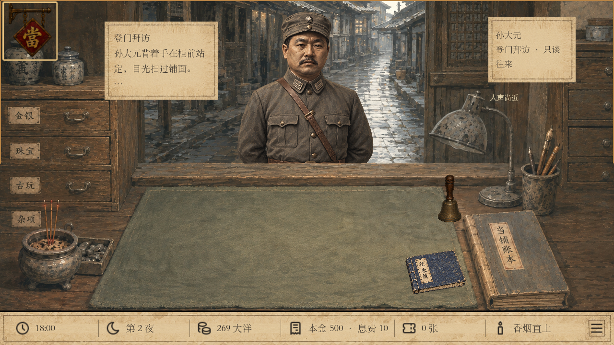
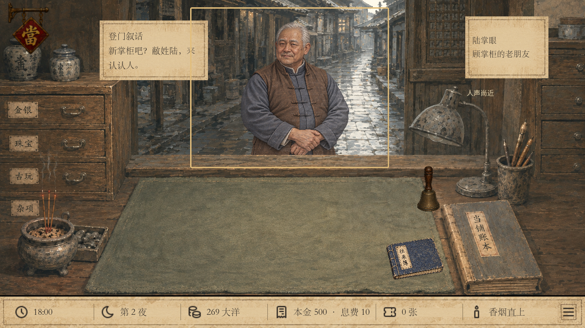
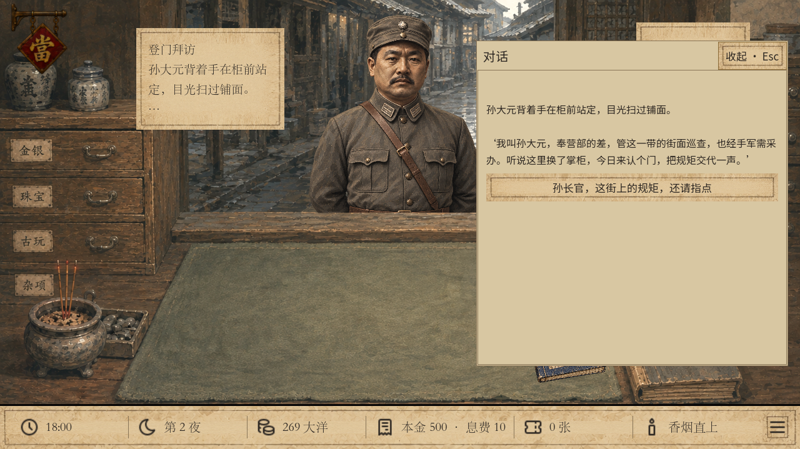
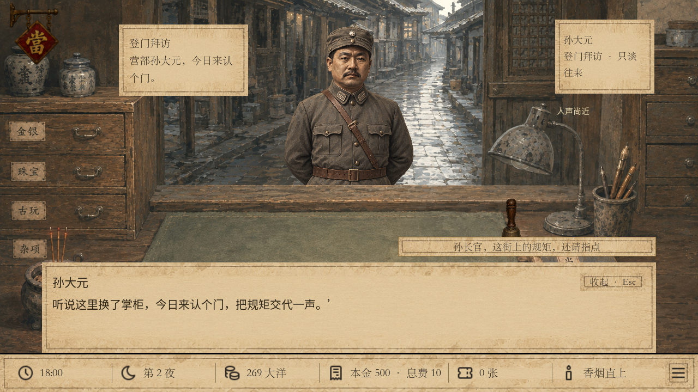
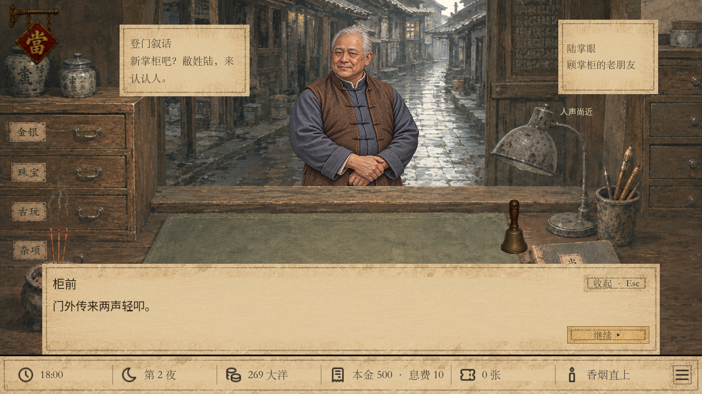

# 孙大元登门：RPG 对话与立绘比例复核

2026-09-25，当前本地 v43 分支。基准是游戏已有的陆掌眼 RPG 对话与柜台角色布置。

## 结论与范围

孙大元原先确实使用右侧功能面板呈现对白；独立的立绘显示框也比陆掌眼更大，使头肩显得突出。原图保持宽高比，没有被非等比拉伸。

本次复用 `FirstDebtConversation`，保留原有剧情、三个选择、费用、时间、解锁规则与存档结构。立绘继续使用孙大元专属原图，只调整显示尺寸与柜沿定位。

## 1. 登门：已修正

同一 1280×720 画面下，旧显示框高度为柜台区域的 55%，新高度为 46%，等比缩小约 16.4%。新框与陆掌眼使用同一尺度和柜沿基线；普通顾客各自约为 48.5%～51.5%，需按原图构图微调，不能只比较图片像素尺寸。孙大元保留宽肩、军帽与背手站姿。

本次同窗口对照：

普通账房图是在相同柜台和窗口中仅替换呈现模型得到的美术对照，不是更改实际游戏来客。

## 2. 交谈：已修正

旧版将整段对白和回应放在右侧面板。现在使用底部短句分页，说话人与旁白分别署名，相关话读完后才显示独立回应；可收起再打开，中途加载按已保存的段落继续。左上角只留简短来意。

在 1280×720 与1600×900实测文字无需滚动，按钮可点击。新增修正保证入场、告别时键盘焦点留在对话按钮，不跳到场景热点。未进行全面无障碍认证。

## 3. 告别与接续：通过

孙大元告别时保留立绘，读完后接入陆掌眼登门；《往来簿》按原规则解锁，陆掌眼来信仍须完成他自己的介绍。全程不推进营业时间、不改现金。孙大元前两次回应为空结果，直接接续下一段原对白，不显示无关人物的默认文本。

截图由当前 Godot 游戏实际渲染并保存；最终截图在原有0.18秒入场淡入结束后取得。

## 验证与已知限制

- `tests/sun_introduction_ui.gd`：双分辨率实际交互210项通过，0失败；包括分页、收起重开、中途读档、焦点、立绘比例和接续陆掌眼。
- `tests/lu_introduction_ui.gd`：双分辨率243项通过，0失败。
- `tests/lu_introduction.gd`：规则与存档124项通过，0失败。
- `tests/social_introduction.gd`：173项通过，3项旧v27兼容样本失败（delivery、claim、closure）。在独立临时目录换回 HEAD 中修改前的 `MilitaryIntroduction` 后，同样173项通过、相同3项失败，故这些既有兼容问题不由本次对话和立绘修改引入。本次未改旧档校验逻辑。
- `git diff --check` 通过。改动留在本地，尚未提交或推送。
