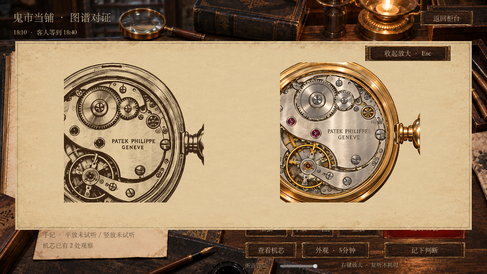
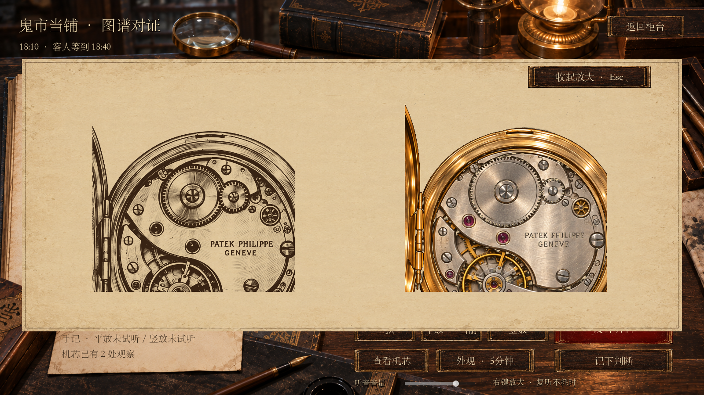
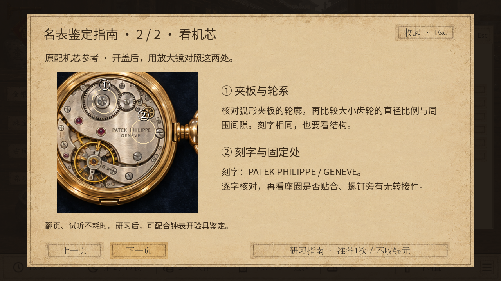

# v36 新增仿制机芯图样

2026-09-23，本地可玩，未推送。新增两张游戏素材，保留原有粗制机芯图，共三种仿制图样。生成工具为内置ImageGen；完整提示词、参考图与资源路径在 [素材来源](../assets/watch_desk/movement-patterns.source.json)。

## 已接入的区别

| 图样 | 图像与观察点 | 素材 |
| --- | --- | --- |
| 刻字差异 | 结构接近原配；刻字为 `PATEK PHILIPPEE`，比参考多一个E，下行为`GENEVE`。另一观察点检查固定处，不能错误提示有宽垫圈 | [movement-01.png](../assets/watch_desk/movement-01.png) |
| 齿轮尺寸差异 | 保留正确刻字；上方大齿轮较大，邻近小齿轮较小，比例与图录不同，两只齿轮分别有观察点 | [movement-02.png](../assets/watch_desk/movement-02.png) |

指南仍只有正版参考图，补充逐字核对刻字、比较齿轮直径比例与间隙的说明。右键放大可将实物与图录并排比较；观察文本描述看见的细节，不直接报真假。

三个仿制图样等权生成，仅在已经抽中仿冒货后选择，不改变客人来访或仿冒货的原有概率。图样有独立随机键并保存，复看与读档不更换；走时、实际价值与v35谈价规则不受图样影响。v35及更早存档继续显示原图，不补抽；统一新游戏为独立v36。

## 直接试玩

刻字差异：

```powershell
& "C:\Users\alvachen\Documents\ChatGPT\pawnbroker\play-unified.cmd" -Stage watch -WatchCase engraving -Wide
```

齿轮差异：

```powershell
& "C:\Users\alvachen\Documents\ChatGPT\pawnbroker\play-unified.cmd" -Stage watch -WatchCase gears -Wide
```

两者都是隔离测试预置，不保存到正式进度。点击当物 → 鉴定 → 器材鉴定 → 开盖核对；点击局部取得观察，右键放大对照。指南可用原有 `-WatchCase guide` 进入第二柜研习。

普通新局不带 `-Stage` 参数；自动位为 `auto/watch_patterns_ten`，独立文件 `user://watch_patterns_ten/autosave_v36.json`。

## 验证

- `watch_movement_patterns.gd`：409项通过。覆盖三种图样×三种外观×三种运转；纹样对应线索、独立观察点、图样稳定、价值不变、新旧存档读写。
- `watch_movement_ui.gd`：1280×720、1600×900各46项通过。通过真实点击检查加载新图、取得两条线索、放大、落笔回柜台和提交身份说法。
- `watch_patterns_journey.gd`：523项通过，两次十夜流程结束，冷重放一致。
- `watch_negotiation.gd`：v35原谈价1070项回归通过。
- 三千种种子：旧仿制1011、刻字版983、齿轮版1006，符合各约三分之一。

未运行全仓测试。Godot的Windows根证书读取提示仍存在，本轮离线启动与验证未受阻。






