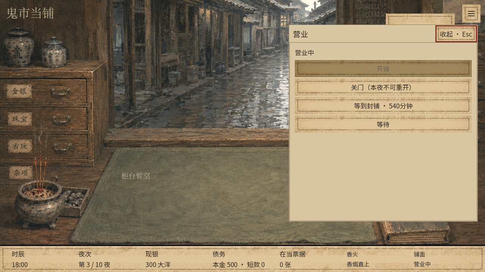
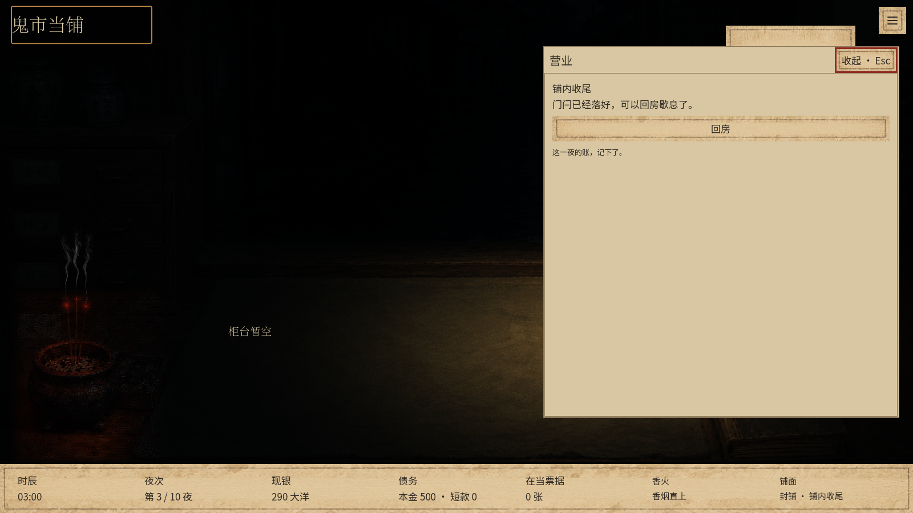

# 营业页回房与等待 · 2026-09-15

已在主目录和独立 v23 试玩目录应用，未推送。

- 铺内收尾阶段，营业页显示回房；未处理的危机或剧情仍阻止回房，并提供对应事件入口。
- 营业页将单纯消耗时间的操作合为“等待”，选择5、10、30、60分钟。“等到封铺”单独放在营业页第一层；封存包布等有实际作用的操作单独保留。移除“查看已知消息”按钮，铺中记事入口保留。
- 时长选择直接执行原有命令一次。打开和取消选择不耗时，剩余时间不足时相应选项不可用，客户等待、事件与保存规则不变。
- 切换时长选择或回房页时滚动位置回到顶部。恢复游戏时不保留上一次临时展开的等待选择。

验证：`tests/day_navigation_ui.gd` 在v23的1280×720、1600×900及主目录1280×720下各29项通过；实际鼠标操作覆盖各时长、取消、剩余时间限制、封铺、收起结算后通过营业页回房。`tests/inventory_event_notice_ui.gd` 19项通过，追加危机期间营业页禁用回房及事件入口检查。`git diff --check`通过。

后续按钮调整在v23的1280×720下32项通过，含第一层封铺、等待子菜单及移除已知消息按钮。

