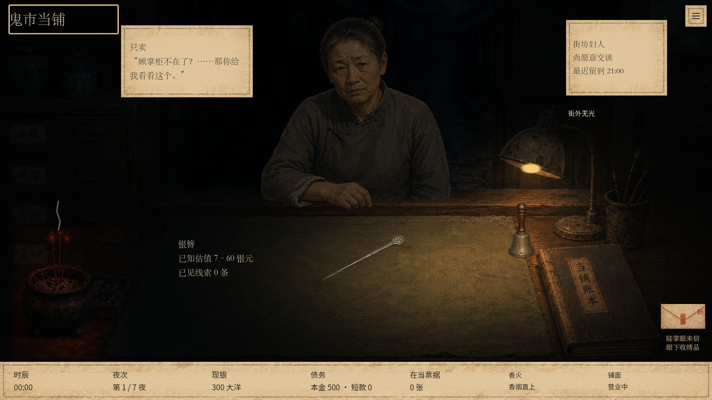
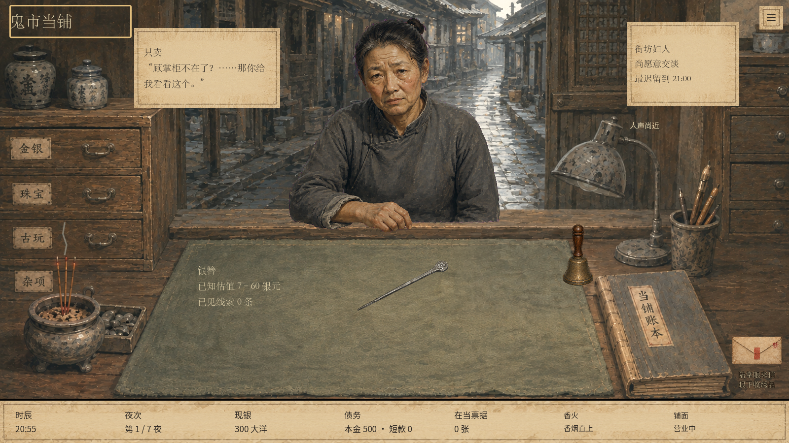

# 财神香微光

沿用本分支的街道提亮与完整熄灯素材，新增燃香视觉。以原香炉画作制作登记对齐的明暗素材，只将香头和近处反光增量合入实际游戏画面。白天轻微红色香头，21:00 后炉口与邻近柜面浮现暗红反光，午夜后对比更明显；无明火、音效、闪烁或新增消耗规则。

现有游戏没有独立燃香耗尽状态，本轮不伪造新的点香、熄香或死亡熄香机制。原烟向、香灰异常保持原逻辑，命灯仍是独立道具。微光只在当前四档氛围局显示，不改变旧内容的画面规则。

内置 Image Gen 素材：`assets/lighting/counter-incense-lit.png`。原图 `assets/art04/counter_room.png` 保留，未使用 CLI。运行时局部取发光差值，因此不会将整张编辑后的图片覆盖到背景。

Godot 导入成功；1280×720、1600×900 的光照 UI 测试各 79 项通过、0 失败，含局部反光增强和远处街道亮度不受影响。已将修改前后同状态截图对照目视检查：香炉轮廓可辨，光线范围小于台灯，不影响菜单、鉴定和四档明暗。截图沿用固定人物/时刻对照夹具，并非实际等候全过程。

未推送，继续使用 `.artifacts/evening-street-light` 本地启动入口。

## 图像编辑提示词

Edit target: this exact 1672x941 pawnshop game background. Change ONLY the small incense burner and its immediately adjacent counter at the bottom left. Keep perfect pixel registration, exact composition, camera, dimensions, every prop, Chinese labels, street and all other lighting unchanged. Existing thin incense sticks rising from the burner should be visibly smouldering at their existing tips: tiny irregular deep red-orange glowing embers, NO flames, no candles, no sparks, no neon or supernatural green. Their very faint warm red light reflects on the ash, inner bronze rim, worn metal of the incense pot, and a small area of wood directly next to its foot. Restrained unsettling stillness, not bright fire. This is a registered lighting-state texture for compositing over the original; preserve all outlines and surface detail perfectly, do not move, resize or add incense sticks. Keep glow confined to the existing burner area approximately x=40..240, y=550..820, natural soft falloff at the edge. Do not change brightness of the rest of the room or the desk lamp, do not add smoke (game renders smoke separately). Full scene, same aspect and camera. No UI, framing, new objects, or text.
