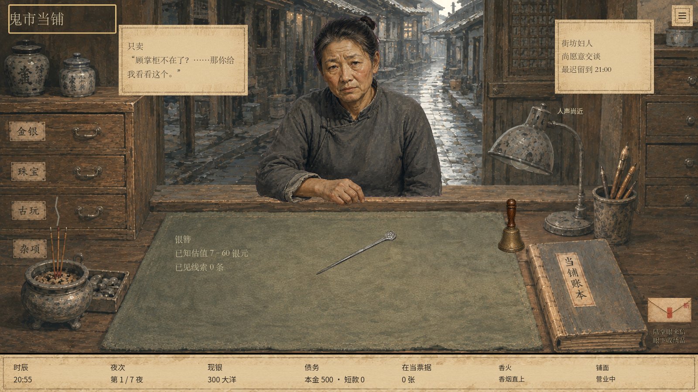
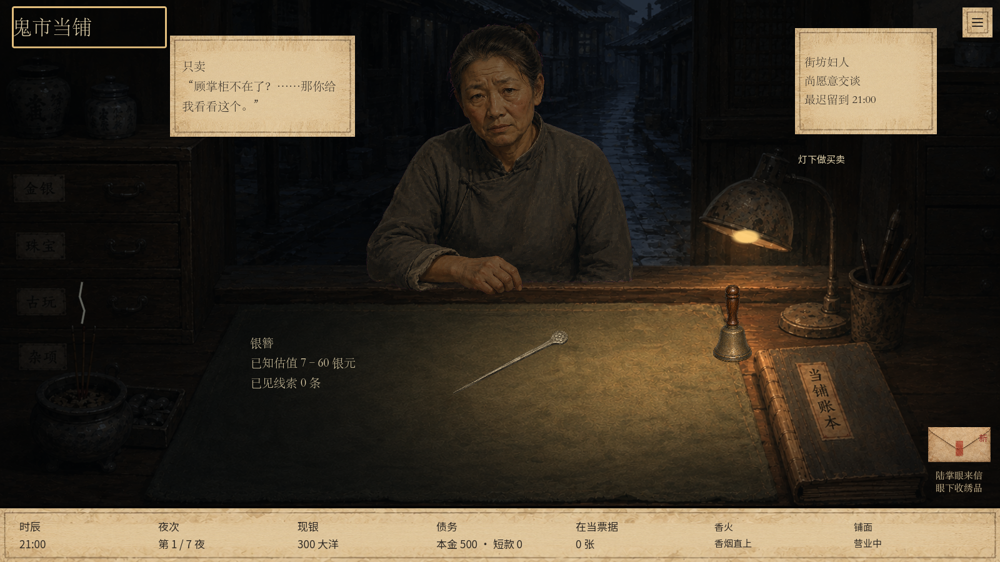

# 台灯完整熄灯状态

延续 `codex/evening-street-light` 分支，保留前一轮街道提亮。

旧实现只用纯色椭圆盖住灯泡，原画中的灯沿、罩内与局部暖光仍存在。现在增加完整熄灯素材：灯罩内侧自然转暗，保留玻璃、金属的环境反光，消除近处灯光痕迹。

运行时只在 21:00 前采样新素材的灯具和附近光照区域，边缘柔和衔接原背景。21:00 后继续原有亮灯素材和照明；其他背景、物件及旧版显示不替换。不修改营业时间、剧情、存档或经营规则。

素材：`assets/lighting/counter-lamp-off.png`，由内置 Image Gen 编辑原 `assets/art04/counter_room.png`，原图保留。未使用 CLI 图像生成。

验证：Godot 导入通过；1280×720、1600×900 的现有光照 UI 测试各 76 项通过、0 失败；检查 21/00/02 分界、台灯、四档亮度、过场透明度、菜单与鉴定。已目视检查实际熄灯及点灯画面，未见黑斑和区域接缝。`git diff --check` 通过。未推送。

以下是固定人物和货物的光照对照，不代表该客人一直等到测试时刻。

## 素材编辑提示词

Use case: lighting-weather / precise-object-edit. Edit target: the provided pawnshop background painting, a production game asset. Create its matching DESK LAMP OFF state. Preserve exact wide 1672x941 composition, camera, original brushwork, positions and sizes of every object, cabinets, Chinese labels, street, mat, ledger, smoke, and scene illumination. Change ONLY the old metal desk lamp at right (roughly x=1170..1445, y=245..575) and its emitted light on immediately surrounding wood/mat. The switch is OFF: no emission at all from bulb, underside or rim; no golden stripe under the shade, no warm halo/cone underneath, no lamp-created pool on the desk. The shade interior should be realistically shadowed aged grey-brown metal; glass bulb subtly visible in ambient reflected daylight, unlit, dimensional, NEVER a flat black/grey pasted circle. The entire lamp has a darker non-emissive metal appearance while retaining worn speckled texture and soft environmental highlights. Remove yellow/orange light spill on the wood just under the shade and near the base, reconstruct matching natural ambient-lit wood. Do not darken the whole image, do not brighten anything else. Everything outside lamp and its local light spill MUST stay perfectly registered with the reference. No crop, zoom, reframe, new objects, UI, labels, decorative framing or added text. Output full matching scene at same aspect ratio; it will be used as a registered local patch, so exact lamp geometry and alignment is critical.
