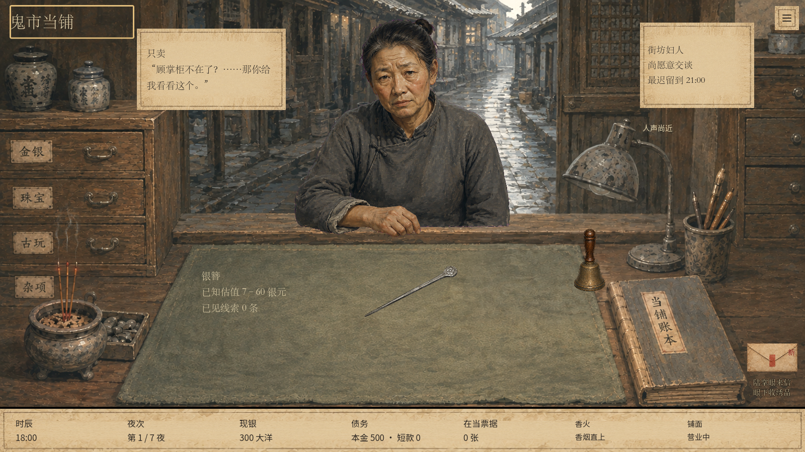
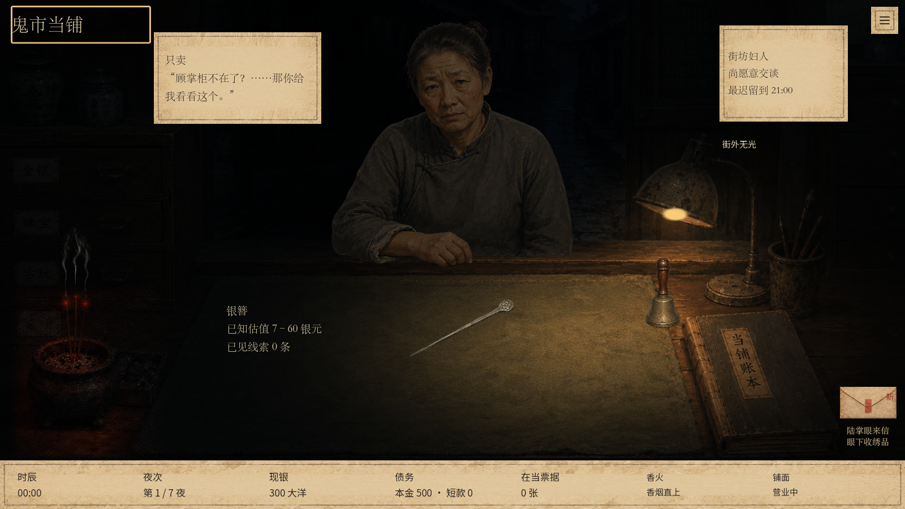

# 财神香动态烟丝

## 可见度修正（2026-09-11）

试玩反馈上一版烟气难以看见。提高烟丝的透明度上限与浅灰对比，保留透明空隙和顶部渐隐；使用同一纹理，不改剧情、烟向判定或存档。白天与夜间均已按完整游戏画面检查。

本次重新导入成功，两种分辨率的光照检查各79项、烟气检查各53项，均0失败。烟气专项新增四档背景下的可辨像素检查，而非仅判断动画像素发生变化。1280×720四档分别有348、499、510、512个烟气像素比背景提高至少0.06亮度；截图仍需配合实际试玩判断观感。初次沙箱运行因无法读取Windows证书库中止，随后在正常Windows环境、隔离测试存档下完整重跑通过。

删除固定四点折线，使用透明烟丝纹理和独立动态材质。三股烟从原画香头位置起烟，下端细稳，上升时产生缓慢、不同相位的偏摆及疏密变化，上半段扩散淡出。没有为烟雾增加声音或明火。

原 `smoke_wrong` 仍由原有风险/美术预览逻辑决定。视觉在约 1.25 秒内逐渐变成向柜内侧偏流，恢复后缓慢转回向上；不改变异常触发条件。动画仅使用渲染时间，不推进游戏时刻、不写存档、不产生未保存进度，烟雾层不接收鼠标。

素材 `assets/lighting/incense-smoke.png` 通过内置 Image Gen 生成，RGBA 1024×1536，已确认含真实透明通道，未使用 CLI。运行时重新映射烟丝细度、透明度与扩散范围，未改背景图片。

最终验证：Godot 导入成功；1280×720、1600×900 下光照回归各 79 项、烟气专项各 45 项通过，0 失败。专项检查不同时刻纹理变化、异常烟气向右偏移、正常烟向恢复、鼠标穿透与游戏状态不变。已目视检查正常及异常夜间截图和白天画面。日志 `.godot/smoke-validation.log`、`.godot/smoke-motion-*.log`。新增专项已接入 `tools/test_windows.ps1`。本轮未重跑与纯表现无关的全部经营测试。

截图是固定人物/时刻的视觉夹具；异常图仅演示已有烟向提示，不代表当局已真实触发事件。动态效果须在游戏中查看。

仍在 `codex/evening-street-light`，未推送。

## 素材提示词

Create one production VFX texture of a single delicate incense smoke wisp, isolated on a genuinely transparent RGBA background. Vertical 2:3 canvas. At bottom center a very thin pale grey translucent thread, slowly curling as it rises, spreading into sparse wispy filaments in the upper half and dissolving completely before the top and side edges. Smoke must be extremely fine, transparent and irregular with soft broken density, NO opaque white areas, NO thick clouds, NO symmetrical ribbon, NO hard contour, NO zigzag line, NO flame, NO glowing effect, NO incense stick, NO burner, NO objects, NO backdrop, NO checkerboard painted into image, NO text. This is faint smoke from a smouldering joss stick, not steam or a chimney. Keep all visible smoke within central 60 percent of width, all borders transparent. Realistic volumetric photographic smoke detail compatible with a muted painted historical game. One plume only, no grid or contact sheet. Its source at bottom center needs a thin gently tapered inlet; upper curls airy, mostly empty transparent space.
