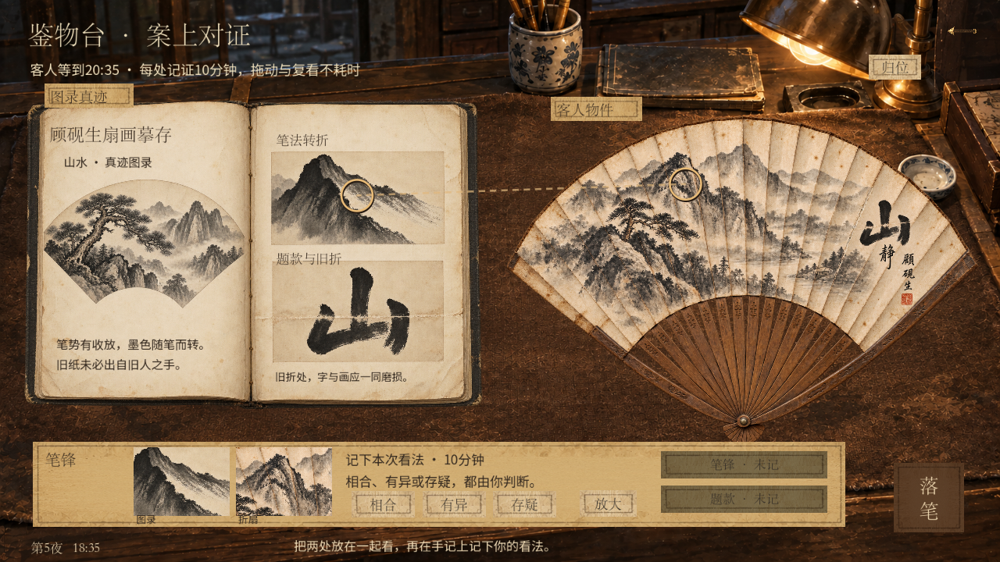
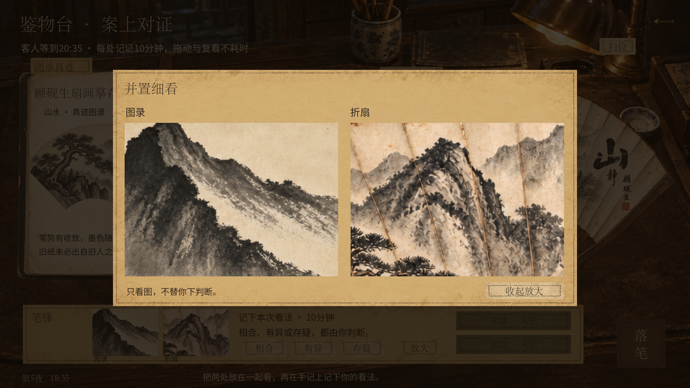
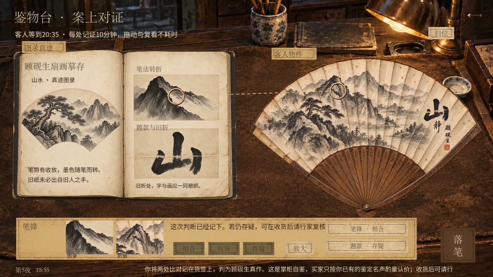

# 折扇案上对证 · 本地验收

日期：2026-09-17。运行：统一试玩 v27 / shop_appraisal_ten。状态：本地实现并验证，未推送。

**历史快照：** 本页记录首次案上对证实现。后续已改为免费可修改草稿、确认落笔一次10分钟，见[最新验收](../fan-drafts/REPORT.md)。下文每处10分钟与655项检查属于当时版本。

## 交付

采用用户选定的方案一：左图录、右实物、底部手记。可以拖动物件、圈选两处对应细节、并排放大真实图片，再自行记录相合、有异或存疑。两处记录后自行落笔判断；界面不直接公布真伪。

已保留每处记录10分钟、客人期限、禁忌、03:00边界、自鉴认可权重和行家复核名声规则。拖动、圈点、放大、复看免费；旧文字版手记可继续读取。快速试玩入口重复启动使用独立日志，避免旧窗口占用日志导致启动失败。

## 本轮验证

| 检查 | 结果 |
| --- | --- |
| 案上对证规则、无效输入、存档及回滚 | 48项通过 |
| 独立进程恢复两处圈点、看法与最终判断 | 3项通过 |
| 既有二级鉴物台、工具知识和自鉴规则回归 | 462项通过 |
| 原生窗口1280×720实际输入事件 | 55项通过 |
| 原生窗口1600×900实际输入事件及参考尺寸截图 | 56项通过 |
| 三种扇面、笔锋和题款局部放大 | 31项通过 |
| 根目录快速试玩启动指令，fan / Verify | 通过 |

合计655项断言／检查，0失败，另验证启动入口。原生日志位于`.godot/qa/appraisal/desk-*.log`。本轮没有重跑全部铜镜和十夜回归；此前结果保留在[首批验收记录](../../SHOP_APPRAISAL_ACCEPTANCE.md)。

环境提示：Godot报告无法读取Windows根证书库；本地画面、输入、保存和启动验证均完成，没有脚本解析错误。

覆盖重点：双方圈点类型不一致时不可记证；畸形或篡改的坐标与看法拒绝；重复检查不扣时；写盘失败恢复内存及磁盘；检查期间客人离开不留下半条圈点；主观手记不强制最终判断；老命令仍可重放。UI输入检查覆盖拖动、归位、选点、放大、复看、落笔与Esc退出。

## 视觉检查

将[选定概念图](../../design/fan-desk/selected.png)与[1672×941原生截图](source-size.png)放在同次图像输入中对照，两者都是选中笔锋、尚未记证的案面状态。重点核对左书右扇、暖灯木案、纸本信息区、选点连线和小箭头。两种常用窗口尺寸也已检查。

- 修复拖动物件没有跟随输入的问题，增加免费归位。
- 统一三种扇面题款的字号和布局，避免字号成为类别提示。
- 缩短图录底部说明，避免不自然换行。
- 书本采用正向摆放，方便稳定圈选；未复刻概念图的斜放角度。底部纸条容纳两项可复看的手记，因此比概念图更宽。这些属于本版交互取舍。

没有发现阻止本地试玩的高优先级视觉问题。美术仍为玩法插画：三种纸纹有少量生成差异，笔锋线索目前偏明显；真实玩家能否顺利读图、难度是否合适，需要试玩反馈，尚未做用户测试。

## 实际截图








## 快速试玩

PowerShell复制完整一行：

```powershell
& "C:\Users\alvachen\Documents\ChatGPT\pawnbroker\play-unified.cmd" -Stage fan -Wide
```

进入折扇比对后，在图录右页与扇面各圈一处，点“放大”细看，再记下看法。先试笔锋，再试题款，最后点“落笔”。删除`-Stage fan`可正常开局；快速场景和正常局存档分开。

[玩法及保存设计](../../FAN_DESK_DESIGN.md)
