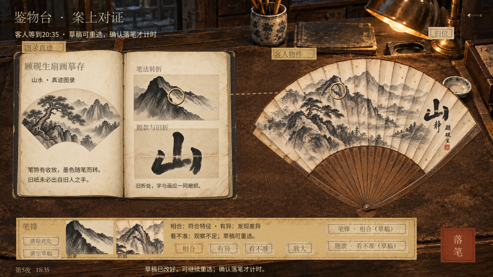
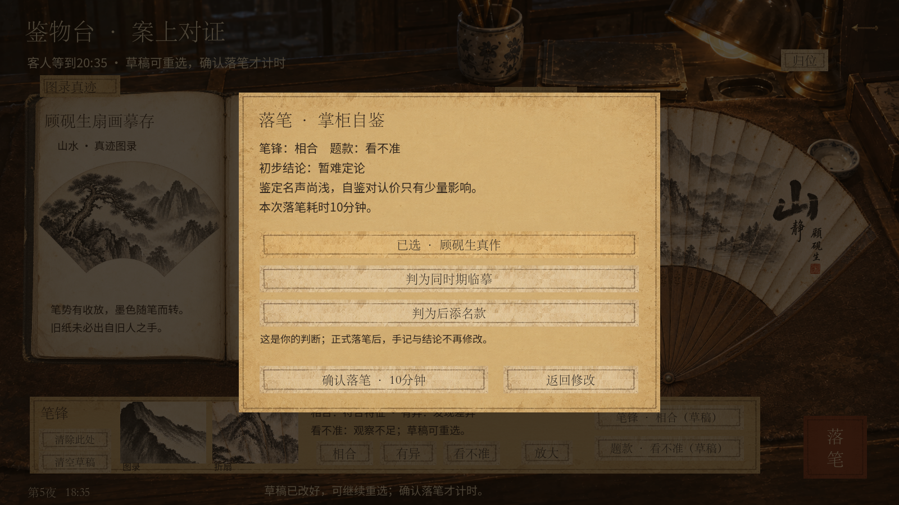
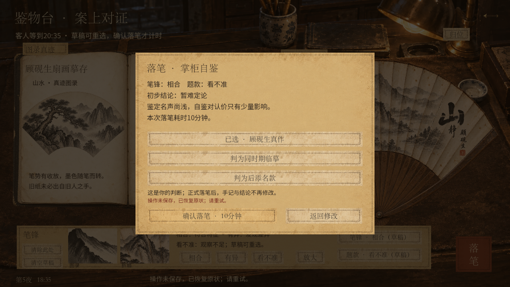

# 折扇鉴定：可修改草稿与落笔计时 · 验收

日期：2026-09-17。统一试玩v27，隔离目录`.artifacts/shop-appraisal`。已本地实现，未推送、未合并。

**后续按钮精简：** 页面现只保留一个“清空草稿”，确认按钮未选择时使用浅色纸面并提示先选结论，另增加后添名款解释。详见[最新截图与169项界面检查](UI_POLISH.md)。下文保留此前两按钮版本的验收记录。

## 结果

- 相合／有异／看不准均为玩家草稿，可以改选、重新圈点、清除此处或清空草稿。选择后自动保存；退出再进入和读取存档均能继续。
- 草稿不耗时间、不改变估值或名声。两处齐备后，落笔面板显示两处手记、初步结论、耗时与三个可自主选择的结论；确认才扣10分钟。返回修改免费。
- 正式结论标注“掌柜自鉴”，锁定手记；买家按已有鉴定名声认可，行家复核仍负责验证。汇总覆盖9种看法组合，不访问物品隐藏真值。
- 预计完成时间必须严格早于客人期限和03:00，否则不开始、不扣时并保留草稿。有效鉴定推进其他客人的等待。拒绝验货禁忌保留，触犯时不产生正式结论。
- 旧命令重放不变；旧存档已支付的检查时间抵扣本次10分钟，不退款。旧手记缺圈点可以免费补填；旧结论不解除锁定。
- 写盘失败完整恢复时间、草稿、正式结论、计价和动作记录；确认面板内显示错误，保留选择以便重试。

## 验证

| 本轮检查 | 结果 | 日志 |
| --- | --- | --- |
| 草稿、9种组合、计时、边界、保存回滚与名声 | 163通过，0失败 | [规则日志](draft-rules.log) |
| 草稿及正式结论跨进程恢复 | 8通过 | [恢复日志](draft-restore.log) |
| 既有鉴物台、工具、知识、自鉴与行家规则 | 462通过，0失败 | [回归日志](draft-regression.log) |
| 旧圈点命令与存档兼容 | 48通过，0失败 | [旧版比对日志](draft-legacy-desk.log) |
| 1280×720原生窗口实际输入 | 86通过，0失败 | [窗口日志](draft-ui-1280.log) |
| 1600×900原生窗口实际输入 | 87通过，0失败 | [窗口日志](draft-ui-1600.log) |

共854项检查，0失败。另实测根目录`play-unified.cmd -Stage fan -Verify`正常启动通过。测试使用独立数据目录，不覆盖正常试玩存档。

规则检查包括：同内容重复提交和清除空草稿为无写盘的无效操作；清除旧记录后不会回填；两处草稿转库存后继续鉴定；已售或在当物拒绝；强制待办与物品风险阻断；工具及知识资格重验；客人期限剩9／10／11分钟、02:49／02:50／02:51的边界；其他客人在鉴定期间正常超时；新流程行家复核积累名声；篡改坐标或看法拒绝；草稿修改、清除与正式提交的真实写盘失败均完整回滚。

UI检查覆盖拖动、归位、圈点、改选、清除、放大、关闭重开、取消结论面板、正式确认、保存失败与重试、落笔后锁定和Esc关闭。发现并修复重开页面后“清除此处”按钮未及时恢复的问题。

环境仍有Godot无法读取Windows根证书库的提示；未出现脚本解析错误，不影响本轮本地测试。未重跑整套十夜与铜镜回归；本轮范围为鉴定交互和相关保存行为。

## 视觉复核

保留原图录、扇面与案面美术，增加的小按钮沿用现有纸签。1280与1600两种尺寸均已查看实际截图：草稿标识、解释、清除入口和确认耗时完整可读，面板没有遮挡自己的操作按钮；保存错误直接出现在确认面板内。







另见[1600草稿](notes-1600.png)、[1280确认](confirm-1280.png)、[正式结论](claim-1600.png)。

## 体验与启动

完整鉴定由两次10分钟改为一次10分钟，设施投入、认价权重与行家费用不变；新的耗时收益仍需正常经营试玩观察，本轮不宣称完成整体经济平衡测试。

PowerShell完整指令：

```powershell
& "C:\Users\alvachen\Documents\ChatGPT\pawnbroker\play-unified.cmd" -Stage fan -Wide
```

关闭旧试玩窗口后重新启动，即可使用本次界面。先记两处草稿，试着改选或清除，再打开“落笔”选择结论并确认。快速场景仍为独立入口；删除`-Stage fan`正常开局。

[当前玩法说明](../../FAN_DESK_DESIGN.md) · [统一试玩说明](../../SHOP_APPRAISAL_PLAYTEST.md)
