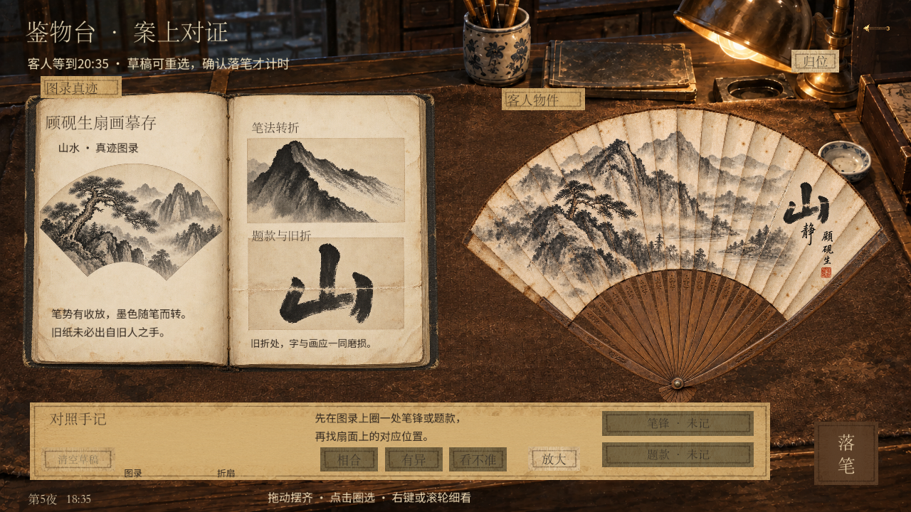
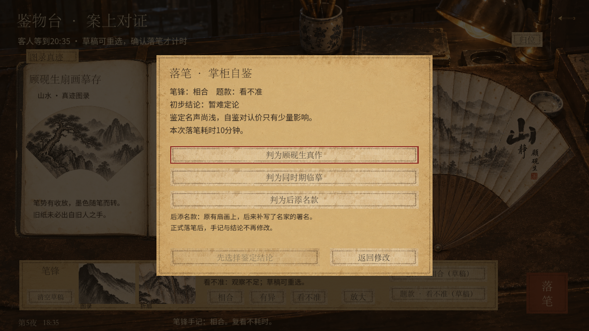

# 手记按钮精简与落笔提示

日期：2026-09-17。本地统一试玩v27，未推送。

- 页面只保留一个“清空草稿”按钮，同时清空笔锋与题款。标题与按钮同列居中，按钮与右侧看法按钮同高对齐；单处修改直接点击对应手记重选。底层旧清除命令保留兼容。
- 确认按钮未选结论时保持浅色纸面，显示“先选择鉴定结论”；仍须玩家明确选择，之后显示“确认落笔 · 10分钟”。无暗选、无提前扣时。
- 面板新增解释：“后添名款：原有扇画上，后来补写了名家的署名。”正式落笔后锁定的说明仍保留。

## 验证

原生窗口实际输入：1280×720共84项、1600×900共85项，合计169项通过、0失败。已查看初始空草稿、填写草稿与未选结论的实际截图，确认对齐和浅色状态。测试继续覆盖草稿重选、清空、重开恢复、确认前不扣时、失败回滚及重试。本轮未修改鉴定服务或存档规则，未重复运行全部经营回归。

Godot仍提示无法读取Windows根证书库；无脚本错误，本地操作检查正常完成。

[1280日志](polish-ui-1280.log) · [1600日志](polish-ui-1600.log)

[1600草稿](single-clear-1600.png) · [1600确认](light-confirm-1600.png)
