# v21 界面与美术预览

截图来自实际Godot窗口和真实鼠标点击；测试存档由正常游玩产生。美术采用项目已有SVG物件体系的低饱和灰绿、旧银与纸色，独立素材在`assets/goods_v21/`。茶盏纹样图只在观察后开放，隐藏制式不进入图片路径；折扇三种归属共用未复核图片。

## 四种新品、背面与取证细节

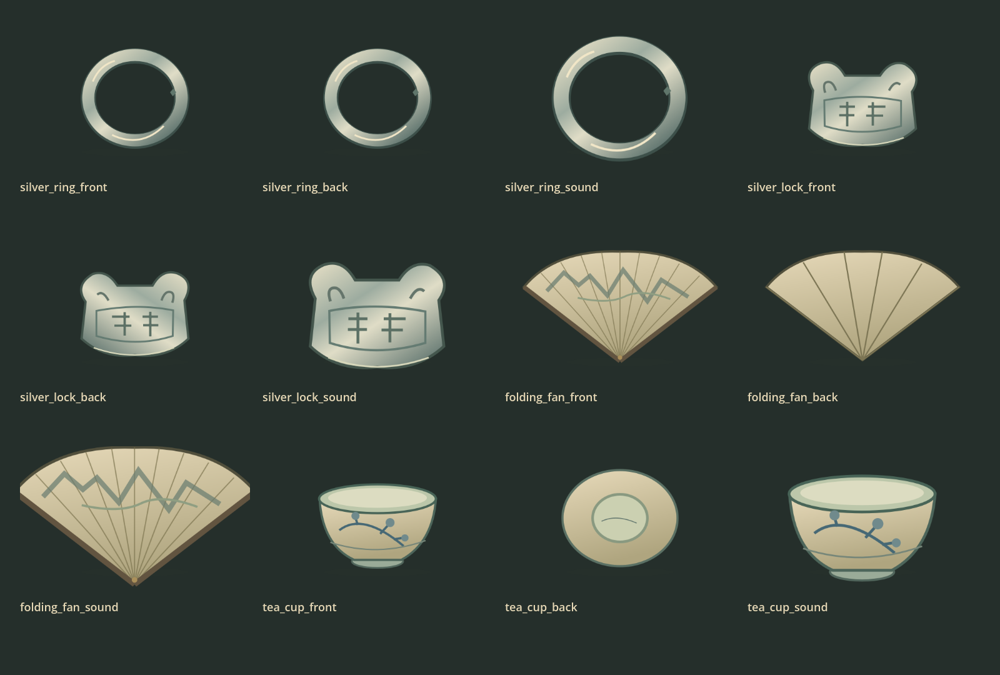

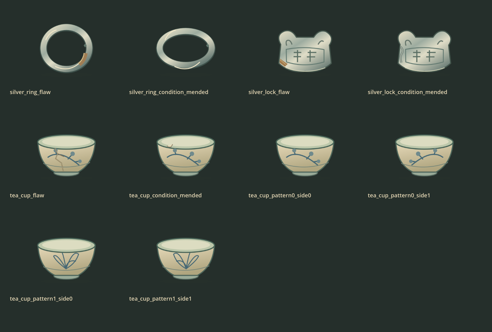

## 寻货确认与复核

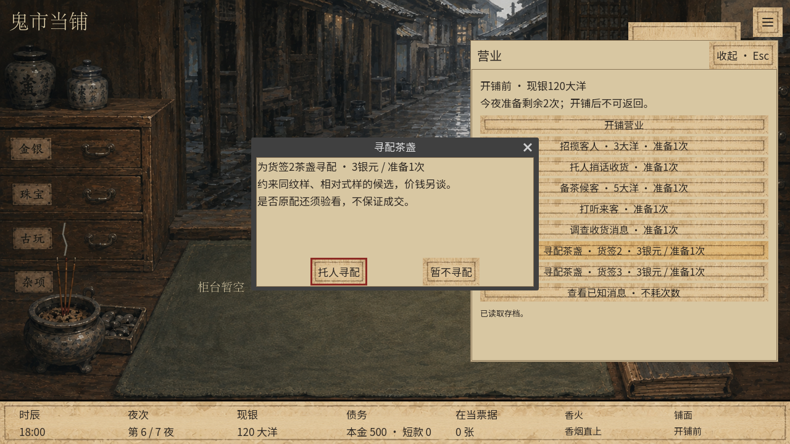

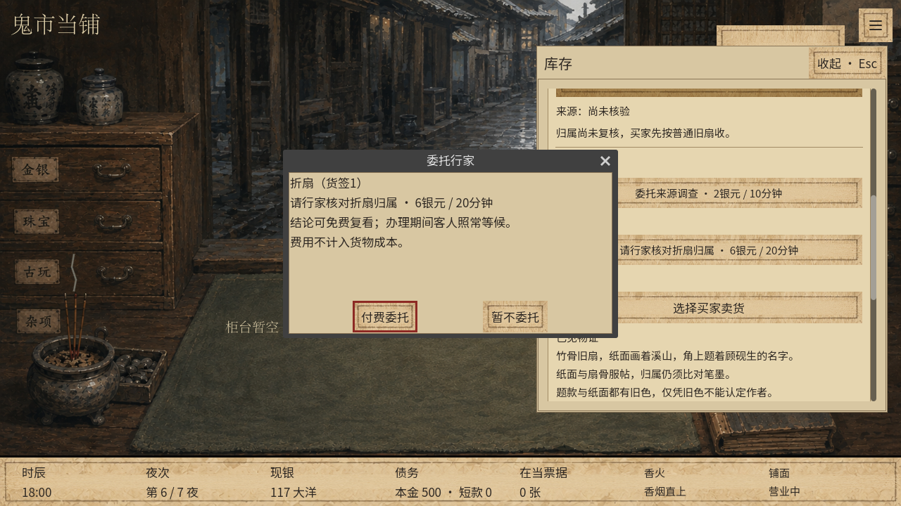

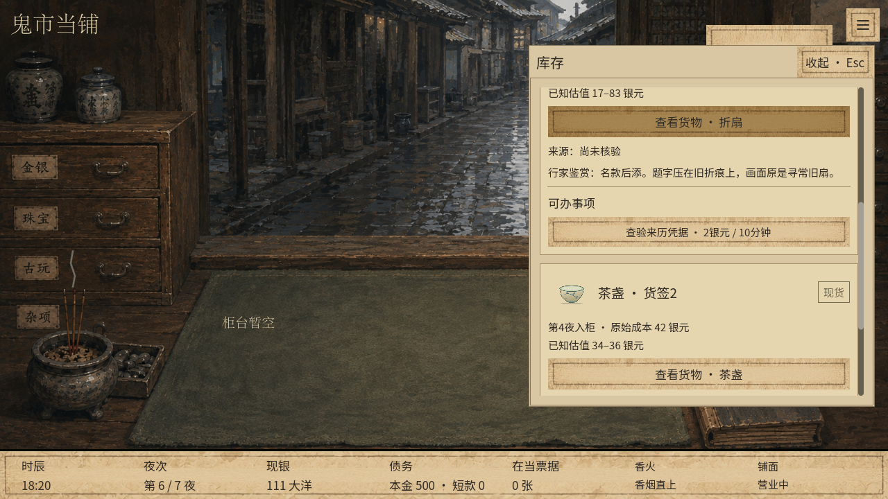

## 明确勾选原配与成交流水

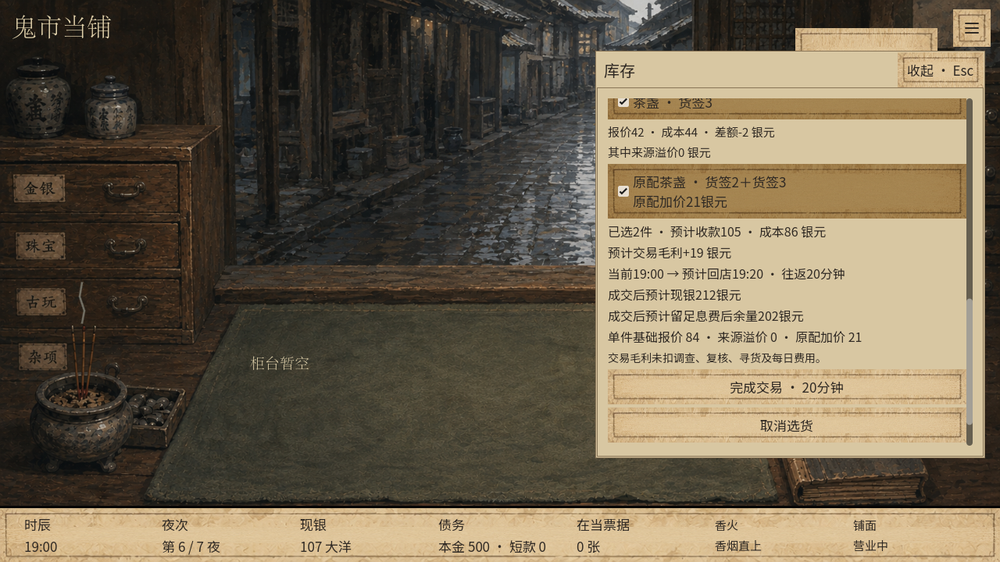

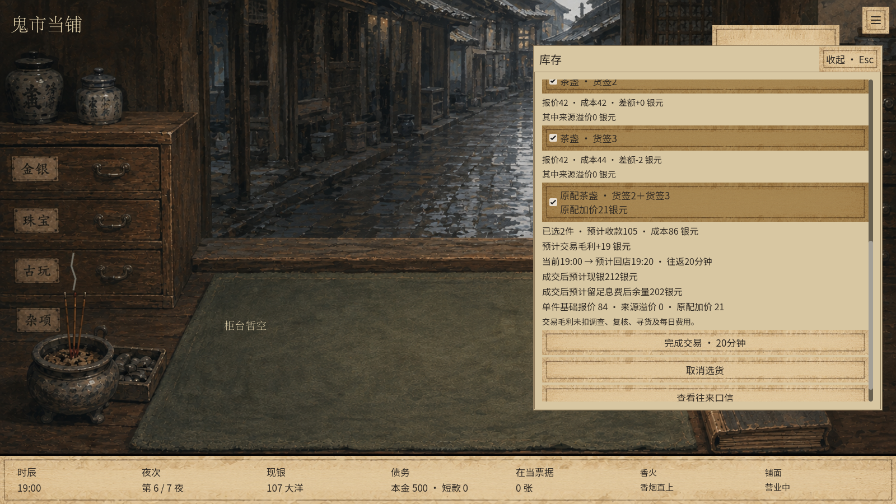

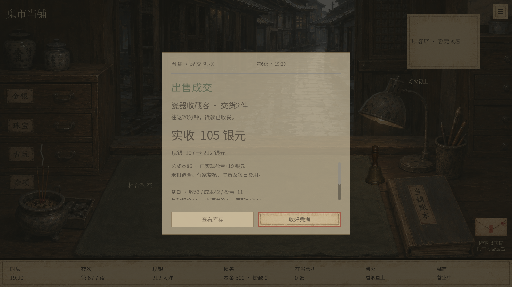

## 新品柜台检查

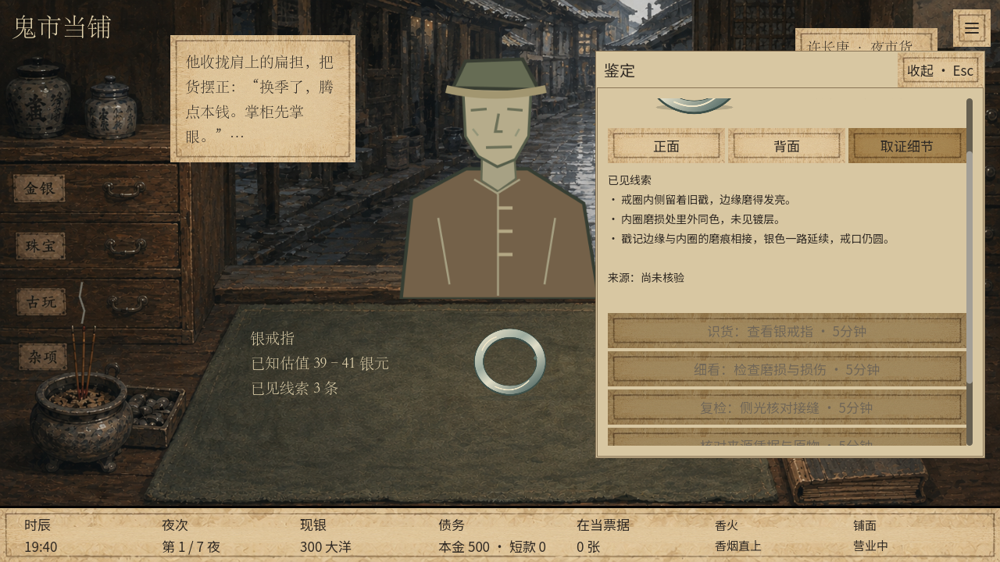

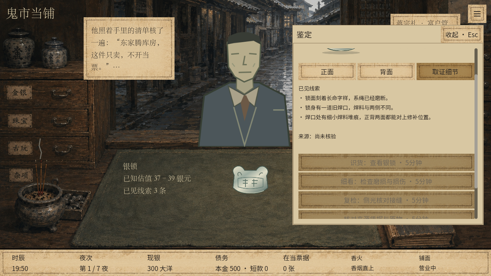

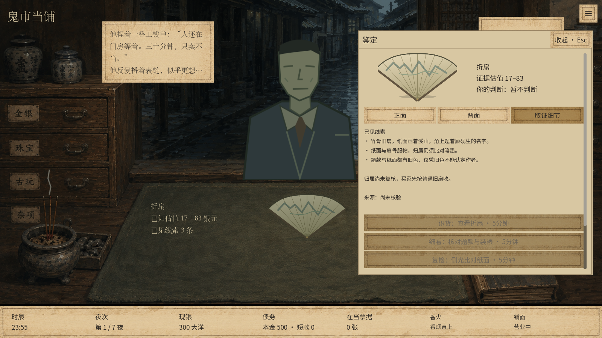

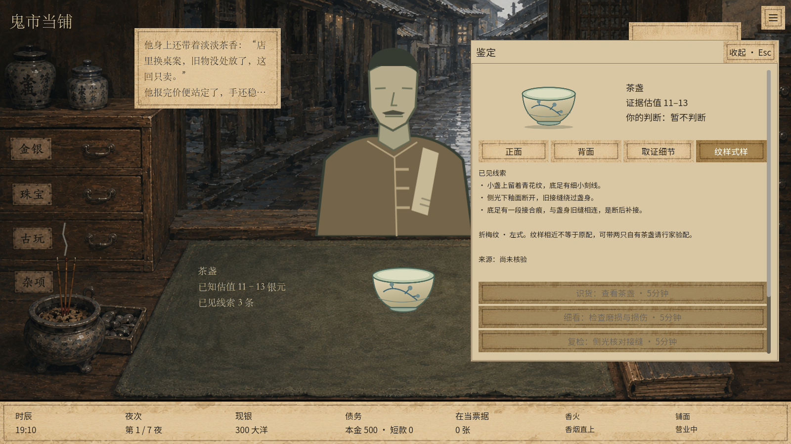
