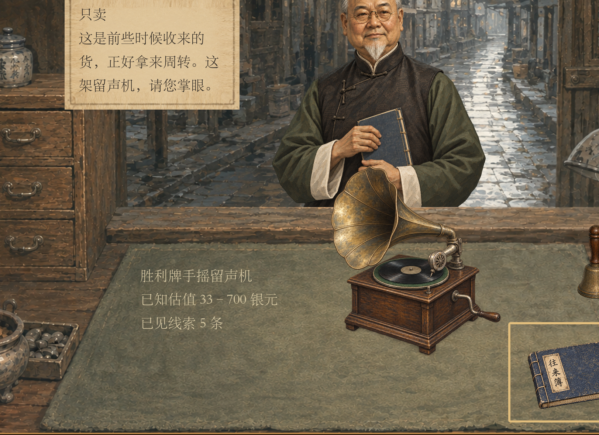
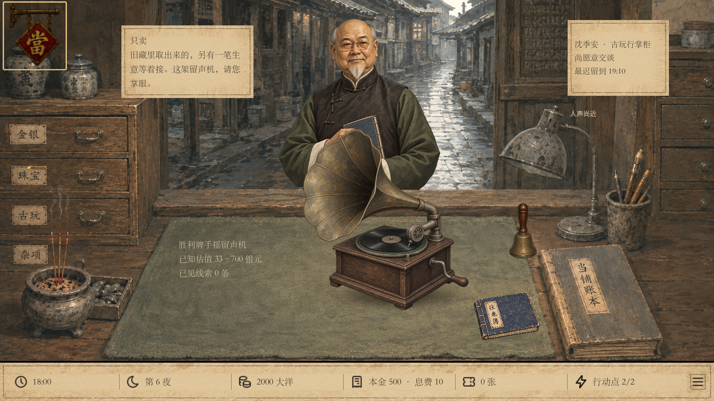
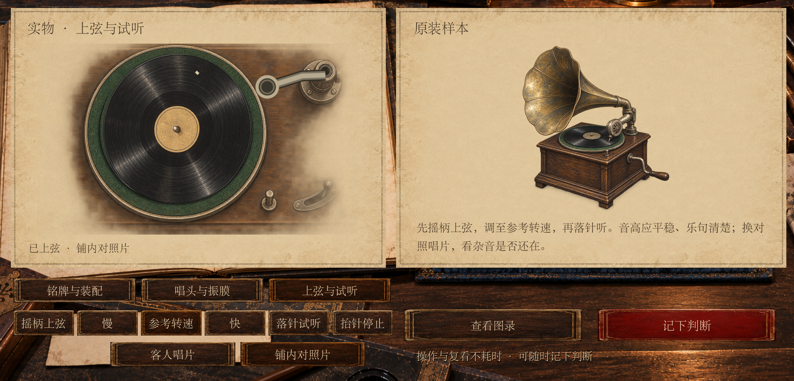
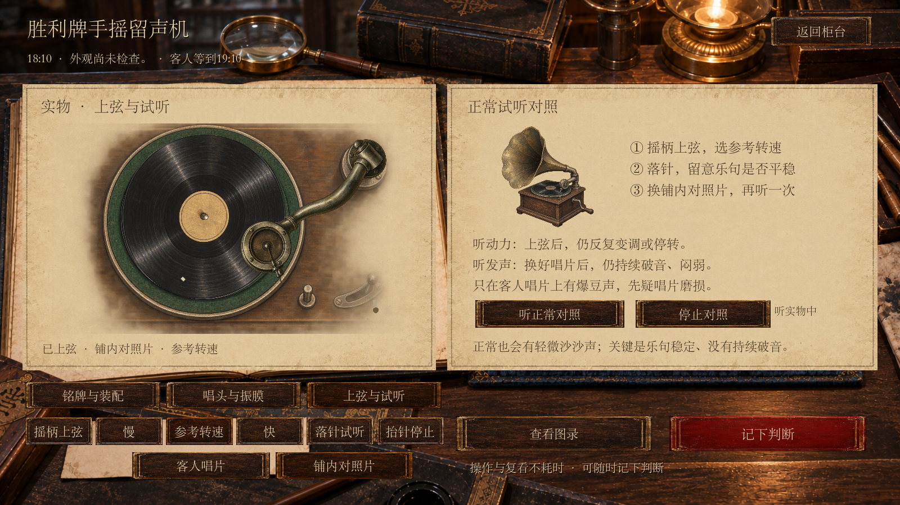

# 留声机体验与美术修订 · 2026-09-25

依据用户提供的实际截图审看柜台和“上弦与试听”，沿现有 v44 局部改进。本轮使用 Product Design 的既有界面审看流程与内置 imagegen，未另建网页或改变收售玩法。

## 发现与处理

| 截图/操作 | 原问题 | 已做调整 |
| --- | --- | --- |
| 柜台摆放 | 边缘与金属高光过硬，木箱与桌面缺接触感 | 重绘低饱和水粉整机，校准木箱/唱片/喇叭比例，复用桌面光照与局部脚底阴影 |
| 进入上弦与试听 | “音高平稳”缺少可学的直接参照 | 同屏正常对照按钮、三步检查提示，明确换片用于排除唱片问题 |
| 听实物与指南 | 现代钢琴乐段缺早期唱片质感 | 1919 Victor 录音替换；正常也有底噪，破音/闷弱/变速是另外叠加的差异 |
| 动画 | 唱臂像平面塑料图标 | 透明绘画唱臂，固定臂长旋转落针和抬针 |
| 双音源 | 切换参照时可能难分正在听谁 | 实物与对照互斥，显示正在听实物/正常对照/停止 |

正确的玩家顺序：摇柄上弦 → 参考转速 → 落针 → 换铺内对照片 → 与正常样本比较。慢挡变低、快挡变高是调速结果；只有回到参考挡后仍反复变调或停转才作为动力判断依据。正常老唱片底噪不是机器坏的保证；声音也不能证明机器原装。

## 验证

- 留声机规则回归：3814 通过，0 失败。
- 播放组件：20 通过，0 失败；上弦不足、持续运转、变速、故障停转、音源区别及循环。
- 1600×900：67 通过，0 失败；新增对照不增加实物依据，切换不混播，保存失败仍不播放。
- 1280×720：67 通过，0 失败；检查正常对照、按钮、短句与指南均无遮挡。
- 原文件 MD5 与图书馆清单一致。六段音频均为 23.9 秒单声道、无数字削波，破音和正常平均响度校准一致，唱片磨损层独立。
- Godot 导入与 diff --check 通过。本机根证书存储警告继续存在，不影响本轮离线测试。
- 真实窗口截图已检查标题、按钮、短句、桌面落点；本轮不宣称完成屏幕阅读器或完整无障碍审计。转盘纸点可辅助看速度，但发声判断仍依赖听音。
- 声音已验证来源、文件处理和游戏播放，最终听感由用户本机试听确认。

## 对照与交付

| 原界面（用户提供） | 修订实机 |
| --- | --- |
|  |  |
|  |  |

原截图为用户裁切范围，新截图为完整游戏窗口，比较以对象、界面区域为准，不作像素级复刻评估。

- [指南小窗口](gramophone_1280_guide_2.png)
- [声音来源与处理](../../../assets/gramophone_desk/audio/SOURCE.md)
- [最终素材及内置 imagegen 提示词](../../../assets/gramophone_desk/REFINEMENT_PROMPTS.json)
- [本地试玩说明](../../GRAMOPHONE_V44.md)

未推送、未合并；沿用独立 v44 试玩入口和存档。
