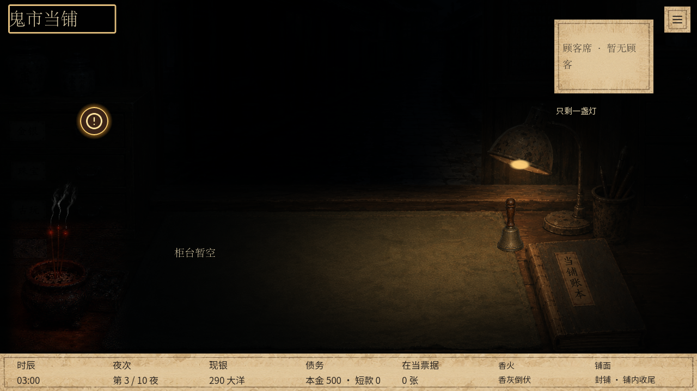
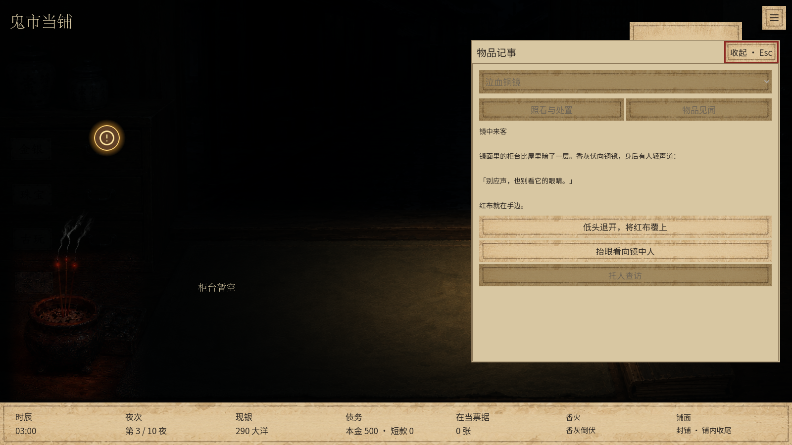
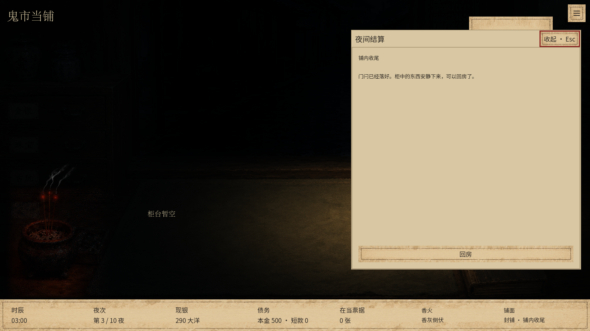

# 库存事件提醒 · 本地验收

final result: passed

范围：用户提供的第三夜“镜中来客”截图及当前柜台界面。仅新增左侧库存柜事件入口；本批未推送。主目录和 `.tools/v23-playable` 均已应用。

## 交互与检查结果

- 未触发事件时隐藏；触发后持续亮起，收起页面不清除。
- 点击进入对应待处理页面，物品危机直接显示处置按钮；不消耗时间，不改变事件或存档。
- 实际执行退开覆红后提醒消失；恢复未完成状态会重新显示。
- 持有物品、已有见闻及尚未开展的调查不产生提醒。普通剧情不冒充库存事件；要求物品的已触发剧情指向铺中记事。
- 库存提醒不覆盖寝屋界面，也不在死亡、破产或试玩结束后显示。
- `tests/inventory_event_notice_ui.gd` 使用真实鼠标输入，v23 的 1280×720、1600×900及 main 的1280×720各17项通过、零失败。通过原有封铺动作实际触发危机，通过原有回应按钮解除。
- `git diff --check` 通过。Godot 根证书提示不影响本地画面与交互检查。

## 视觉复核

已将用户参考图与实际重开事件画面放入同一轮视觉检查，并查看收起、重开及解除后的画面。参考2358×1355，验证1280×720和1600×900；测试现银、当票及已调查材料与用户存档不同，属于独立测试状态，不作为版式差异。不是整页像素复刻。

- 字体与文字：沿用原有柜台及纸页字体；新增图标使用现有Tabler图标库，提示文字只描述待处理事项。
- 间距与布局：52像素点击区域置于库存柜右上侧，不挤占事件正文、选项、菜单及底栏；两种尺寸均可点到。
- 色彩与对比：沿用旧金与深褐色，亮金描边和柔和光晕保持暗场可见，无闪烁动画；悬停和键盘焦点有明确反馈。
- 资产：原有场景、纸页及物品图未改；Tabler 3.34.1 `alert-circle` 沿用MIT许可，仅将原始描边替换为可调色白色。
- 文案：未预告后果；点击后直接回到原有处置选项，不增加额外确认步骤。

未发现需要修复的P0/P1/P2问题。

## 画面

