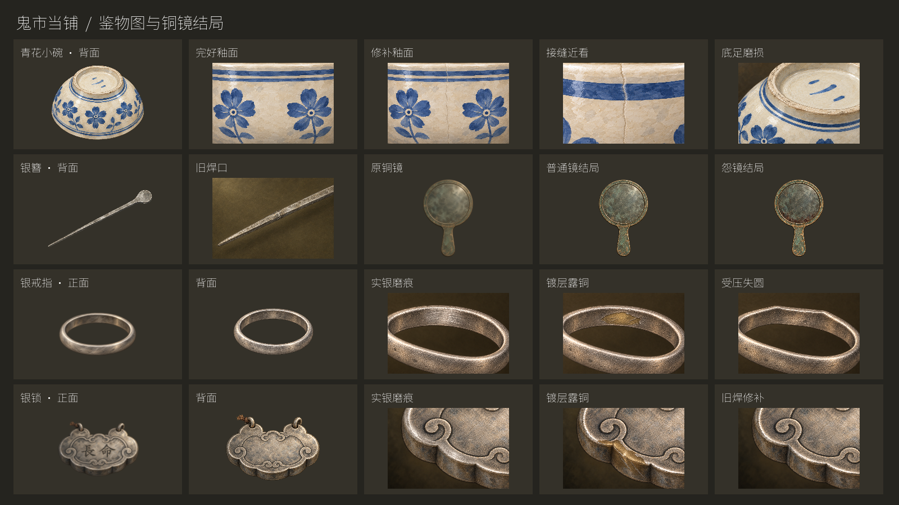
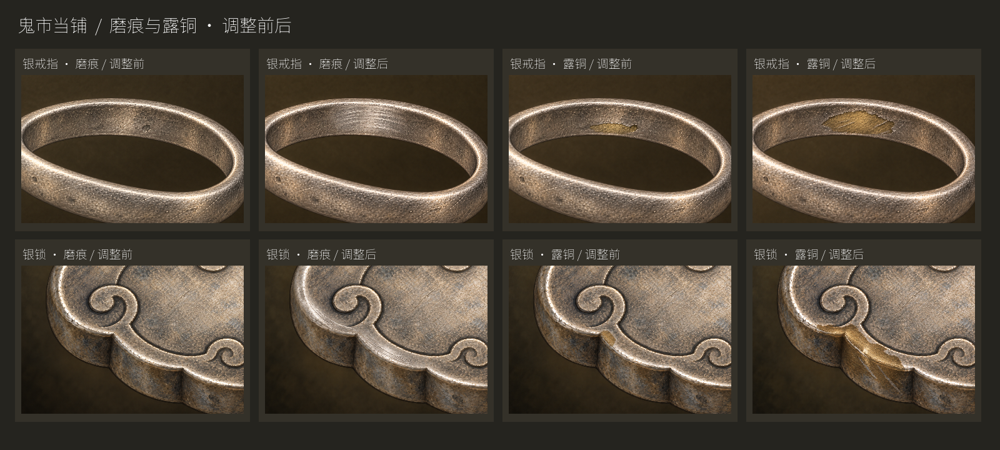

# 四组优先美术交付

本地分支：`codex/item-study-art-20260923`，原画基于 `e891dc2`，发布前已整合最新 main `f4e996b`（v37）。新图在此独立工作区完成接入和验证，根目录原有未提交内容保持不变。用户于 2026-09-23 看过增强版后授权推送并合并 main；发布结果以 GitHub PR 合并记录为准。



## 本地启动

```sh
godot --path /Users/alvachen/Documents/ChatGPT/pawn/.artifacts/item-study-art
```

默认是具名富客主线 v37。鉴定页免费可看正面、背面；执行对应的底足、侧光或银器检查后，才能看见取证细节。铜镜结局图在完成结局后的库存里出现。

## 初始 v30 验证

- `tests/item_art_contracts.gd`：448 个断言，0 失败。覆盖 v30 / v21 图片门槛、开场银簪、旧路径升级、页面 ID 与标签不变、自定义图优先、结局无虚构背面。
- `tests/item_study_art_ui.gd`：1280×720 / 1600×900 各 1520 个断言，0 失败。9 次自然编排的真实来客：碗完好/修补，银簪修补，戒指及银锁的完好/镀银/修整。验证实际取证、按钮切图、免费复看不耗时、柜台比例、交易入库与 v30 存档恢复。
- `tests/unified_campaign.gd -- fixtures-only`：2042 passes，0 失败。按真实流程生成统一主线结局存档。
- `tests/item_study_mirror_ui.gd`：两个分辨率各 8 个断言，0 失败。解码真实主线 acknowledged / resentment 结局并检查实际库存对应 PNG。
- 原画与实际控件截图放入同一对照图中复核；完整报告见项目根目录 `design-qa.md`。
- Headless 检查有当前 macOS 沙盒系统 CA 证书读取提示；断言通过，真实图形运行没有脚本或资源错误。

GUI 测试可加 `-- wide`。铜镜 UI 先运行上述 fixtures-only。全部原始截图保存在 `.godot/qa/item-studies/`；本目录保留重点证据和前一轮遮挡截图。这些记录对应本地验证；远程发布结果以 GitHub PR 合并记录为准。

## 露铜与磨痕反馈修订

按“露铜、磨痕不明显”的反馈重绘银戒指、银锁的四张证据图：连续定向擦痕、磨平的银灰区域，以及边界明确的暗黄铜底。仍然是原有品相和解锁门槛。



加强后以实际鉴定栏大小检查，并重跑四个相关来客品相；1280×720 与 1600×900 各 752 断言、0 失败。日志见 feedback-1280.txt / feedback-1600.txt。旧版素材和截图保留在 feedback-before。

## 最新 main v37 合并验证

- 美术契约：611 断言，0 失败，覆盖 v37 / v30 / v21。
- 九种实际来客品相、取证、交易入库与存档恢复：两个分辨率各 1441 断言，0 失败。
- 铜镜结局库存：两个分辨率各 8 断言，0 失败。
- 新怀表与刺绣图集切换：两个分辨率各 13 断言，0 失败；确认普通碗去底、新怀表材质及刺绣材质清理正确。
- `tests/named_wealthy_story.gd -- fixtures-only`：2020 passes，0 失败，生成当前 v37 主线结局存档。

当前 UI 测试默认 v37；旧 v30 可加 `-- v30`。宽屏加 `-- wide`。v37 日志及精选截图见本目录 `v37-*` / `v37_*`。合并前 v37 QA 报告保留在 previous-design-qa-v37.md。
