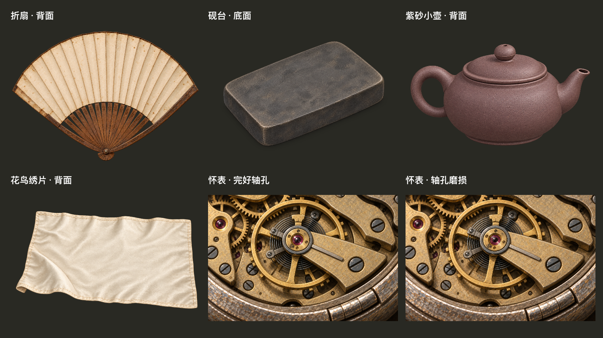

# 第二批鉴物美术 · 本地验收

基于 main 5673b92（v37），独立分支 codex/item-study-second-20260923。2026-09-24 完成本地验收；用户随后授权 push 与线上合并，发布结果以 GitHub PR 记录为准。



新增折扇背面、砚台底面、紫砂小壶背面、花鸟绣片背面、普通怀表两张轴孔微距；折扇柜台、鉴定、成交回执及库存复用已认可精绘正面。原根工作区未提交内容保持不变。

## 启动

```sh
godot --path /Users/alvachen/Documents/ChatGPT/pawn/.artifacts/item-study-second
```

要直接复查真实流程的自动演示（隔离测试存档，自动依次展示物品）：

```sh
godot --path /Users/alvachen/Documents/ChatGPT/pawn/.artifacts/item-study-second --script res://tests/item_study_second_ui.gd
```

加 `-- wide` 验证1600×900；加 `-- fan-only` 只查看折扇三种隐藏品相。普通翻面免费，怀表的检查细节仍需原有取证。worn 品相没有虚构新细节页。

## 验证

- 美术契约：959断言，0失败；v37/v30/v21路径、页面与门槛、自定义覆盖。
- 原生1280×720及1600×900：各1393断言，0失败；九种实际来客，免费翻面、取证、返回图片、成交回执、入库、存档恢复。
- 高档怀表/绣屏图集切换：13断言，0失败。
- 导入成功，最终GUI日志无脚本/资源错误；未运行Windows打包或全游戏剧情回归。

完整设计验收见根目录 design-qa.md。原画与实际控件的合成对照图、完整窗口图均为Godot原生渲染；assets.json记录原画哈希。准确生成提示词与参考路径见 assets/item_studies_second/*.json，使用内置image_gen。

## 发布整合 v39

发布前整合 main db4182b：默认入口为 first_debt_unified v39，保留珍珠鉴定与第一笔阴账剧情。解决 CounterItemArt 材质白名单冲突，同时保留龙凤镯、折扇及本批细节图。测试脚本默认随此入口运行，`-- v37` / `-- v30` 可选旧局。

复查：1509 美术契约断言；两种分辨率各1350 GUI断言；图集切换13断言；`first_debt_unified_appraisal.gd` 23030 passes，均0失败（其继承测试输出标题仍为 PEARL V38，实际 setup/会话/冷回放使用v39）。截图与日志使用v39前缀。原始v37验收保留为历史记录。
