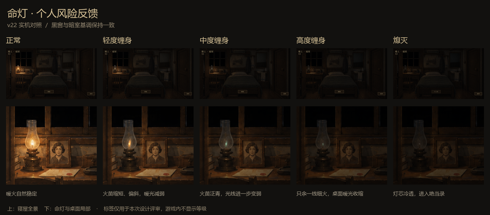

# v22 命灯验收

初次验收基线 main：`5883ef3261e83d82a139f6e6f6eeb57f1121bbf9`。Godot 4.6.1，Windows，实际图形测试使用 NVIDIA RTX 3060 Laptop / OpenGL Compatibility。

## 自动检查

2026-09-12 经用户确认发布，已合入 main `60736d6` 的议价界面与柜台灯光更新，无冲突。合入后重新验证：个人风险 2364、跨进程读档 20、M0–M7 1800、寝屋 701、议价反应 18、议价实机 129、命灯实机两种分辨率各 84、营业死亡实机 20，全部通过。对应日志为 `.artifacts/merge-*.log`。下方灯态对照沿用初次验收画面，营业中死亡图更新为合入后的柜台表现。

| 检查 | 结果 |
|---|---|
| `tests/run_personal_risk.gd` | 2364 通过，0 失败 |
| `tests/run_personal_risk.gd -- process-read` | 20 通过，0 失败；独立进程恢复 18 份营业、睡眠应对、次日及终局快照 |
| `tests/run_all.gd` | M0–M7：1800 通过 |
| `tests/run_room.gd` | 701 通过，0 失败 |
| `tests/run_night_market.gd -- quick` | 旧 v21：1818 通过，0 失败 |
| `tests/life_lamp_ui.gd`，1280×720 | 84 通过，0 失败 |
| `tests/life_lamp_ui.gd -- wide`，1600×900 | 84 通过，0 失败 |
| `tests/life_lamp_death_ui.gd` | 20 通过，0 失败；实际点击、失败重试、营业中死亡与界面显示 |
| 交互预览 | 五个按钮逐一实际点击验证，可返回正常试玩 |
| `tools/build_lamp_review.py` | 两种分辨率下灯焰动效局限于灯具附近，熄灭后静止；桌面及镜面亮度逐档递减 |

测试使用隔离的 APPDATA 和独立测试存档。引擎输出存在一条 Windows 根证书库读取警告；不涉及游戏联网，不影响这些检查。没有脚本、渲染或断言错误。

## 覆盖的规则

- 四次独立普通伤害依次达到 1、2、3、4；两次重伤跨档并在耗尽时死亡。
- 追看 1 + 同事件回头补 1 = 2；再次点击、恢复存档、睡眠结算不重复计伤。
- 普通用镜、停止追看、过期追看、店铺存放违规和正确避险不误扣个人风险。
- 追看与铺内攻击分别累计；未耗尽的重伤能继续就寝，并直接进入次日。
- 恢复一档、恢复至正常、恢复后再受伤、死亡后禁止复活；恢复不清除事件去重。
- 卖镜、覆布、安睡、封存湿布不恢复。湿布实际受害接入同一服务，新运行不再按夜叠加旧的灯级。
- 营业中死亡不伪造关门、日结或追加息费；睡眠死亡保存实际来源阶段和原因。
- 保存失败完整回滚受害、时间、死亡记录和事件；重试成功清除旧错误提示。
- 旧运行读取、新旧运行切换、共用手动存档位与新运行独立自动存档。

## 实机画面

两种分辨率都检查了命灯观察、照片/旧信、镜面联动、菜单、就寝确认、取消以及“放松入眠”进入次日。镜面保持正常反射模式，没有附加角色或随机异象。

同一桌面区域相对正常灯态的平均亮度约为 100%、76%、54%、38%、32%；镜面区域约为 100%、84%、69%、57%、51%。窗格采样平均亮度均低于 1%，保留近黑窗外。数字只用于图像验收，不显示给玩家。逐帧差分记录见 [光照与动效检测](light-and-motion.json)。

[1280 正常](1280_lamp_0.png) · [1280 高度受伤](1280_lamp_3.png) · [1600 正常](1600_lamp_0.png) · [1600 熄灭](1600_lamp_4.png) · [营业中死亡](1280_business_death.png)

原始运行日志保存在本工作树 `.artifacts/` 的 `personal-risk.log`、`lamp-cross-process.log`、`legacy-all.log`、`initial-check.log`、`legacy-night.log`、`lamp-ui-1280.log`、`lamp-ui-1600.log`、`lamp-death-ui.log`、`lamp-preview.log`；可按上述脚本复现。分档预览和测试剧情不写入玩家正式存档。
