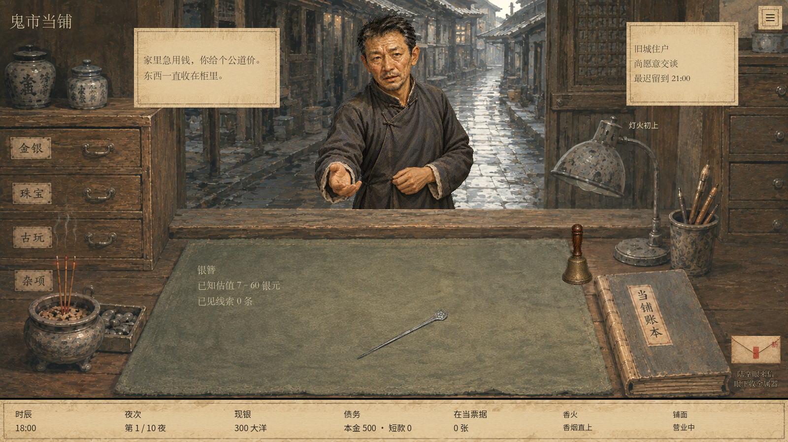
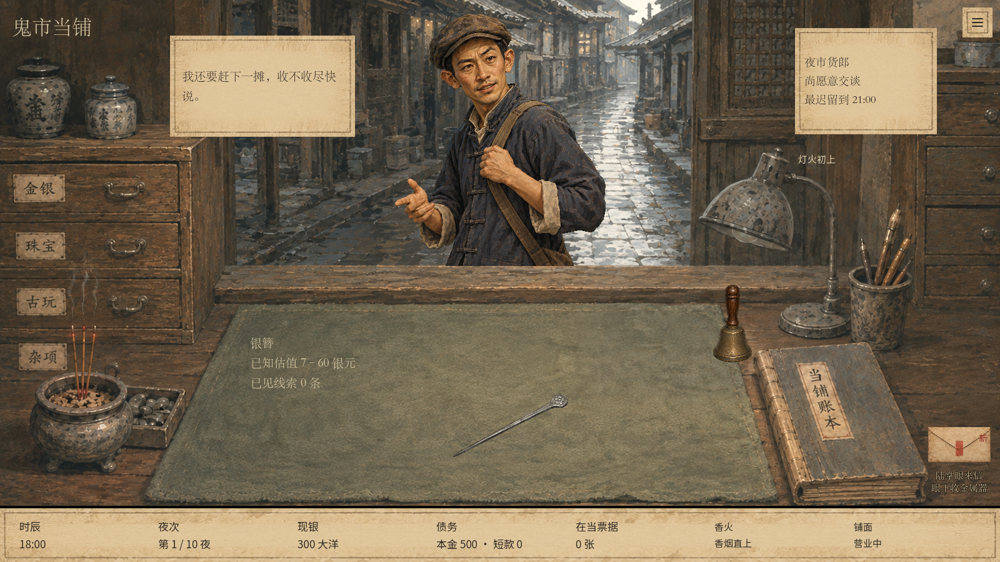
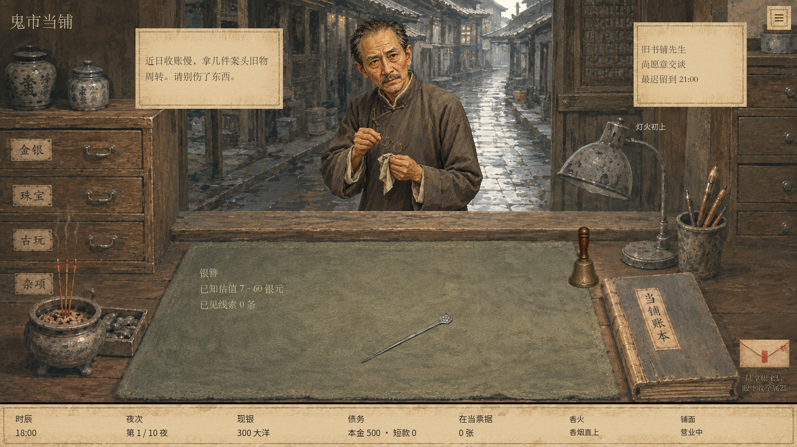
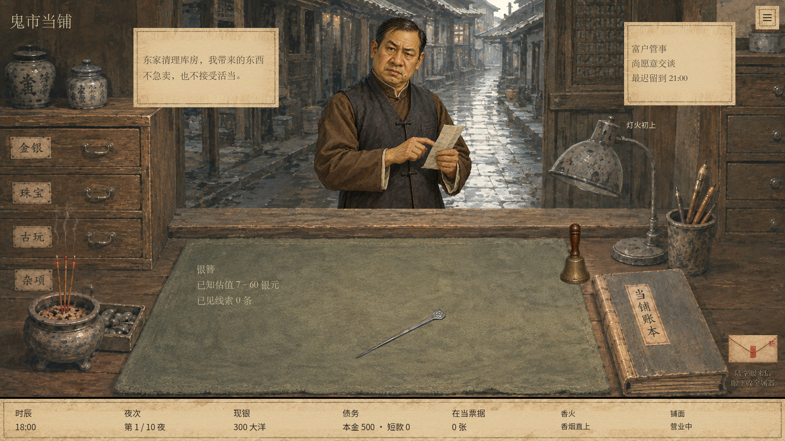
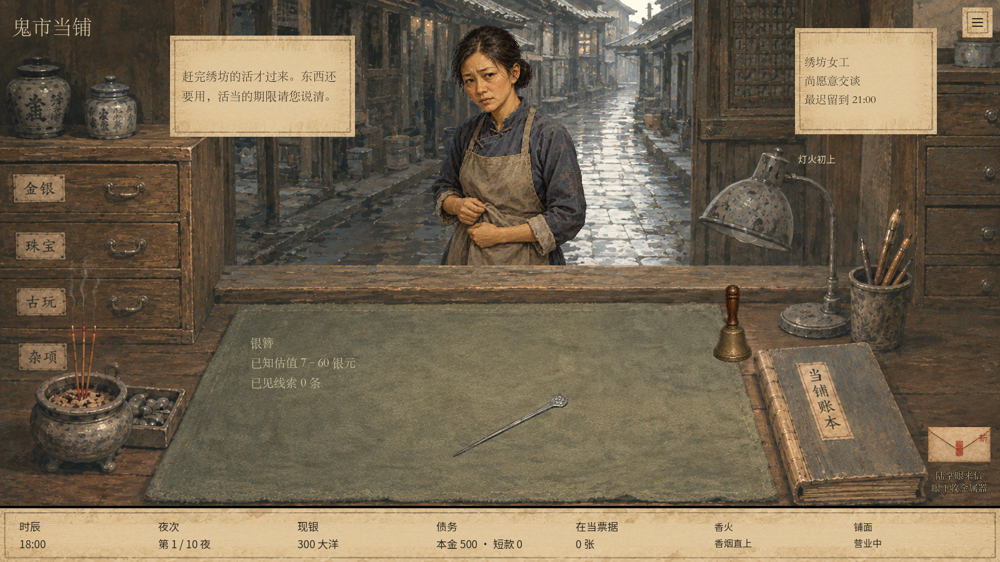
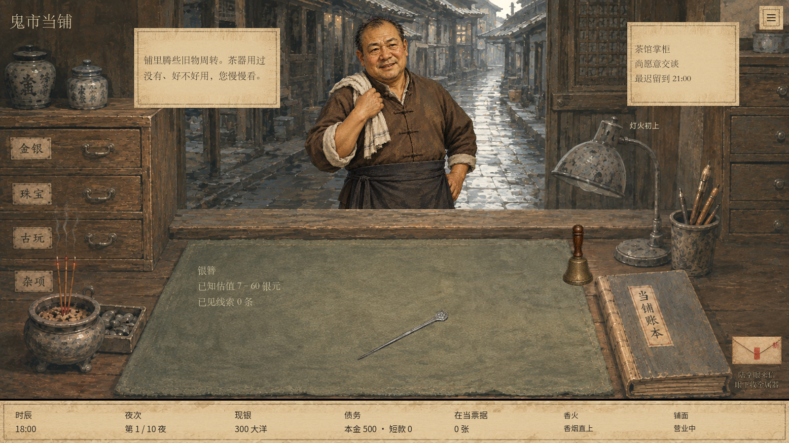
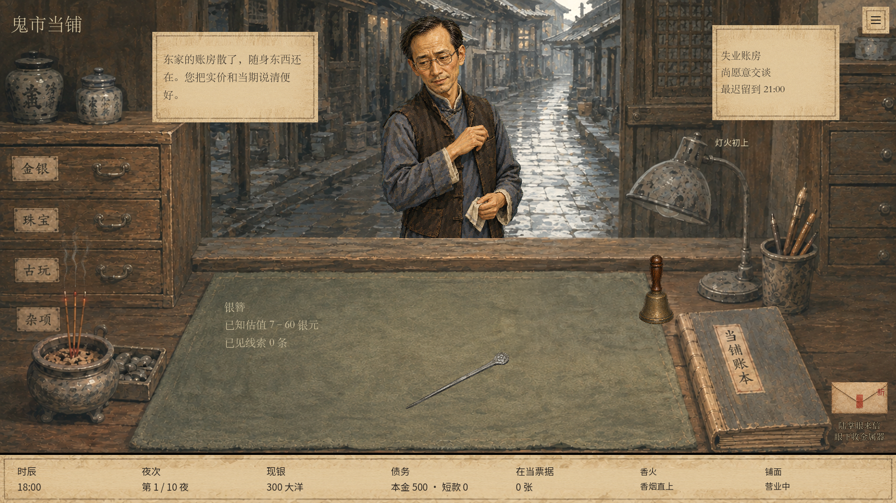

# 普通客人立绘验收

本批接入八位已批准的普通职业人物，分别保留探手、扶肩带、摘镜、核单、攥裙、卷袖、搭巾和收帕动作。富户管事采用已确认的 v3 面貌，其他为 v2。原 PNG 完整保留，游戏使用现有着色器去除洋红底。

## 提交范围

- `assets/art04/customers/ordinary/`：八张生产 PNG、导入配置、说明及相邻 `provenance/` 生成提示词。
- 普通职业通过 customer_id 映射，熟客通过只读 person_id 区分；柜台和对话使用同一人物。
- 每人独立摆放参数使下摆贴合柜台后沿；保留现有氛围、入场和离场行为。
- 不修改剧情人物形象、剧情文案、经营规则或保存格式。

## 最新 main 上的复验

基于远端 main `28f3a4382a51fe311755e1ccf9c4592ca0ab601b` 的独立工作目录验证，使用 Godot 4.6.1；无原工作区其他未提交功能。

| 检查 | 结果 |
| --- | --- |
| 编辑器资源导入 | 退出码 0 |
| `tests/ordinary_customers_visual.gd` | 152 项断言，0 失败 |
| `tests/run_aqi_investigation.gd` | 2711 项通过，0 失败 |
| 8 张生产图与批准原图哈希 | 全部一致 |

立绘验收使用正式场景，逐人覆盖 1280×720、1600×900，检查对话身份一致性、可视边界、三态显示、特殊人物和熟客保留、审阅不更改存档以及成交离场。这里的截图为视觉夹具，柜台物品与时间来自同一隔离开局，不是八笔实际交易的记录。

Godot 在本机沙箱内报告系统根证书库无法读取；离线导入、GPU 渲染和两组测试均完成。原始测试输出保存在本目录的 `visual-results.txt` 与 `v24-results.txt`。

## 画面

| 旧城住户 | 夜市货郎 |
| --- | --- |
|  |  |
| 旧书铺先生 | 富户管事 |
|  |  |
| 绣坊女工 | 钟表修理匠 |
|  |  |
| 茶馆掌柜 | 失业账房 |
|  |  |

补充：[1280 小尺寸](1280_bookkeeper.png)、[禁时氛围](1600_atmosphere_2.png)、[首客形象保留](1600_opening_preserved.png)。全部重新运行的截图仍输出到本地 `artifacts/ordinary-customers-20260915/standees/`。
