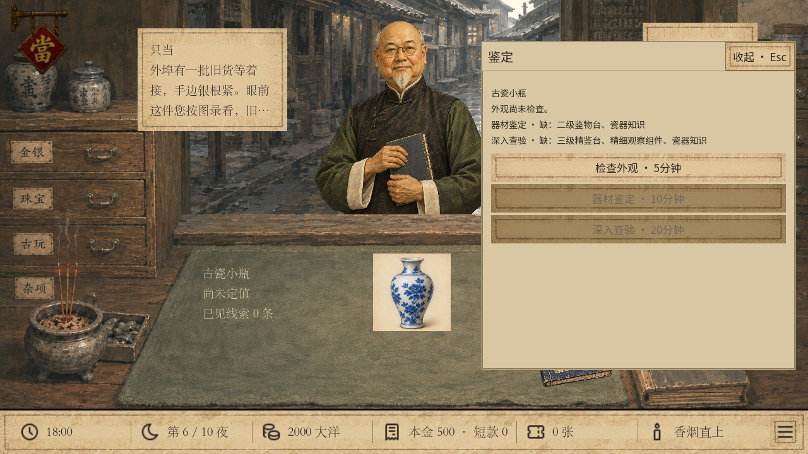
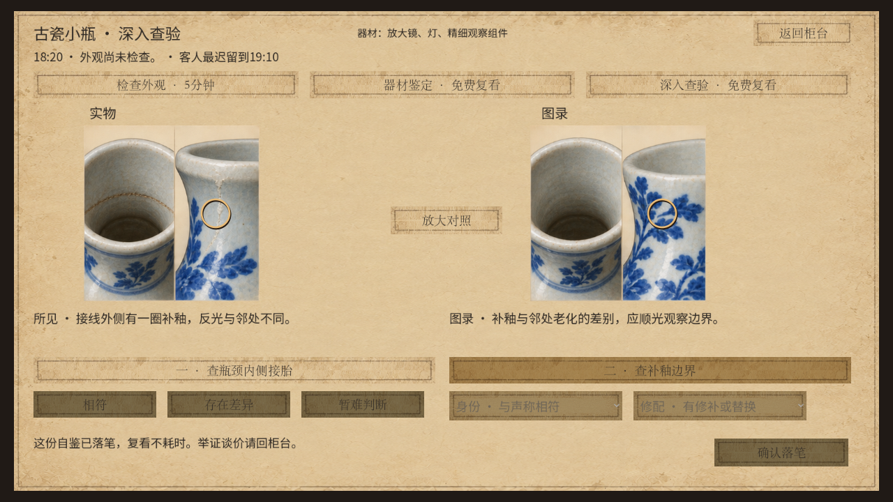
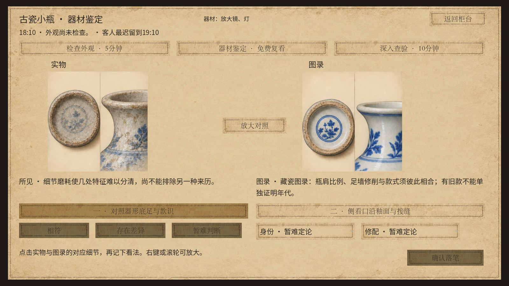
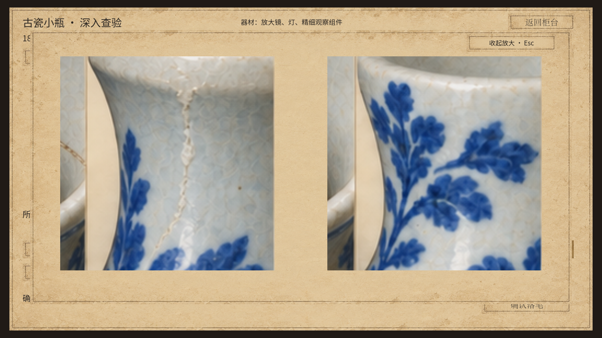
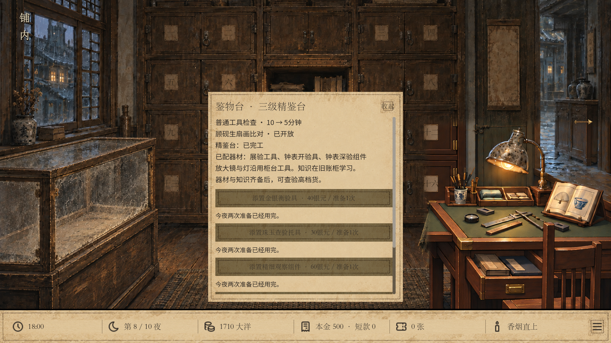

# v32 本地验收记录

日期：2026-09-23。Godot 4.6.1，Windows，项目源码运行；未推送或发布。

## 已通过

| 检查 | 结果 |
| --- | --- |
| 十件货 × 三货况 × 三外观 × 两难度 | 180 组合；分级证据、定价、时间、快照与 JSON 稳定性全部通过 |
| `tiered_appraisal.gd` | 6,233 项，0 失败；含独立随机分布、器材与知识门槛、筹款线、先后／合并举证、重复压价、错误举证、畸形圈点、期限、写盘失败回滚 |
| `tiered_journey.gd` | 1,094 项，0 失败；7 位富客、6 次高级鉴定（含 2 次三级）、4 笔放当、1 次回赎，跨夜记录冷重放一致 |
| `tiered_storage.gd` | 80 项，0 失败；真实文件写入／读取、v31 鉴定旧档、读取旧档后重新开始 v32、三级台继续鉴扇 |
| `tiered_ui.gd` 1280×720 | 99 项，0 失败；真实鼠标圈选、原生下拉菜单、放大、落笔、举证与购置 |
| `tiered_ui.gd` 1600×900 | 99 项，0 失败；同上 |
| `wealthy_customers.gd` | v31 回归 1,554 项，0 失败 |
| `wealthy_ui.gd` | v31 界面回归 48 项，0 失败 |
| `unified_appraisal.gd` | 旧折扇／基础鉴定回归 2,185 项，0 失败 |
| `tiered_story.gd` | 新默认局剧情回归 3,486 项，0 失败 |
| `tiered_companion.gd` | 新默认局阿七回归 3,276 项，0 失败 |
| 统一入口 `-Verify` | `normal`、`wealthy-basic`、`wealthy`、`wealthy-deep` 均启动通过 |
| 源文件差异检查 | 无空白格式错误 |

连续经营先用正式 300 银元开局跑完一局，再在测试内将初始资金设为 2,500，以覆盖三级建设和大额放款。后一部分仍经真实建设、购买、营业和行动记录重放，不改写正式配置。180 组合是构造状态的穷举与序列化测试，完整保存重放由经营测试单独承担，不把构造预置冒充真实存档。

测试环境存在 Godot 读取 Windows 系统证书库的提示；本次不使用联网功能，脚本、存档和渲染测试正常。最终通过日志没有脚本错误或失败断言。

## 实际运行画面

十件货的三级画面均另有截图，以 `precision_1280_`／`precision_1600_` 加物品键命名。图片检查修正了原图中的错误裂纹、真假图录不一致、怀表编号和报时怀表分格；源文件与修改来源保存在 `assets/appraisal_v32/`。

## 试玩顺序

1. `wealthy-basic`：无设备查外观，查看缺项，直接举证外伤。
2. `wealthy -Condition sound -Difficulty ordinary`：二级足以落笔并谈价。
3. `wealthy-deep -Condition sound -Difficulty hidden`：真货二级也可能难辨，三级补证。
4. `wealthy-deep -Item porcelain_vase`：轻损修补瓷，先外观、再深查，确认 600→480→240 的证据定价。
5. `wealthy-deep -Item gold_watch -Condition flawed`：查明仿制后，厂主仍坚持原最低筹款额。

启动完整命令与所有物品参数见 [试玩说明](../../PRECISION_V32.md)。
