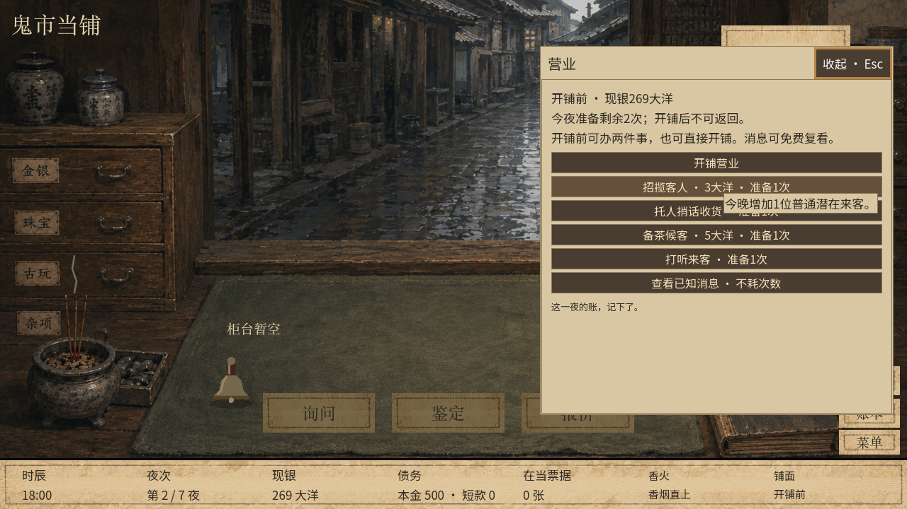
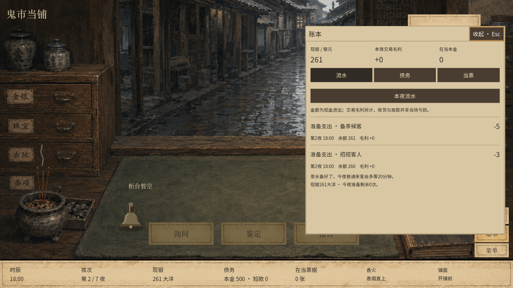

# 版本15发布前验证

2026-09-08，macOS，Godot 4.6.1。在从远端 main 创建的独立发布工作树内导入资源并执行，默认标题使用版本15。

37项检查全部通过，合计540395项断言，零失败。所有结果日志检查 `SCRIPT ERROR`、`Parse Error`、`Invalid call`、`ERROR:` 和 `FAIL`，均无命中。

覆盖256种子、资金边界、准备动作顺序与回滚、11步跨进程恢复、新旧存档、双分辨率完整七夜和默认入口、铃铛与美术界面。Windows未在本次运行；未制作安装包。

| 检查 | 结果 |
| --- | --- |
| run_all | M0–M7 TESTS PASSED · 1799 assertions |
| run_room | ROOM TESTS: 701 assertions, 0 failures |
| run_pawn | PAWN TESTS: 107 passes, 0 failures |
| run_variety | VARIETY TESTS: 17079 passes, 0 failures |
| run_market | MARKET TESTS: 5931 passes, 0 failures |
| run_bargaining | BARGAINING TESTS: 182 assertions, 0 failures |
| bargaining_variety_tests | BARGAINING VARIETY TESTS: 69 passes, 0 failures |
| run_integrated_variety | INTEGRATED VARIETY TESTS: 16976 passes, 0 failures |
| run_four_night | FOUR NIGHT TESTS: 42532 passes, 0 failures |
| run_seven_night | SEVEN NIGHT TESTS: 136843 passes, 0 failures |
| seven_edge_tests | SEVEN EDGE TESTS: 340 assertions, 0 failures |
| manual_save_tests | MANUAL SAVE TESTS: 1163 assertions, 0 failures |
| run_opening | OPENING TESTS: 100 assertions, 0 failures |
| run_integrated_seven | INTEGRATED SEVEN TESTS: 8011 passes, 0 failures |
| preparation_tests | PREPARATION TESTS: 305412 assertions, 0 failures |
| preparation_process_start | PREPARATION PROCESS start: 161 assertions, 0 failures |
| preparation_process_attract | PREPARATION PROCESS attract: 4 assertions, 0 failures |
| preparation_process_tea | PREPARATION PROCESS tea: 4 assertions, 0 failures |
| preparation_process_finish | PREPARATION PROCESS finish: 4 assertions, 0 failures |
| preparation_process_second | PREPARATION PROCESS second: 16 assertions, 0 failures |
| preparation_process_target | PREPARATION PROCESS target: 4 assertions, 0 failures |
| preparation_process_intel | PREPARATION PROCESS intel: 4 assertions, 0 failures |
| preparation_process_third | PREPARATION PROCESS third: 111 assertions, 0 failures |
| preparation_process_sixth | PREPARATION PROCESS sixth: 223 assertions, 0 failures |
| preparation_process_end | PREPARATION PROCESS end: 218 assertions, 0 failures |
| preparation_process_read | PREPARATION PROCESS read: 7 assertions, 0 failures |
| prep_ui_1280 | PREPARATION UI: 537 assertions, 0 failures |
| prep_ui_1600 | PREPARATION UI: 537 assertions, 0 failures |
| default_ui_1280 | DEFAULT PREPARATION UI: 90 assertions, 0 failures |
| default_ui_1600 | DEFAULT PREPARATION UI: 90 assertions, 0 failures |
| legacy_ui_1280 | INTEGRATED UI: 505 assertions, 0 failures |
| title_ui_1280 | TITLE MENU UI TESTS: 108 assertions, 0 failures |
| bell_core | BELL TESTS: 195 passes, 0 failures |
| bell_ui_smoke_1280 | BELL UI: 55 assertions, 0 failures |
| bell_ui_smoke_1600 | BELL UI: 55 assertions, 0 failures |
| art04_ui_smoke_1280 | ART04 UI SMOKE: 111 assertions, 0 failures |
| art04_ui_smoke_1600 | ART04 UI SMOKE: 111 assertions, 0 failures |

## 实际界面

1280×720：按钮仅保留名称、费用与次数，鼠标移入显示效果。

1600×900：准备支出计入账本流水。

