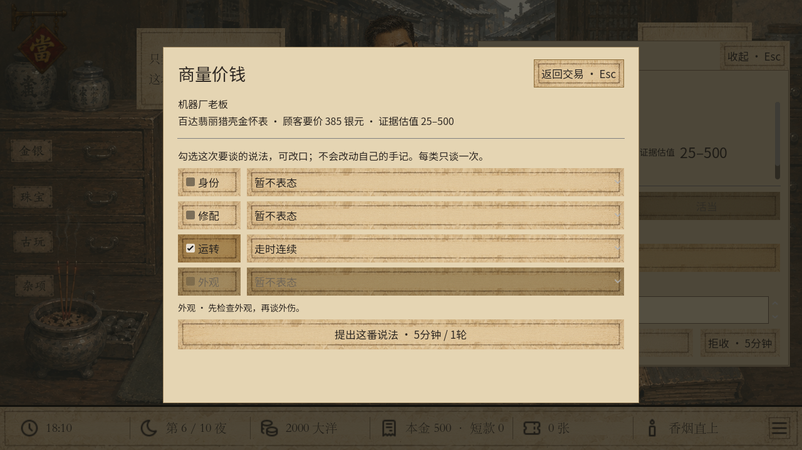
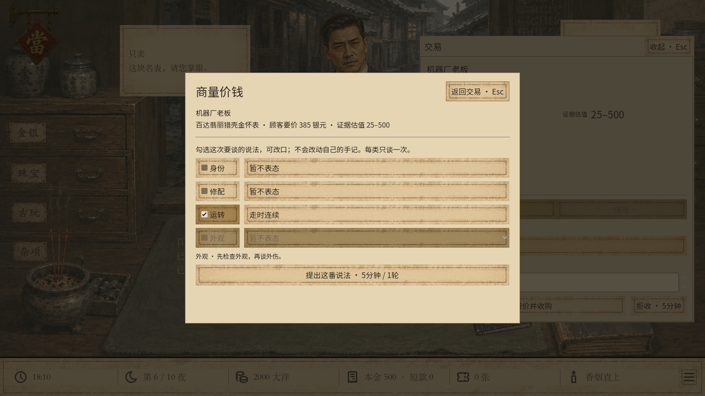
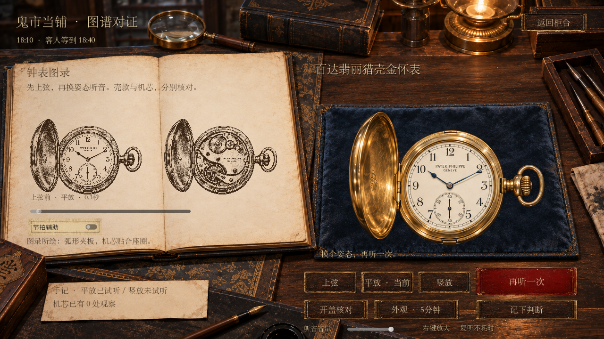
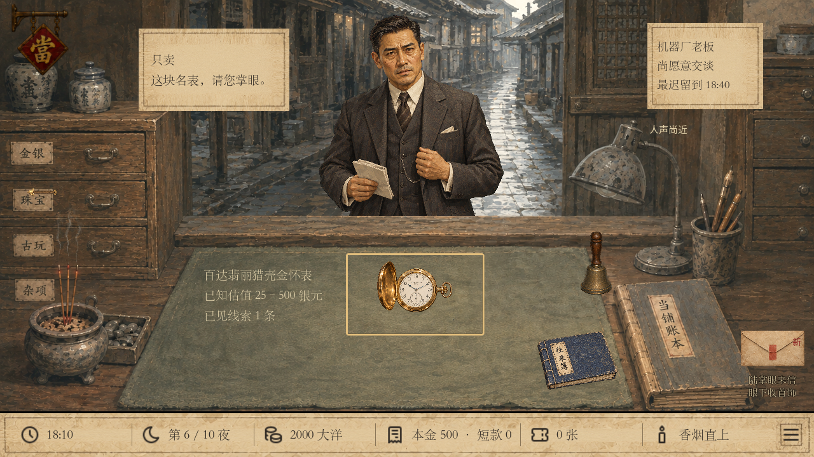
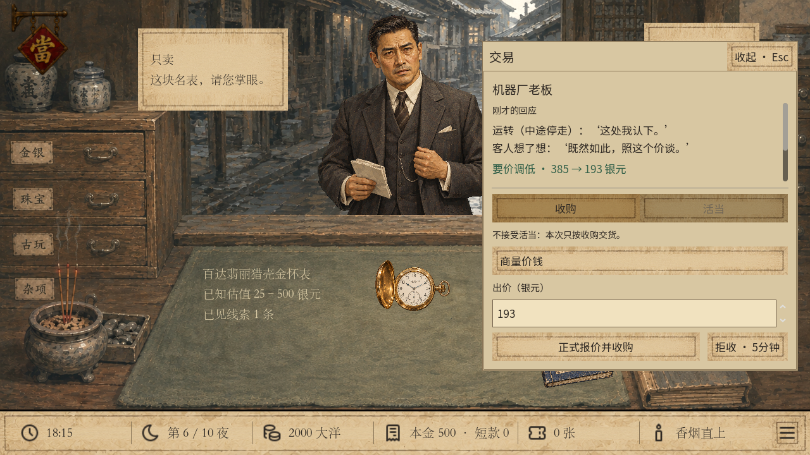
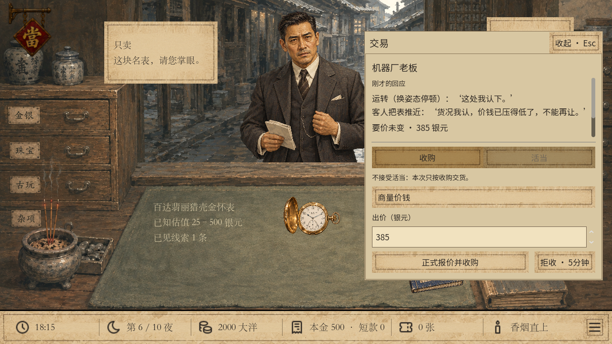
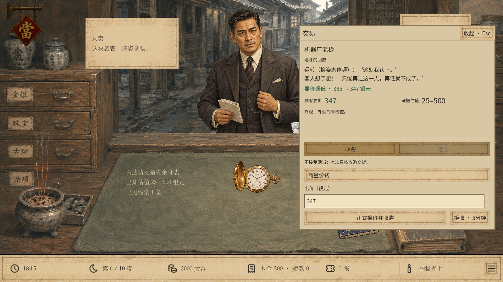
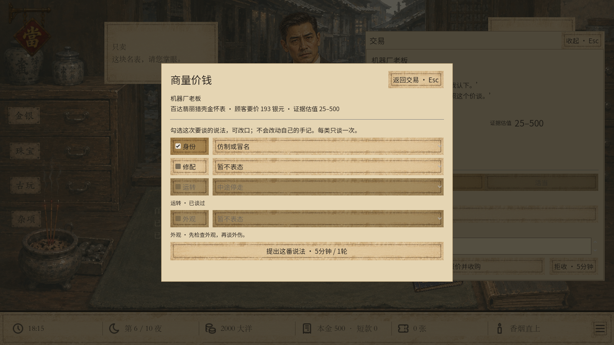

# v35 怀表说法、信任与让价验收

日期：2026-09-23。Windows / Godot 4.6.1 / Compatibility 渲染。本地可玩版本，未推送或发布。

## 结果

以下检查均为0失败。测试用户目录位于项目 `.godot` 下，未读取或改写玩家正式进度。没有运行整仓全部测试。

| 检查 | 通过数 | 覆盖 |
| --- | ---: | --- |
| `tests/watch_negotiation.gd` | 1070 | 27种实物组合；信任概率表及阈值；3种性格×2种急迫；单次机会、虚假说法、价值不变、商誉封顶、163筹款线、保存失败、其他九件货 |
| `tests/watch_negotiation_storage.gd` | 223 | v35文件写入/读取，v31至v34旧槽载入，新开局恢复v35 |
| `tests/watch_negotiation_journey.gd` | 526 | 两次十夜流程；自然怀表来客的点听、部分落笔、改口、写盘失败回滚、清空缓存后重放，放当与赎回 |
| `tests/watch_negotiation_ui.gd` | 71 / 71 | 1280×720 / 1600×900，真实点击、键盘选择、音频播放与立即停止、落笔回柜台、改口不改手记、不同客人回应 |
| `tests/watch_economy.gd` | 916 | v34经济、27种固定货值、收购/放当/赎回/绝当与出售 |
| `tests/watch_appraisal.gd` | 4950 | v33旧鉴定216种组合 |
| `tests/watch_partial_seal.gd` | 55 | v34部分落笔、不可改写及保存失败 |
| `tests/luxury_appraisal_summary.gd` | 227 | 十种货30档货况，鉴定摘要及估值区间 |
| `tests/fan_condition.gd` | 2078 | 折扇品相、报价与举证回归 |
| `tests/watch_market_ui.gd` | 107 | v34指南与鉴定实机交互，1280×720 |

统一入口 `play-unified.cmd -Stage watch -WatchCase fake-fault -Wide -Verify` 已输出 `Verified unified v35: watch`。`git diff --check` 通过。

Godot仍会报告Windows根证书存储读取错误；本轮离线游戏启动及上述测试均完成，无脚本解析错误。这不计作联网功能验证。

## 关键观察

- 先保存试听开始记录，才播放声音。模拟写盘失败时，没有声音和新记录，并显示失败原因。立即停止仍能提交运转说法；播放结束不会再写一次动作。
- 手记写“走时连续”，对客改口为“中途停走”，客人可相信并从385让至193。手记仍是连续，实物仍值500，公开估值仍为25–500。
- 同一真实故障，好商量客人385→308；谨慎客人385→347；强硬客人承认问题但仍要385。急迫系数只在初始心理定价中应用一次。
- 同类问题提交后禁用；改口、补查与读档均不恢复。分别、倒序与合并提交使用同一固定反应，负面说法的最终价差重算一致。
- 已计入初始报价的外伤不会再次打折；虚假认识不影响出售价值与公开商誉判价。
- 一万种种子生成性格：好商量3493、谨慎4536、强硬1971，接近35%/45%/20%。概率表另以每个阈值上下边界逐项检查。
- 两次十夜流程均正常结束。普通起始资金的一局没有条件完成高级鉴定；另一次明确增加测试起始资金，覆盖自然怀表鉴定、贷款与赎回，未修改正式建设价格。
- 检查截图时发现切换隔离预置会残留上一情境的短期回应，已修正并新增断言，确保每个预置只显示本情境回应。

## 实机截图

### 勾选与改口

### 试听与落笔

### 客人回应

试玩命令见 [v35本地试玩](../../WATCH_V35.md)。概率、性格与让价比例按首版默认值实施，手感与经济难度留待玩家试玩调整。
