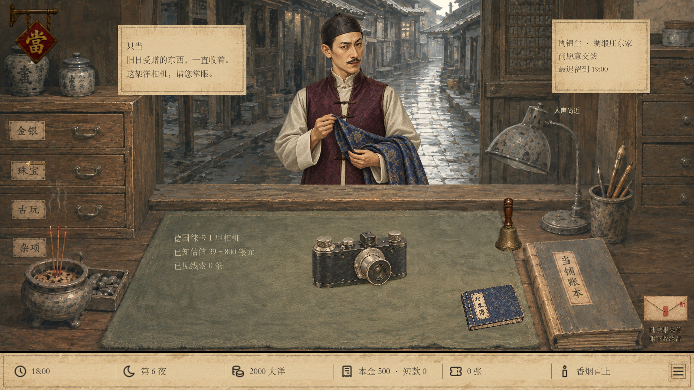
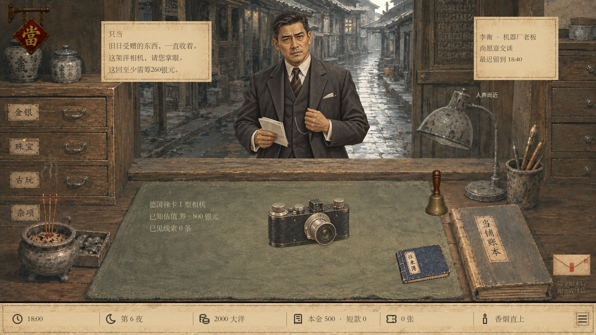
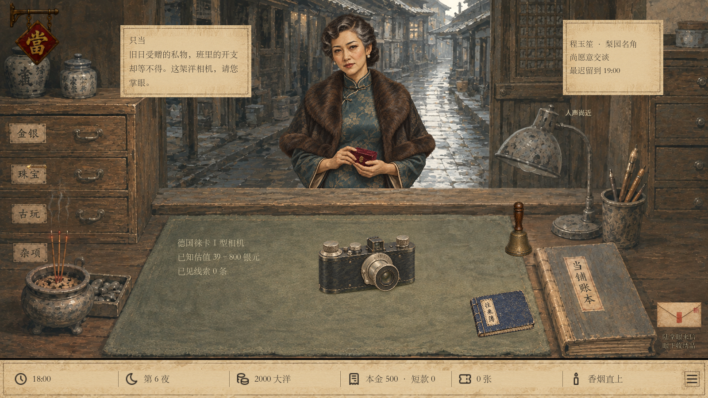
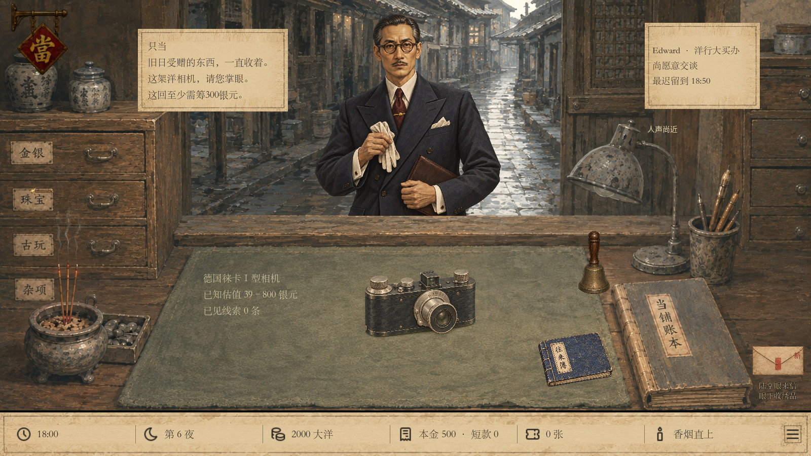

# 富客立绘环境融合 · 本地验收

2026-09-25。使用内置 image_gen 重绘五位固定富客，沿用 docs/ART04_GOUACHE_DIRECTION.md 的不透明水粉方向。保留脸型、年龄、姿势与职业服饰，简化细碎高光与材质纹理，新增真实透明边缘。原始立绘保留以供回退。

新版资产：assets/art04/customers/wealthy/painted/。每位人物的完整提示词见同目录 generation.json。人物路由仍按固定 customer_id 选择，不改变普通客人、剧情人物、交易规则或存档字段。新版原生 alpha 关闭色键去底，普通旧版素材继续沿用原去底方式；沿用既有柜台遮挡、点击区域和夜间调光。

验证：Godot 导入通过；1280×720 与 1600×900 各 63 项通过，0 失败，覆盖五人正确素材、原生透明、画面边界、人物点击和交易姓名，以及普通人素材路由。实际场景逐项检查正常与夜间截图。Windows 根证书库读取警告仍存在，未出现脚本或断言失败。git diff --check 通过。本轮只在本地，未推送。

## 试玩

```powershell
& "C:\Users\alvachen\Documents\ChatGPT\pawnbroker\.artifacts\camera-appraisal-v43\play-unified.cmd" -Stage camera -Holder factory -Wide
```

Holder 可选 silk（周锦生）、factory（李衡）、opera（程玉笙）、antique（沈季安）、comprador（Edward）。这是隔离试玩，不覆盖正式进度。

## 周锦生

[原立绘柜台效果](silk_before_1600.png) · [新版 1280](silk_after_1280.png) · [夜间](silk_night_1600.png)



## 李衡

[原立绘柜台效果](factory_before_1600.png) · [新版 1280](factory_after_1280.png) · [夜间](factory_night_1600.png)



## 程玉笙

[原立绘柜台效果](opera_before_1600.png) · [新版 1280](opera_after_1280.png) · [夜间](opera_night_1600.png)



## 沈季安

[原立绘柜台效果](antique_before_1600.png) · [新版 1280](antique_after_1280.png) · [夜间](antique_night_1600.png)


## Edward

[原立绘柜台效果](comprador_before_1600.png) · [新版 1280](comprador_after_1280.png) · [夜间](comprador_night_1600.png)


