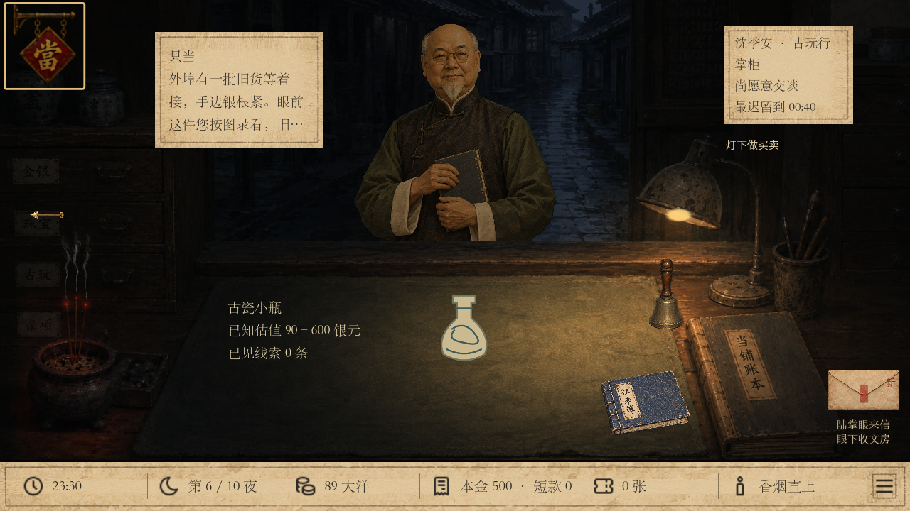
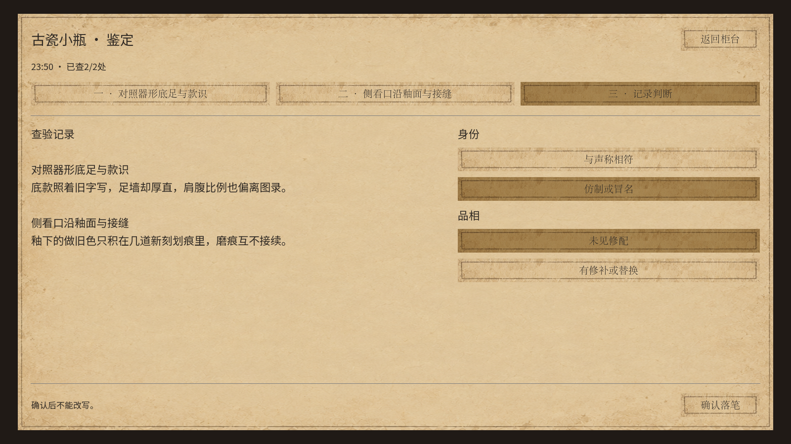
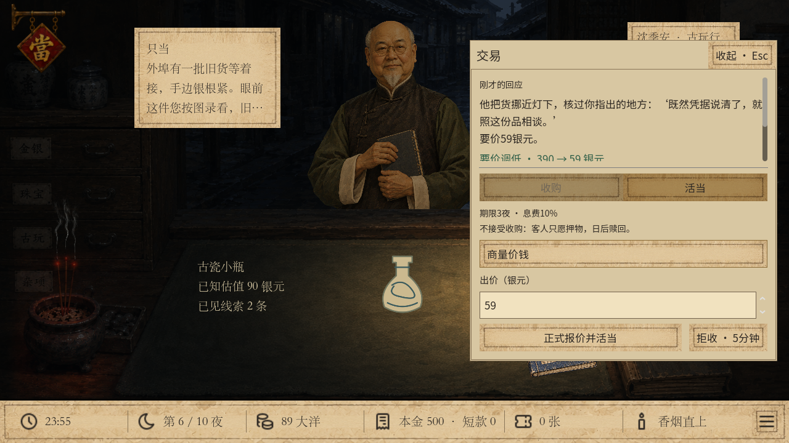
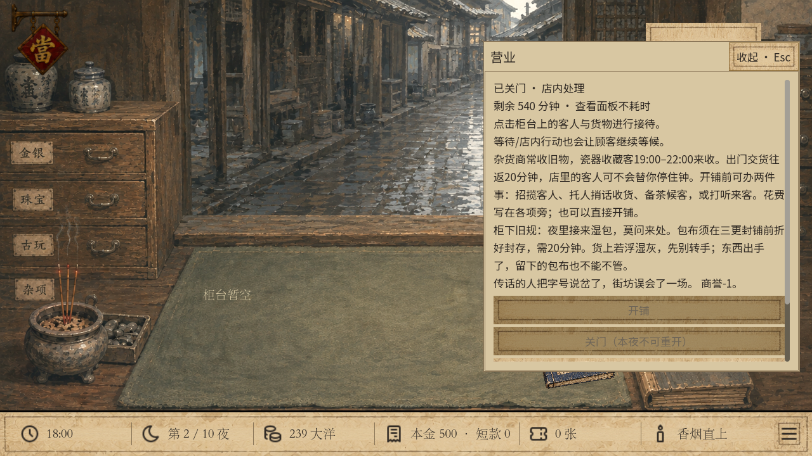
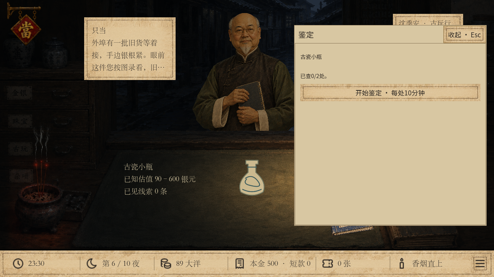
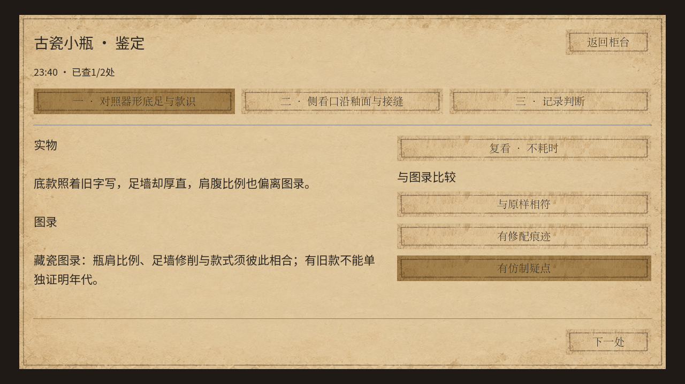
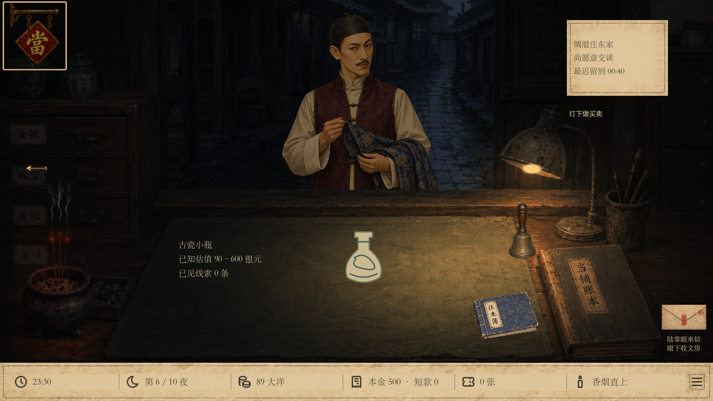
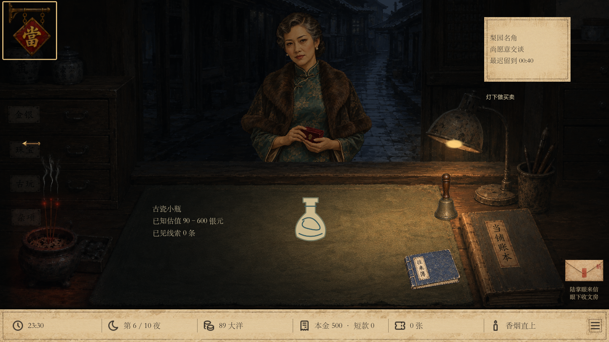
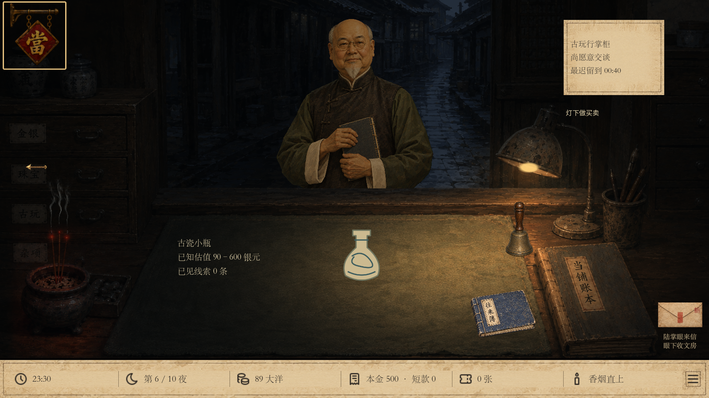

# v31富客本地验收 · 2026-09-22

本批仅本地源码交付，未推送、未打包。环境为Windows、Godot 4.6.1 Compatibility，界面检查使用1280×720与1600×900实际窗口。

| 验证 | 结果 | 本地日志 |
| --- | --- | --- |
| 五类属性、十货三货况、概率统计、资金与当票、广告/累计边界、保存回放 | 1554通过，0失败 | `.godot/wealthy-customers-final.log` |
| 真实十夜资金与富客来访/鉴定/放当/赎回 | 507通过，0失败 | `.godot/wealthy-journey-final.log` |
| v31铜镜、夜半来声及结局回归 | 3486通过，0失败 | `.godot/wealthy_story.log` |
| v31阿七十夜回归 | 3282通过，0失败 | `.godot/wealthy_companion.log` |
| v30原折扇鉴定、品相与交易回归 | 2185通过，0失败 | `.godot/wealthy-regression-appraisal.log` |
| v30原商誉、军方与准备回归 | 1882通过，0失败 | `.godot/unified_social.log` |
| v31实际界面：1280×720 | 36断言，0失败 | `.godot/wealthy-ui-1280-final.log` |
| v31实际界面：1600×900 | 36断言，0失败 | `.godot/wealthy-ui-1600-final.log` |
| v30原整合局实际界面及旧进度读取 | 40断言，0失败 | `.godot/wealthy-legacy-ui-final.log` |
| 统一入口及富客快速试玩启动 | 正常退出，无脚本错误 | `.godot/qa/unified-launch/launch-normal.log`、`launch-wealthy.log` |

领域测试的构造状态用于精确边界，不冒充真实通关。真实进度测试用种子222和444从300现银开始：两局均完成十夜，共遇3位富客，3次鉴定，1次放当且实际赎回；另一单受制于现银只能拒收。保存失败注入验证每次检查的时间、证据和现金全部回滚；重新读取则完整回放，篡改宣传结果被拒。

本金不足不提交报价；直接拒收不扣商誉；厂主/大买办查出仿冒仍不能压过筹款线；三夜后无人回赎才转入逐票绝当，留货不产生现金，出售走现有买家。第八、九、十夜当票分别保留第十一、十二、十三夜期限，不提前处置。

界面脚本以真实鼠标点击完成柜台入鉴定、两项细查、图录配对、独立判断、落笔、举证、实际放当，并核对扣款与新增当票。另检查关铺宣传反馈和实际商誉变化。截图已人工查看，正文及操作区可滚动，没有用隐藏真实货况替玩家作答。

Godot在本机读取系统根证书库时有环境错误日志，未阻止上述离线玩法、保存或窗口验证。未验证其他操作系统、DPI与发行EXE；未执行全部历史发行门禁。高档货为新SVG图示，尚无逐部件细节插图。

## 设计反馈修订：鉴定信息与五位人物

鉴定入口移除整本估价簿与重复规则说明，操作按钮直接可见。鉴物台分成两项细查和记录判断三页；每次只对照当前实物与对应图录，最后分别判断身份、品相。选择高亮只表示玩家所选，不表示答对。价格参考仍可从知识柜查看。

五类富客已使用独立立绘。绸缎庄东家按负责人指出的撞脸问题重新设计，采用瘦长脸、细髭、瓜皮帽、浅长衫和深色马甲。古玩掌柜以秃顶、圆眼镜、白尖须区分；厂主、名角、大买办各有独立衣装与五官。原图洋红底由既有游戏材质去除，原画像素不做离线改绘。

| 本次验证 | 结果 | 日志 |
| --- | --- | --- |
| 富客领域与保存规则回归 | 1554通过，0失败 | `.godot/wealthy-design-core.log` |
| 1280×720实际鉴定、配对、落笔、举证、放当 | 48断言，0失败 | `.godot/wealthy-design-ui.log` |
| 1600×900相同操作流程 | 48断言，0失败 | `.godot/wealthy-design-ui-wide.log` |
| 五类独立人物资源加载与柜台截图 | 17断言，0失败 | `.godot/wealthy-art-preview.log` |

两项细查的线索与对应图录在上述尺寸均无需滚动即可读完，关闭与底部操作可见。五张人物截图为渲染层逐张替换的美术检查，借用同一柜台场景，并非五次真实来访；不写入玩家存档。上方旧表保留首轮验收历史，本轮未重复完整十夜剧情套件。

后续人物反馈：梨园名角已调整为五十岁上下的外观，增加眼角细纹、面颊岁月感及鬓边银丝，保留原衣装、姿态与名角身份。重新导入并检查柜台去底、位置与夜间光照，人物资源检查17项通过、0失败（`.godot/wealthy-opera-age-preview.log`）；本次只替换人物图片，未改玩法代码。

